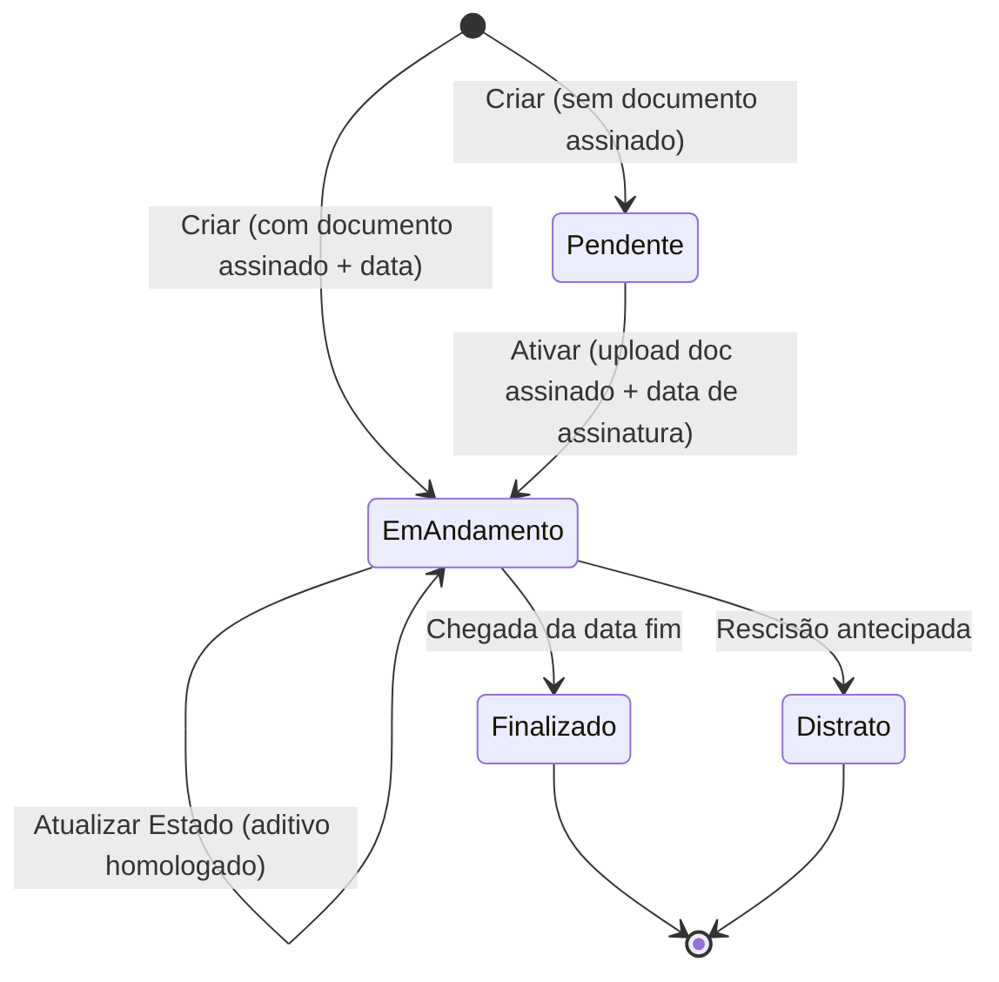

[← Voltar para ADRs](./README.md)

# ADR-0023: Ciclo de vida do Contrato — estado `Pendente` (4 estados)

- **Status:** Accepted
- **Date:** 2026-05-27
- **Deciders:** P.O. (autoridade de regra de negócio) + Arquiteto técnico
- **Origem:** [Inquiry-0021](../../inquiries/0021-contract-status-lifecycle-http.md) — resposta definitiva da P.O. na call de 2026-05-27.

---

## Contexto

Ao planejar a exposição HTTP do módulo Contratos (front consumindo um contrato derivado do `openapi.yaml` legado, traduzido por uma Anti-Corruption Layer), confrontou-se o ciclo de vida do contrato em duas fontes divergentes:

- **Handbook de domínio** [`gestao-contratos.md`](../../domain_questions/contratos/bounded-contexts/gestao-contratos.md): **3 estados** — `Vigente`, `Encerrado`, `Distratado` (l.27/35), com o contrato **nascendo `Vigente`** (l.48: *"Define status como `Vigente`"*) e máquina de estado de 3 nós (l.67-72).
- **Código** (`src/modules/contracts/domain/contract/types.ts:36-59`): implementa fielmente — `Contract = ActiveContract | ExpiredContract | TerminatedContract`, com `signedAt` **obrigatório** em `CreateContractInput` (sempre nasce assinado).
- **openapi.yaml legado** (l.591-604): **5 estados** — `Pendente`, `Assinado`, `Em andamento`, `Finalizado`, `Distrato`, com a nota *"Pendente (sem documento assinado) ou Em andamento (com documento assinado + data de assinatura)"*.

A divergência sobre `Pendente`/`Em andamento` **não é de forma, é de regra de negócio**. Pelo princípio do time (a forma do contrato HTTP é negociável; a regra de negócio NÃO), levou-se a decisão à P.O. ([Inquiry-0021](../../inquiries/0021-contract-status-lifecycle-http.md)).

### Resposta da P.O. (2026-05-27)

1. **Sim**, o operador cadastra um contrato **antes** do documento assinado → status **`Pendente`**.
2. `Pendente` **não tem efetividade**: não inicia vigência, **não aceita aditivos**, sem vínculo financeiro/execução.
3. A transição `Pendente → Em Andamento` ocorre ao **fazer upload do documento assinado + preencher a data de assinatura**.
4. `Assinado` e `Em Andamento` são **o mesmo estado** (vigente).
5. Terminais: **`Finalizado`** (fim normal do prazo) e **`Distrato`** (rompimento antecipado).
6. Lista final: **`Pendente` → `Em Andamento` → `Finalizado` / `Distrato`** (4 estados).

Conclusão: o agregado `Contract` está **incompleto** — falta o estado inicial `Pendente` e a transição de ativação por assinatura.

---

## Decisão

**O ciclo de vida do `Contract` passa de 3 para 4 estados, com o contrato nascendo `Pendente`.**

### Máquina de estado nova

### Nomenclatura canônica (EN no código · PT na borda)

Mantém-se o padrão do projeto: identificadores em EN; termos ao humano em PT via dicionário (`cli/formatters/`, e futuramente a ACL HTTP). A P.O. é a autoridade dos termos de UI.

| Código (`status`) | Termo de negócio (UI/ACL) | Handbook antigo (sinônimo) |
| :--- | :--- | :--- |
| `Pending` | `Pendente` | — (novo) |
| `Active` | `Em Andamento` | `Vigente` |
| `Expired` | `Finalizado` | `Encerrado` |
| `Terminated` | `Distrato` | `Distratado` |

> Os termos da P.O. (`Em Andamento`/`Finalizado`/`Distrato`) prevalecem sobre os sinônimos antigos do handbook (`Vigente`/`Encerrado`/`Distratado`) na camada de apresentação. O **discriminador interno permanece em EN** e ganha o membro `'Pending'`.

### Modelagem (direção — refinada nos tickets de domínio)

Espelha o padrão **já existente** no agregado `Amendment` (`PendingWithoutDocument → PendingWithDocument → Homologated`):

- **Novo tipo refinado `PendingContract`** (`status: 'Pending'`): carrega os dados de cadastro (`id`, `sequentialNumber`, `title`, `objective`, `originalValue`, `originalPeriod`), mas **sem `signedAt`** e **sem vigência efetiva** (`currentValue`/`currentPeriod` não iniciados) e **sem `homologatedAmendmentIds`** ativos.
- **`Contract.create` passa a ser dual:** nasce `Pending` (sem documento) **ou** `Active` (com documento assinado + `signedAt`).
- **Nova transição `Contract.activate`:** `PendingContract + referência de documento assinado + signedAt → ActiveContract` (inicia vigência: `current = original`).
- `ActiveContract`/`ExpiredContract`/`TerminatedContract` permanecem como hoje (renomeados apenas na apresentação).

### Invariantes (novas / revisadas)

- **RN-CV-01 (novo):** `PendingContract` **rejeita aditivos** (criar/anexar/homologar) — só `Active` aceita. Estende R3 (que hoje só cobre terminais).
- **RN-CV-02 (novo):** ativação **exige** referência de documento assinado **+** `signedAt` — espelha RN-12 do `Amendment`. Sem documento, permanece `Pending`.
- **R1/R2/R3 do handbook** seguem válidas para `Active`+terminais.

### Eventos de domínio

- `ContractCreated` passa a carregar o estado inicial (`Pending` ou `Active`).
- **Novo evento `ContractActivated`** (EN passado) na transição `Pending → Active`.

---

## Consequências

### Positivas

- **Domínio reflete a operação real** (cadastro antes da assinatura é prática confirmada pela P.O.).
- **Reaproveita padrão consolidado** (`Amendment` Pending→Document→Homologated) — baixa novidade conceitual, modelagem testada.
- **Desbloqueia o HTTP com o contrato correto** — o enum exposto será `Pendente | Em Andamento | Finalizado | Distrato`, sem ACL "inventando" estados.
- **Invariante anti-aditivo-em-Pendente** previne vínculo financeiro indevido (preocupação explícita da P.O.).

### Negativas

- **Refactor estrutural do agregado mais central** do módulo, com efeito em: tipos, `create`, persistência (schema/migration — novo `status` + `signedAt`/doc nuláveis em Pending), CLI, use cases, `public-api`.
- **Migração de dados** (quando houver): contratos já existentes assumem `Active` (todos nasceram assinados sob a regra antiga).
- **`signedAt` deixa de ser sempre presente** — código que assumia `signedAt: Date` incondicional precisa narrowing por estado.

### Neutras

- Atualiza o handbook [`gestao-contratos.md`](../../domain_questions/contratos/bounded-contexts/gestao-contratos.md) (§3, §4, §5, §7, §8) — a máquina de estados oficial passa a ter 4 nós. Registrado em [`handbook/CHANGELOG.md`](../../CHANGELOG.md).

---

## Alternativas consideradas

### A. Manter 3 estados; ACL "deriva" Pendente/Em andamento

**Rejeitada:** não há como derivar `Pendente` (cadastro sem assinatura) a partir de um domínio que força `signedAt`. Seria fabricar estado na borda — viola o princípio de que regra mora no domínio, não na ACL. Contradiz diretamente a P.O.

### B. `signedAt` opcional sem novo estado refinado (booleano `isSigned`)

**Rejeitada:** reintroduz "optional-as-state" (null/flag para representar estado), exatamente o anti-padrão que o domínio eliminou (DO C§29 / estados refinados). O estado `Pending` deve ser um tipo, não um campo nulável solto.

---

## Plano de implementação (ordem)

1. **Atualizar o handbook** `gestao-contratos.md` (máquina de estados 4 nós, RN-CV-01/02, evento `ContractActivated`) + `CHANGELOG.md`.
2. **Série de tickets de domínio** (skill `ts-domain-modeler`, pipeline W0→W3):
   - `PendingContract` (tipo refinado) + `create` dual + `activate` + invariante anti-aditivo.
   - Persistência (schema/migration: `status` 4 valores, `signedAt`/doc-ref nuláveis em Pending).
   - CLI + formatters PT.
3. **Só então** retomar o desenho da camada HTTP+ACL (ADR de adoção HTTP pendente), agora com o enum de 4 estados.

---

## Referências

- [Inquiry-0021](../../inquiries/0021-contract-status-lifecycle-http.md) — decisão da P.O. (fonte desta ADR).
- [`gestao-contratos.md`](../../domain_questions/contratos/bounded-contexts/gestao-contratos.md) — máquina de estados a atualizar.
- `src/modules/contracts/domain/contract/types.ts` — agregado a revisar.
- `src/modules/contracts/domain/amendment/types.ts` — padrão `Pending→Document→Homologated` a espelhar.
- [ADR-0006](./0006-modular-monolith-core-api.md) — domínio sem framework (HTTP é adapter).
