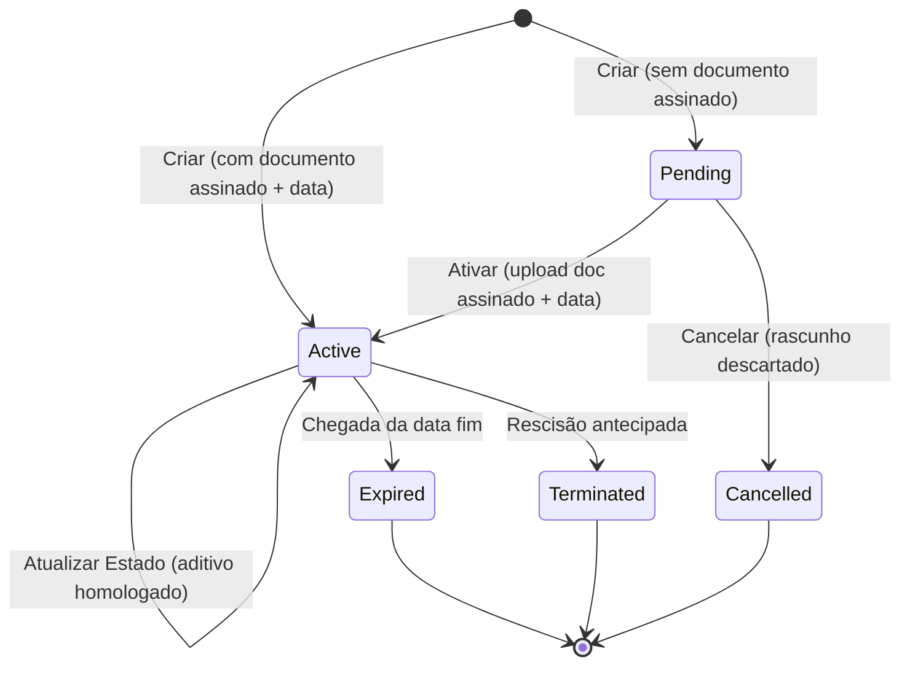

[← Voltar para ADRs](./README.md)

# ADR-0039: Ciclo de vida do Contrato — estado terminal `Cancelled` (5 estados)

- **Status:** Accepted
- **Date:** 2026-06-09
- **Deciders:** P.O. (autoridade de regra de negócio, via handoff do front) + Arquiteto técnico
- **Origem:** Ticket [CTR-HTTP-CANCEL-PENDING](../../tickets/done/CTR-HTTP-CANCEL-PENDING.md) — ação "Excluir" no grid/detalhe de Contratos (web-app v2).
- **Estende:** [ADR-0023](./0023-contract-lifecycle-pending-state.md) (não o supersede — adiciona um estado terminal).

---

## Contexto

No grid e no detalhe de Contratos, a ação **Excluir** abre um modal de confirmação, mas o botão **Confirmar fica desabilitado**: o backend recusa qualquer remoção — `DELETE /contracts/:id` responde **405 `contract-delete-forbidden`** (imutabilidade — exclusão física proibida, US-002).

A regra de negócio desejada: um contrato ainda **Pendente** (cadastrado mas nunca ativado/assinado — ADR-0023) é um **rascunho que não vigorou**. O operador deve poder **cancelá-lo**. Contratos já efetivados (`Active`/`Expired`/`Terminated`) **permanecem imutáveis** — sem exclusão.

O ADR-0023 estabeleceu 4 estados (`Pending → Active → Expired/Terminated`) sem transição de cancelamento. Falta um destino terminal para o rascunho descartado.

---

## Decisão

**O ciclo de vida do `Contract` ganha um 5º estado terminal `Cancelled`, alcançável apenas a partir de `Pending`.**

### Máquina de estado revisada

### Nomenclatura (EN no código · PT na borda)

| Código (`status`) | Termo de negócio (UI/ACL) |
| :--- | :--- |
| `Cancelled` | `Cancelado` |

### Modelagem

- **Novo tipo refinado `CancelledContract`** (`status: 'Cancelled'`): carrega `ContractRegistration`
  (dados de cadastro) **+ `endedAt: Date`** (instante do cancelamento). **NÃO** carrega vigência
  efetiva (`signedAt`/`currentValue`/`currentPeriod`/`homologatedAmendmentIds`) — nasce de um
  `PendingContract`, que nunca teve efetividade. Distingue-se de `Expired`/`Terminated` exatamente
  nisso (aqueles estendem `EffectiveContractCore`; `Cancelled` estende só `ContractRegistration`).
- **Nova transição `Contract.cancel`:** `PendingContract → CancelledContract` (assina `endedAt`). O
  parâmetro `PendingContract` garante **em compile time** que só rascunhos são canceláveis (espelha
  `activate`/`expire`/`terminate`). `Contract.parsePending` é o refinement constructor (espelha
  `parseActive`).
- **Novo evento `ContractCancelled`** (`{ type, contractId, occurredAt }`, EN passado). Distinto de
  `ContractEnded` — um rascunho cancelado não é um contrato vigente que encerrou; a timeline e os
  consumidores tratam o marcador "Cancelado" sem conflato com "Encerrado".

### Invariantes (novas / revisadas)

- **RN-CV-03 (novo):** apenas `PendingContract` é cancelável. Tentar cancelar `Active`/`Expired`/
  `Terminated`/`Cancelled` → erro de estado (`ContractNotPending` no domínio; **409** na borda HTTP).
- **Persistência:** `Cancelled` tem a mesma forma nula de vigência que `Pending` (signed_at/current_*
  NULL) **+** `ended_at` populado. Os CHECKs do schema são revisados:
  - `status ∈ {Pending,Active,Expired,Terminated,Cancelled}`.
  - `ended_at IS NOT NULL ⟺ status ∈ {Expired,Terminated,Cancelled}`.
  - `(status ∈ {Pending,Cancelled}) ⟺ (signed_at IS NULL AND current_* IS NULL)`.

### Borda HTTP

`DELETE /contracts/:id` deixa de ser 405 incondicional: **Pending → 200** (corpo = contrato cancelado);
**não-Pending → 409** `contract-not-pending`; **inexistente → 404**; auth `contract:write`. A rota
**não apaga a row** — faz a transição de estado (soft-delete). Exclusão física segue proibida.

---

## Consequências

### Positivas

- Desbloqueia a ação "Excluir" do front para rascunhos, sem violar a imutabilidade dos efetivados.
- `Cancelled` é um tipo refinado (não flag) — coerente com a eliminação de optional-as-state (DO C§29).
- Evento próprio dá timeline/auditoria corretos e mantém consumidores cross-módulo limpos.

### Negativas

- Toca o agregado central + persistência (CHECKs/migration) + mappers + public-api + borda + CLI.
- Consumidores que fazem switch exaustivo em `ContractEvent`/`ContractStatus` ganham um membro novo
  (compile error força tratamento — desejável).

### Neutras

- Atualiza `gestao-contratos.md` (máquina 5 nós) + `CHANGELOG.md`.

---

## Alternativas consideradas

### A. Flag de soft-delete (`cancelledAt` nullable, status segue `Pending`)

**Rejeitada:** reintroduz optional-as-state (null/flag para representar estado terminal), o anti-padrão
que o domínio eliminou. `Cancelled` deve ser um tipo, não um campo nulável solto.

### B. Reusar `ContractEnded(kind:'Cancelled')`

**Rejeitada:** menor superfície, mas a timeline (`kind = event.type`) mostraria "Encerrado" para um
rascunho cancelado, e todo consumidor de `ContractEnded` precisaria de special-case
"não-realmente-encerrado". Evento próprio é mais claro pelo custo mecânico de um payload a mais.

---

## Referências

- [ADR-0023](./0023-contract-lifecycle-pending-state.md) — ciclo de vida (4 estados); este ADR estende.
- [ADR-0006](./0006-modular-monolith-core-api.md) — domínio sem framework; eventos como contrato público.
- `src/modules/contracts/domain/contract/types.ts` — união do agregado a estender.
- Ticket [CTR-HTTP-CANCEL-PENDING](../../tickets/done/CTR-HTTP-CANCEL-PENDING.md).
