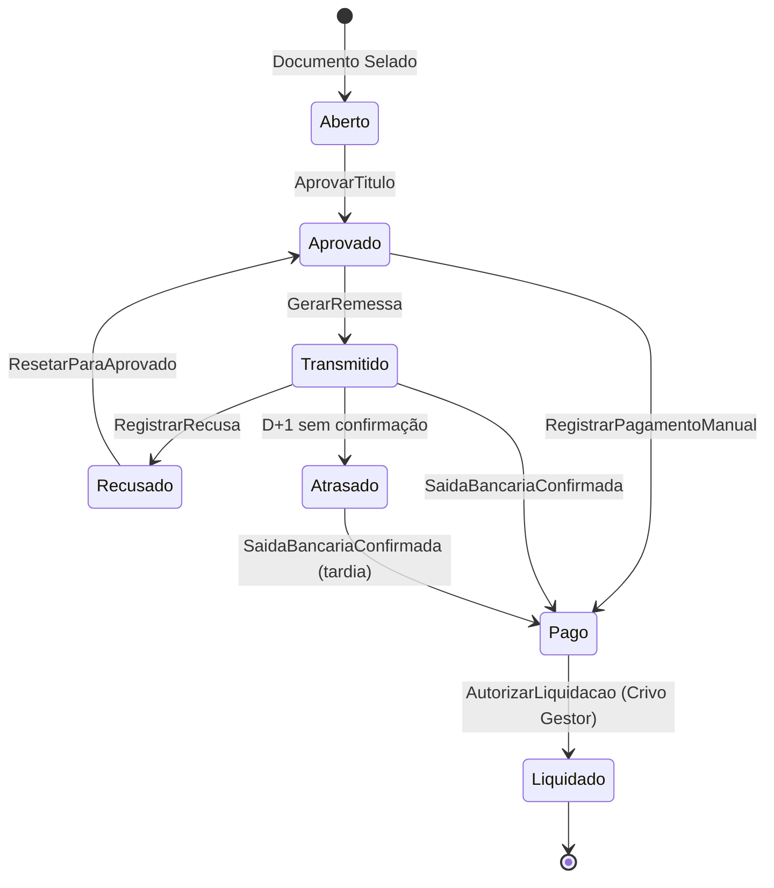

# 🧩 Bounded Context: Títulos e Liquidação

## 1. Papel no Mapa

Este contexto transforma o **Documento Selado** em obrigações pagáveis. Sua missão é garantir que o fluxo de caixa do sistema reflita a realidade do banco, mas sempre **sob o controle final do usuário (Governança)**.

## 2. Atores

* **Aprovador (Perfil)** — Único que pode mover um título de `Aberto` para `Aprovado`.
* **Operador de Contas a Pagar** — Gera os arquivos de remessa (CNAB), monitora rejeições, registra pagamentos manuais e solicita reaberturas.
* **Sistema (Integrador Bancário)** — Processa arquivos e muda status baseado em eventos técnicos (Retorno/Extrato).
* **Gestor Financeiro** — Dá a palavra final na **Liquidação** (Baixa).

## 3. Agregados e Entidades

```ts
TituloFinanceiro {
  id: TituloID;
  origem: DocumentoID;          // Vínculo obrigatório com o Pai
  tipo: TipoTitulo;             // Principal (Líquido) ou Imposto (Filho)
  status: StatusTitulo;         // Aberto, Aprovado, Transmitido, Recusado, Pago, Atrasado, Liquidado
  metodoPagamento: 'Remessa_Bancaria' | 'Manual_Externo';
  beneficiario: DadosBancarios;
  dadosPagamento: {
    valor: Money;
    vencimento: Date;
    saidaBancariaReal: Date;    // Confirmado pelo extrato
    fitid: string;              // Identificador único da transação (anti-duplicidade)
  };
  rastreabilidade: {
    remessaID: string;
    dataPagamento: Date;
    autenticacaoBancaria: string;
  };
}
```

## 4. Comandos / Casos de Uso Principais

| Comando | Quem chama | Pré-condições | Efeito | Evento Publicado |
| :--- | :--- | :--- | :--- | :--- |
| **GerarTitulos** | Sistema | `DocumentoSelado` | Cria 1 título "Principal" e N títulos "Imposto". | `TitulosGerados` |
| **AprovarTitulo** | Aprovador | Título em `Aberto` | Habilita título para pagamento. | `TituloAprovado` |
| **GerarRemessa** | Operador | Títulos em `Aprovado` | Agrupa em CNAB e muda para `Transmitido`. | `TituloTransmitido` |
| **RegistrarPagamentoManual** | Operador | Título em `Aprovado` | Pula remessa e define status como `Pago`. | `TituloPagoManualmente` |
| **ProcessarSaidaBancaria** | Sistema | Retorno da VAN/Extrato | Se confirmado, status vai de `Transmitido` para `Pago`. | `SaidaBancariaConfirmada` |
| **MarcarComoAtrasado** | Sistema/Operador | D+1 e status `Transmitido` | Identifica que a saída bancária não ocorreu. | `PagamentoAtrasado` |
| **RegistrarRecusa** | Sistema (Retorno) | Arquivo de Retorno com erro | Muda status para `Recusado`. | `TituloRecusado` |
| **ResetarParaAprovado** | Operador | Título em `Recusado` | Volta para `Aprovado` para nova tentativa. | `TituloResetado` |
| **AutorizarLiquidacao** | Gestor | Título em `Pago` | Efetiva a baixa final no sistema (Crivo Humano). | `TituloLiquidado` |

## 5. Invariantes e Regras de Negócio

* **R1 (Soberania da Aprovação)** — Somente títulos com perfil `Aprovado` podem ser incluídos em arquivos de remessa ou marcados como `Pago`.
* **R2 (Imutabilidade de Valor)** — O valor de um `TituloFinanceiro` (seja Principal ou Imposto) **nunca** pode ser editado neste contexto. Se o valor estiver errado, o Documento Fiscal (Pai) deve ser **Reaberto**.
* **R3 (Sincronia de Status)** — Um título só pode ser `Transmitido` se o seu Documento de origem estiver no status `Selado`.
* **R4 (Anti-Duplicidade FITID)** — O sistema deve recusar a importação de qualquer transação de extrato (OFX, XLSX, PDF) cujo `FITID` já tenha sido processado anteriormente.
* **R5 (Diferenciação Retorno vs. Saída)** — O sucesso no arquivo de retorno (CNAB) é apenas um status informativo. O status `PAGO` só é atingido após a confirmação da **Saída Bancária** (extrato/retorno de liquidação).
* **R6 (Controle de Liquidação)** — A mudança de `PAGO` para `LIQUIDADO` **nunca é automática**. O sistema sugere o "casamento" dos dados, mas exige a autorização do Gestor.
* **R7 (Status Atrasado)** — Se após a data prevista de pagamento o título permanecer como `Transmitido` (sem retorno de saída bancária), o sistema o sinaliza como `ATRASADO` para ação imediata do operador.
* **R8 (Integridade de Imposto)** — Títulos do tipo "Imposto" herdam o vencimento e as regras de aglutinação conforme a natureza do imposto lido no documento original.

## 6. Fluxos de Status e Transições

### Caminho da Saída Bancária (Caminho Feliz)
1. `ABERTO` → `APROVADO` (Ação do Aprovador)
2. `APROVADO` → `TRANSMITIDO` (Operador gera CNAB)
3. `TRANSMITIDO` → `PAGO` (Sistema lê saída bancária em D+1)
4. `PAGO` → `LIQUIDADO` (Gestor autoriza a baixa na conciliação)

### Caminho Manual (Fora da Remessa)
1. `ABERTO` → `APROVADO`
2. `APROVADO` → `PAGO` (Operador registra que pagou via Internet Banking)
3. `PAGO` → `LIQUIDADO` (Gestor concilia com o extrato)

### Caminho de Recusa e Recuperação
1. O banco recusa um título por "Agência/Conta Inválida".
2. O sistema marca como `RECUSADO`.
3. O Operador identifica o erro, corrige o cadastro do fornecedor.
4. O Operador executa **ResetarParaAprovado** (`RECUSADO` → `APROVADO`).
5. O título fica disponível para a próxima remessa bancária.

## 7. Máquina de Estados do Título



## 8. Glossário Específico

* **Título Filho** — Obrigação tributária derivada de um documento fiscal.
* **Remessa** — Arquivo enviado ao banco com ordens de pagamento.
* **Retorno** — Arquivo recebido do banco confirmando o processamento.
* **FITID** — Identificador único da transação bancária; impede que um pagamento de R$ 100,00 seja lançado duas vezes se o arquivo for reimportado.
* **Saída Bancária** — O evento real de débito na conta da entidade, soberano sobre o arquivo de remessa.
* **Crivo de Liquidação** — Ato de governança onde o gestor confirma que a conciliação sugerida pelo sistema está correta.
* **Liquidação** — O estado final onde o dinheiro saiu da conta e foi devidamente "casado" com o extrato.
