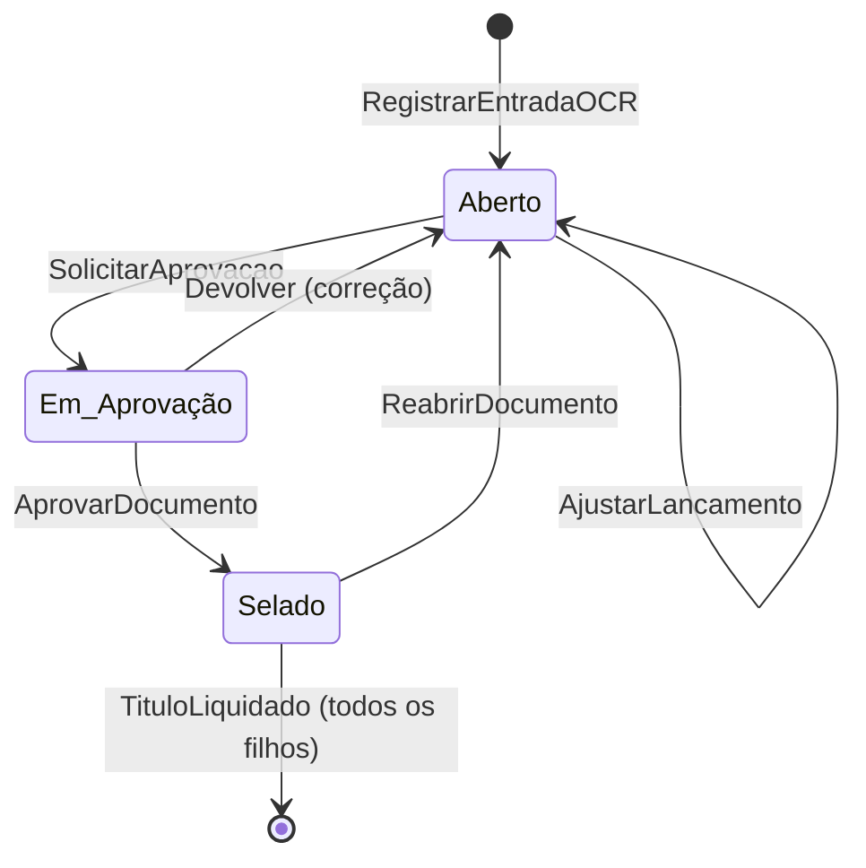
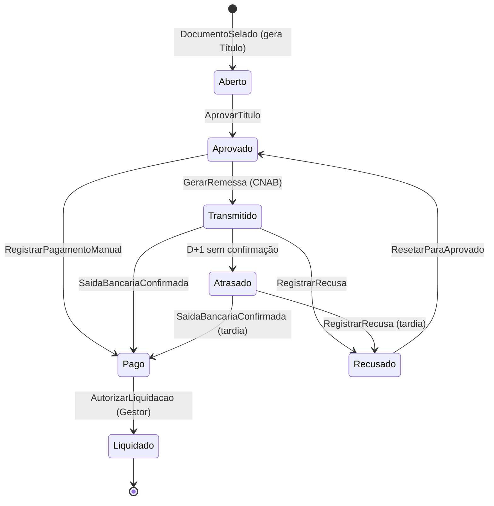
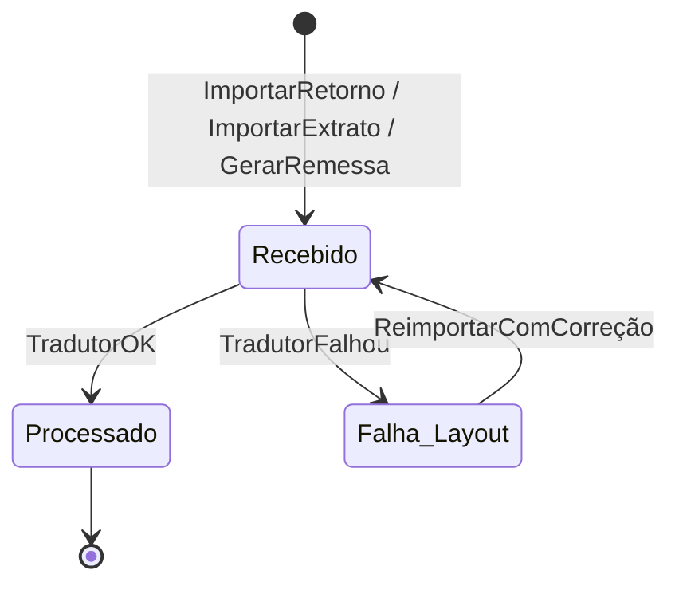

# 🔁 Máquinas de Estado Consolidadas

> Referência única para todos os fluxos de status do sistema. Qualquer transição não listada aqui é **proibida** por design.

---

## 1. Documento Fiscal

### 1.1. Estados

| Status | Significado |
| :--- | :--- |
| **Aberto** | Documento capturado (OCR ou manual); aguardando ajustes do Operador. |
| **Em_Aprovação** | Operador concluiu conferência e enviou para o Aprovador. |
| **Selado** | Aprovador validou. Imutável. Dispara geração de títulos. |
| *(Reaberto)* | Pseudo-estado: rollback de `Selado` para `Aberto`, cancelando títulos em aberto. |

### 1.2. Diagrama

### 1.3. Eventos Disparados

| Transição | Evento |
| :--- | :--- |
| → Aberto | `DocumentoCapturado` |
| Aberto → Aberto | `LancamentoRefinado`, `DocumentoEnriquecido` |
| Aberto → Em_Aprovação | `AprovacaoSolicitada` |
| Em_Aprovação → Selado | `DocumentoSelado` |
| Selado → Aberto | `DocumentoReaberto` |

---

## 2. Título Financeiro

### 2.1. Estados

| Status | Significado |
| :--- | :--- |
| **Aberto** | Criado a partir de `DocumentoSelado`; aguardando aprovação. |
| **Aprovado** | Liberado para fluxo bancário (remessa ou pagamento manual). |
| **Transmitido** | Incluído em arquivo CNAB enviado à VAN. |
| **Recusado** | Banco identificou erro no processamento (exige reset manual). |
| **Atrasado** | D+1 sem confirmação de saída bancária. |
| **Pago** | Saída bancária confirmada (extrato/retorno de liquidação). |
| **Liquidado** | Baixa final autorizada pelo Gestor (Crivo Humano). |

### 2.2. Diagrama Completo

### 2.3. Matriz de Transições Permitidas

| De \ Para | Aberto | Aprovado | Transmitido | Recusado | Atrasado | Pago | Liquidado |
| :--- | :---: | :---: | :---: | :---: | :---: | :---: | :---: |
| **Aberto** | – | ✅ | ❌ | ❌ | ❌ | ❌ | ❌ |
| **Aprovado** | ⚠️* | – | ✅ | ❌ | ❌ | ✅ | ❌ |
| **Transmitido** | ❌ | ❌ | – | ✅ | ✅ | ✅ | ❌ |
| **Recusado** | ❌ | ✅ | ❌ | – | ❌ | ❌ | ❌ |
| **Atrasado** | ❌ | ❌ | ❌ | ✅ | – | ✅ | ❌ |
| **Pago** | ❌ | ❌ | ❌ | ❌ | ❌ | – | ✅ |
| **Liquidado** | ❌ | ❌ | ❌ | ❌ | ❌ | ❌ | – |

> ⚠️ * Apenas via `DocumentoReaberto` (cancela o título antes de qualquer pagamento).

### 2.4. Eventos Disparados

| Transição | Evento |
| :--- | :--- |
| → Aberto | `TitulosGerados` |
| Aberto → Aprovado | `TituloAprovado` |
| Aprovado → Transmitido | `TituloTransmitido` |
| Aprovado → Pago | `TituloPagoManualmente` |
| Transmitido → Pago | `SaidaBancariaConfirmada` |
| Transmitido → Recusado | `TituloRecusado` |
| Transmitido → Atrasado | `PagamentoAtrasado` |
| Recusado → Aprovado | `TituloResetado` |
| Pago → Liquidado | `TituloLiquidado` / `ConciliacaoConfirmada` |

---

## 3. Lote de Comunicação Bancária

### 3.1. Estados

| Status | Significado |
| :--- | :--- |
| **Recebido** | Arquivo (remessa, retorno ou extrato) chegou ao sistema. |
| **Processado** | Conteúdo lido com sucesso e eventos disparados. |
| **Falha_Layout** | Tradutor não conseguiu interpretar o arquivo; exige intervenção manual. |

### 3.2. Diagrama

---

## 4. Regras Transversais

* **R1** — Toda transição registra entrada na **Trilha de Auditoria** (`AuditLogGenerated`).
* **R2** — Transição "ilegal" (não listada) deve falhar com erro de domínio explícito, **sem** estado intermediário.
* **R3** — Reabertura de documento (`Selado` → `Aberto`) exige cancelamento de **todos** os títulos filhos que ainda estejam em `Aberto` ou `Aprovado`. Títulos já `Transmitidos` ou posteriores **bloqueiam** a reabertura.
* **R4** — `LIQUIDADO` é estado terminal. Não há rollback.
