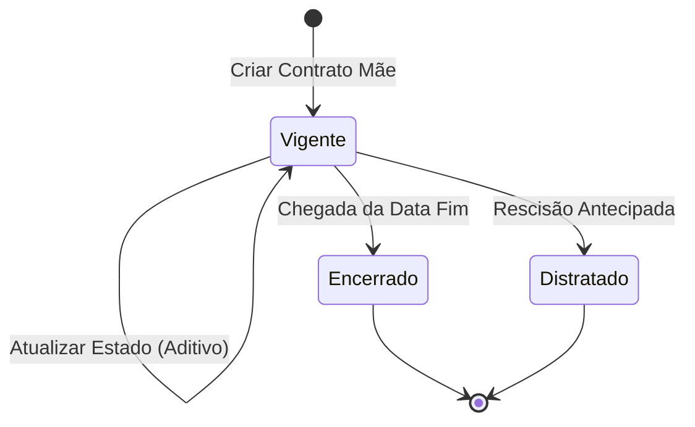

[← Voltar ao Módulo Contratos](./README.md)

# 🧩 Bounded Context: Gestão de Contratos

> **Status:** vigente | **Última revisão:** 2026-04-28

---

## 1. Papel do Contexto no Mapa

Este é o **Core Domain ⭐** principal. É o guardião da definição do **Contrato Mãe** e o responsável por expor o **Estado Contratual Vigente** (valor e prazo que valem "hoje"). Não processa aditivos, mas reage à homologação deles para atualizar seus indicadores.

## 2. Atores

- **Gestor** — Realiza o cadastro inicial (Contrato Mãe).
- **Operador** — Consulta o saldo e a vigência atualizada.
- **Auditor** — Verifica se o estado atual condiz com os registros históricos.

## 3. Agregados e Entidades

```ts
interface Contrato {
  id: ContratoID;
  numeroSequencial: string; // 000/AAAA — gerado automaticamente
  titulo: string;
  objeto: string;
  dataAssinatura: Date;

  // Valores Originais (imutáveis após criação)
  valorOriginal: Moeda;
  vigenciaOriginal: Periodo;

  // Estado Vigente (calculado dinamicamente)
  valorVigente: Moeda;
  vigenciaVigente: Periodo;
  status: StatusContrato; // Vigente, Encerrado, Distratado
}
```

> **Raciocínio:** O Contrato é a raiz do agregado. Os campos "originais" servem como âncora histórica, enquanto os campos "vigentes" são os que o restante do ERP consome.

## 4. Value Objects e Enums

- **StatusContrato** — `Vigente`, `Encerrado`, `Distratado`.
- **Moeda** — Garante precisão decimal (2 casas), evita erros de arredondamento. Em MySQL: `DECIMAL(15, 2)`.
- **Período** — `dataInicio` + `dataFim`, com validação cronológica.

## 5. Comandos / Casos de Uso Principais

### Criar Contrato Mãe

- **Quem chama:** Gestor.
- **Pré-condições:** Título, Objeto, Valor e Vigência inicial informados; documento principal anexado.
- **Efeitos:**
  1. Gera número sequencial padronizado `000/AAAA`.
  2. Define `valorVigente = valorOriginal`.
  3. Define `vigenciaVigente = vigenciaOriginal`.
  4. Status inicial = `Vigente`.
- **Evento publicado:** `ContratoMaeCriado`.

### Atualizar Estado Vigente

- **Quem chama:** Sistema (reação a `AditivoHomologado`).
- **Pré-condições:** Aditivo homologado recebido do contexto de Aditivos.
- **Efeitos:**
  1. Recalcula `valorVigente` (Σ acréscimos − Σ supressões).
  2. Recalcula `vigenciaVigente` (se aditivo tipo Prazo).
- **Evento publicado:** `EstadoContratualAtualizado`.

### Encerrar Contrato

- **Quem chama:** Sistema (chegada da data fim) ou Gestor (distrato).
- **Efeitos:** Status → `Encerrado` ou `Distratado`. Bloqueia novos aditivos de valor.
- **Evento publicado:** `ContratoEncerrado`.

## 6. Eventos de Domínio

| Evento | Gatilho | Descrição |
| :--- | :--- | :--- |
| `ContratoMaeCriado` | Finalização do cadastro inicial | Novo contrato entrou no ecossistema. |
| `EstadoContratualAtualizado` | Homologação de aditivo | Notifica interessados (Financeiro) que saldo/prazo mudou. |
| `ContratoEncerrado` | Chegada da data fim ou ação manual | Contrato não permite mais aditivos de valor. |

## 7. Máquina de Estados



## 8. Invariantes e Regras de Negócio

- **R1 (Cálculo de Valor)** — `valorVigente` nunca pode ser editado manualmente. É soma algébrica do original com aditivos homologados.
- **R2 (Numeração)** — Número sequencial é imutável e único para todo o ciclo de vida.
- **R3 (Status terminal)** — Contrato `Encerrado` ou `Distratado` não pode receber novos aditivos de acréscimo, supressão ou prazo.
- **R4 (Chave lógica)** — Não pode existir mais de um contrato com a mesma combinação `numero + ano`.
- **R5 (Preservação)** — Valor original e vigência original permanecem como referência histórica; nunca sobrescritos.

## 9. Fluxo Exemplar ("Filminho")

O Gestor cadastra um contrato de R$ 100.000,00 com validade de 12 meses. O sistema gera o número `001/2026`. Meses depois, o contexto de Aditivos avisa que um acréscimo de R$ 20.000,00 foi homologado. O contexto de Gestão de Contratos imediatamente "acorda", recalcula e passa a expor R$ 120.000,00 como **Valor Vigente** para qualquer relatório ou consulta do Operador — e para o módulo Financeiro via evento `EstadoContratualAtualizado`.

## 10. Glossário Específico

- **Contrato Mãe** — Registro inicial que estabelece o vínculo jurídico original.
- **Estado Vigente** — Fotografia atual do contrato considerando todas as alterações formalizadas.
