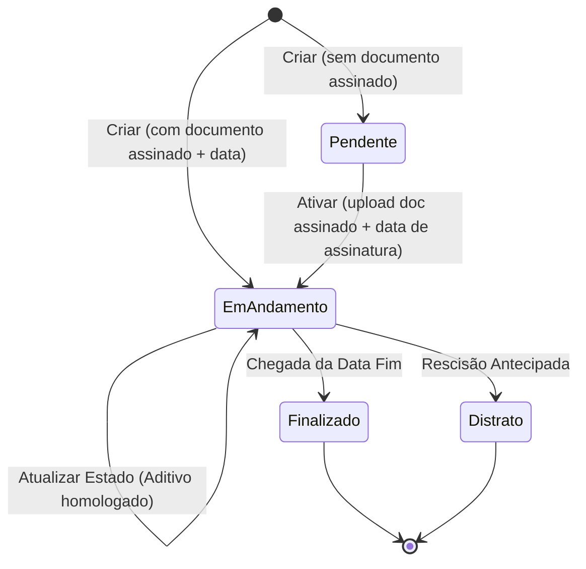

# 🧩 Bounded Context: Gestão de Contratos

> **Revisão 2026-05-27 ([ADR-0023](../../../architecture/adr/0023-contract-lifecycle-pending-state.md), decide [Inquiry-0021](../../../inquiries/0021-contract-status-lifecycle-http.md)):** o ciclo de vida passou de 3 para **4 estados** — o contrato pode nascer `Pendente` (cadastrado sem documento assinado, sem efetividade) e é **ativado** ao anexar o documento assinado + data de assinatura. Termos canônicos alinhados à P.O.

## 1. Papel do Contexto no Mapa
Este é o **Core Domain** principal. Ele é o guardião da definição do **Contrato Mãe** e o responsável por expor o **Estado Contratual Vigente** (o valor e o prazo que valem "hoje"). Ele não processa aditivos, mas reage à homologação deles para atualizar seus próprios indicadores.

## 2. Atores
* **Gestor**: Realiza o cadastro inicial (Contrato Mãe).
* **Operador**: Consulta o saldo e a vigência atualizada.
* **Auditor**: Verifica se o estado atual condiz com os registros históricos.

## 3. Agregados e Entidades
```ts
interface Contrato {
  id: ContratoID;
  numeroSequencial: string; // Gerado automaticamente
  titulo: string;
  objeto: string;
  dataAssinatura?: Date; // AUSENTE em Pendente; presente a partir da ativação

  // Valores Originais (Imutáveis após criação)
  valorOriginal: Moeda;
  vigenciaOriginal: Periodo;

  // Estado Vigente (Calculado dinamicamente — efetivo só a partir de Em Andamento)
  valorVigente: Moeda;
  vigenciaVigente: Periodo;
  status: StatusContrato; // Pendente, Em Andamento, Finalizado, Distrato
}
```

> **Raciocínio**: O Contrato é a raiz do agregado. Os campos "originais" servem como âncora histórica, enquanto os campos "vigentes" são os que o restante do ERP consome.
>
> **Estado refinado por status (DDD):** na implementação, `Pendente` é um **tipo refinado** sem `dataAssinatura` e sem vigência efetiva — não um campo nulável solto. A transição `Pendente → Em Andamento` (ativação) adiciona `dataAssinatura` + a referência do documento assinado e inicia a vigência (`vigente = original`). Espelha o padrão do agregado `Aditivo` (`Pendente → Pendente-com-documento → Homologado`).

## 4. Value Objects e Enums

* **StatusContrato** (4 estados): `Pendente`, `Em Andamento`, `Finalizado`, `Distrato`.

  Mapeamento canônico (código em EN; termos de UI/ACL em PT, conforme P.O.):

  | Código (`status`) | UI / ACL (PT) | Sinônimo antigo (pré-ADR-0023) |
  | :--- | :--- | :--- |
  | `Pending` | `Pendente` | — (novo) |
  | `Active` | `Em Andamento` | `Vigente` |
  | `Expired` | `Finalizado` | `Encerrado` |
  | `Terminated` | `Distrato` | `Distratado` |

  > `Assinado` e `Em Andamento` são o **mesmo** estado (vigente). `Pendente` **não tem efetividade**: não inicia vigência, não aceita aditivos, sem vínculo financeiro.
* **Moeda**: Objeto que garante a precisão decimal (2 casas) e evita erros de arredondamento.
* **Período**: Contém `dataInicio` e `dataFim`, com regras de validação cronológica.

## 5. Comandos / Casos de Uso Principais

### Criar Contrato Mãe
* **Quem chama**: Gestor.
* **Pré-condições**: Título, Objeto, Valor e Vigência inicial informados.
* **Efeitos** (criação **dual**, conforme presença do documento assinado):
  1. Gera número sequencial padronizado.
  2. **Sem documento assinado** → status `Pendente`; vigência **não** inicia (sem `valorVigente`/`vigenciaVigente` efetivos), sem `dataAssinatura`.
  3. **Com documento assinado + data de assinatura** → status `Em Andamento`; define `valorVigente` = `valorOriginal` e `vigenciaVigente` = `vigenciaOriginal`.
* **Evento publicado**: `ContratoMaeCriado` (carrega o estado inicial: `Pendente` ou `Em Andamento`).

### Ativar Contrato (Pendente → Em Andamento)
* **Quem chama**: Gestor/Operador.
* **Pré-condições**: contrato em `Pendente`; upload do documento assinado + preenchimento da data de assinatura.
* **Efeitos**:
  1. Anexa a referência do documento assinado e registra `dataAssinatura`.
  2. Inicia a vigência: `valorVigente` = `valorOriginal`, `vigenciaVigente` = `vigenciaOriginal`.
  3. Transita status para `Em Andamento`.
* **Evento publicado**: `ContratoAtivado` (`ContractActivated`).

### Atualizar Estado Vigente
* **Quem chama**: Sistema (reação à homologação de aditivo).
* **Pré-condições**: Aditivo homologado recebido do contexto de Aditivos.
* **Efeitos**:
  1. Recalcula `valorVigente` (Somatório de original + acréscimos − supressões).
  2. Recalcula `vigenciaVigente` (Se o aditivo for do tipo Prazo).
* **Evento publicado**: `EstadoContratualAtualizado`.

## 6. Eventos de Domínio

| Evento | Gatilho | Descrição |
| :---- | :---- | :---- |
| ContratoMaeCriado | Finalização do cadastro inicial | Indica que um novo contrato entrou no ecossistema (estado `Pendente` ou `Em Andamento`). |
| ContratoAtivado (`ContractActivated`) | Upload do documento assinado + data, num contrato `Pendente` | Contrato passa a vigorar (`Pendente → Em Andamento`); vigência inicia. |
| EstadoContratualAtualizado | Homologação de aditivo | Notifica interessados (como o Financeiro) que o saldo ou prazo mudou. |
| ContratoEncerrado | Chegada da data fim ou ação manual | O contrato não permite mais aditivos de valor. |

## 7. Máquina de Estado



## 8. Invariantes e Regras de Negócio

* **R1 (Cálculo de Valor)**: O `valorVigente` nunca pode ser editado manualmente. Ele é obrigatoriamente a soma algébrica do original com aditivos assinados.
* **R2 (Numeração)**: O número sequencial é imutável e único para todo o ciclo de vida.
* **R3 (Status)**: Um contrato `Finalizado` ou `Distrato` não pode receber novos aditivos de acréscimo ou supressão.
* **RN-CV-01 (Pendente sem efetividade)**: um contrato `Pendente` **não aceita aditivos** (criar/anexar/homologar) — apenas `Em Andamento` aceita. Estende R3 para o estado inicial.
* **RN-CV-02 (Ativação por assinatura)**: a transição `Pendente → Em Andamento` **exige** a referência do documento assinado **+** a data de assinatura. Sem ambos, o contrato permanece `Pendente`. Espelha a RN-12 do agregado Aditivo (homologação exige documento assinado).

## 9. Fluxo Exemplar ("Filminho")

O Gestor cadastra um contrato de R$ 100.000,00 com validade de 12 meses. O sistema gera o número `001/2024`. Meses depois, o contexto de Aditivos avisa que um acréscimo de R$ 20.000,00 foi assinado. O contexto de Gestão de Contratos imediatamente "acorda", soma os valores e passa a exibir R$ 120.000,00 como **Valor Vigente** para qualquer relatório ou consulta do Operador.

## 10. Glossário Específico

* **Contrato Mãe**: O registro inicial que estabelece o vínculo jurídico original.
* **Estado Vigente**: A fotografia atual do contrato, considerando todas as alterações legais já processadas.
