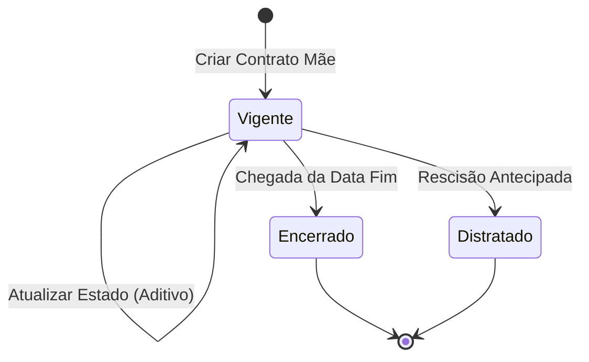

# 🧩 Bounded Context: Gestão de Contratos

## 1. Papel do Contexto no Mapa
Este é o **Core Domain** principal. Ele é o guardião da definição do **Contrato Mãe** e o responsável por expor o **Estado Contratual Vigente** (o valor e o prazo que valem "hoje"). Ele não processa aditivos, mas reage à homologação deles para atualizar seus próprios indicadores.

## 2. Atores
* **Gestor**: Realiza o cadastro inicial (Contrato Mãe).
* **Operador**: Consulta o saldo e a vigência atualizada.
* **Auditor**: Verifica se o estado atual condiz com os registros históricos.

## 3. Agregados e Entidades
```ts
interface Contrato {
  id: ContratoID;
  numeroSequencial: string; // Gerado automaticamente
  titulo: string;
  objeto: string;
  dataAssinatura: Date;

  // Valores Originais (Imutáveis após criação)
  valorOriginal: Moeda;
  vigenciaOriginal: Periodo;

  // Estado Vigente (Calculado dinamicamente)
  valorVigente: Moeda;
  vigenciaVigente: Periodo;
  status: StatusContrato; // Vigente, Encerrado, Distratado
}
```

> **Raciocínio**: O Contrato é a raiz do agregado. Os campos "originais" servem como âncora histórica, enquanto os campos "vigentes" são os que o restante do ERP consome.

## 4. Value Objects e Enums

* **StatusContrato**: `Vigente`, `Encerrado`, `Distratado`.
* **Moeda**: Objeto que garante a precisão decimal (2 casas) e evita erros de arredondamento.
* **Período**: Contém `dataInicio` e `dataFim`, com regras de validação cronológica.

## 5. Comandos / Casos de Uso Principais

### Criar Contrato Mãe
* **Quem chama**: Gestor.
* **Pré-condições**: Título, Objeto, Valor e Vigência inicial informados.
* **Efeitos**:
  1. Gera número sequencial padronizado.
  2. Define `valorVigente` = `valorOriginal`.
  3. Define `vigenciaVigente` = `vigenciaOriginal`.
  4. Define status como `Vigente`.
* **Evento publicado**: `ContratoMaeCriado`.

### Atualizar Estado Vigente
* **Quem chama**: Sistema (reação à homologação de aditivo).
* **Pré-condições**: Aditivo homologado recebido do contexto de Aditivos.
* **Efeitos**:
  1. Recalcula `valorVigente` (Somatório de original + acréscimos − supressões).
  2. Recalcula `vigenciaVigente` (Se o aditivo for do tipo Prazo).
* **Evento publicado**: `EstadoContratualAtualizado`.

## 6. Eventos de Domínio

| Evento | Gatilho | Descrição |
| :---- | :---- | :---- |
| ContratoMaeCriado | Finalização do cadastro inicial | Indica que um novo contrato entrou no ecossistema. |
| EstadoContratualAtualizado | Homologação de aditivo | Notifica interessados (como o Financeiro) que o saldo ou prazo mudou. |
| ContratoEncerrado | Chegada da data fim ou ação manual | O contrato não permite mais aditivos de valor. |

## 7. Máquina de Estado



## 8. Invariantes e Regras de Negócio

* **R1 (Cálculo de Valor)**: O `valorVigente` nunca pode ser editado manualmente. Ele é obrigatoriamente a soma algébrica do original com aditivos assinados.
* **R2 (Numeração)**: O número sequencial é imutável e único para todo o ciclo de vida.
* **R3 (Status)**: Um contrato `Encerrado` ou `Distratado` não pode receber novos aditivos de acréscimo ou supressão.

## 9. Fluxo Exemplar ("Filminho")

O Gestor cadastra um contrato de R$ 100.000,00 com validade de 12 meses. O sistema gera o número `001/2024`. Meses depois, o contexto de Aditivos avisa que um acréscimo de R$ 20.000,00 foi assinado. O contexto de Gestão de Contratos imediatamente "acorda", soma os valores e passa a exibir R$ 120.000,00 como **Valor Vigente** para qualquer relatório ou consulta do Operador.

## 10. Glossário Específico

* **Contrato Mãe**: O registro inicial que estabelece o vínculo jurídico original.
* **Estado Vigente**: A fotografia atual do contrato, considerando todas as alterações legais já processadas.
