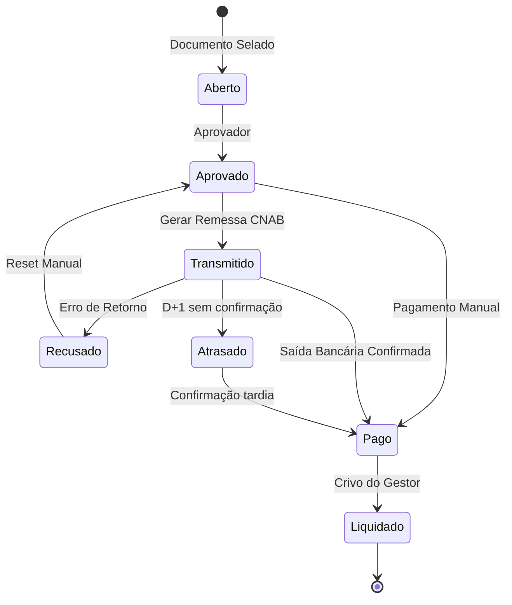

# 🧩 Bounded Context: Títulos e Liquidação

## 1. Papel no Mapa
Gere a vida financeira das obrigações. Sua missão é garantir que o fluxo de caixa do sistema reflita a realidade do banco, mas sempre sob o controle final do usuário (Governança).

## 2. Atores
* **Aprovador (Perfil)**: Único que pode mover um título de `Aberto` para `Aprovado`.
* **Operador de Contas a Pagar**: Gera os arquivos de remessa (CNAB), monitora rejeições, registra pagamentos manuais e solicita reaberturas.
* **Sistema (Integrador Bancário)**: Processa arquivos e muda status baseado em eventos técnicos (Retorno/Extrato).
* **Gestor Financeiro**: Dá a palavra final na **Liquidação** (Baixa).

## 3. Agregados e Entidades

```ts
TituloFinanceiro {
  id: TituloID;
  origem: DocumentoID;
  status: StatusTitulo; // Aberto, Aprovado, Transmitido, Recusado, Pago, Atrasado, Liquidado
  metodoPagamento: 'Remessa_Bancaria' | 'Manual_Externo';
  dadosPagamento: {
    valor: Money;
    vencimento: Date;
    saidaBancariaReal: Date; // Confirmado pelo extrato
    fitid: string; // Identificador único da transação para evitar duplicidade
  };
}
```

## 4. Comandos / Casos de Uso Principais

| Comando | Quem chama | Pré-condições | Efeito | Evento Publicado |
| :--- | :--- | :--- | :--- | :--- |
| **AprovarTitulo** | Aprovador | Título em `Aberto` | Habilita título para pagamento. | `TituloAprovado` |
| **GerarRemessa** | Operador | Títulos em `Aprovado` | Agrupa em CNAB e muda para `Transmitido`. | `TituloTransmitido` |
| **RegistrarPagamentoManual** | Operador | Título em `Aprovado` | Pula remessa e define status como `Pago`. | `TituloPagoManualmente` |
| **ProcessarSaidaBancaria** | Sistema | Retorno da VAN/Extrato | Se confirmado, status vai de `Transmitido` para `Pago`. | `SaidaBancariaConfirmada` |
| **MarcarComoAtrasado** | Sistema/Operador | D+1 e status `Transmitido` | Identifica que a saída bancária não ocorreu. | `PagamentoAtrasado` |
| **AutorizarLiquidacao** | Gestor | Título em `Pago` | Efetiva a baixa final no sistema (Crivo Humano). | `TituloLiquidado` |

## 5. Invariantes e Regras de Negócio
* **R1 (Soberania da Aprovação)**: Somente títulos com perfil `Aprovado` podem ser incluídos em arquivos de remessa ou marcados como `Pago`.
* **R2 (Anti-Duplicidade FITID)**: O sistema deve recusar a importação de qualquer transação de extrato (OFX, XLSX, PDF) cujo `FITID` já tenha sido processado anteriormente.
* **R3 (Diferenciação Retorno vs. Saída)**: O sucesso no arquivo de retorno (CNAB) é apenas um status informativo. O status `PAGO` só é atingido após a confirmação da **Saída Bancária** (extrato/retorno de liquidação).
* **R4 (Controle de Liquidação)**: A mudança de `PAGO` para `LIQUIDADO` nunca é automática. O sistema sugere o "casamento" dos dados, mas exige a autorização do Gestor.
* **R5 (Status Atrasado)**: Se após a data prevista de pagamento o título permanecer como `Transmitido` (sem retorno de saída bancária), o sistema o sinaliza como `ATRASADO` para ação imediata do operador.

## 6. Fluxos de Status e Transições

### O Caminho da Saída Bancária
1. `ABERTO` → `APROVADO` (Ação do Aprovador)
2. `APROVADO` → `TRANSMITIDO` (Operador gera CNAB)
3. `TRANSMITIDO` → `PAGO` (Sistema lê saída bancária em D+1)
4. `PAGO` → `LIQUIDADO` (Gestor autoriza a baixa na conciliação)

### O Caminho Manual (Fora da Remessa)
1. `ABERTO` → `APROVADO`
2. `APROVADO` → `PAGO` (Operador registra que pagou via Internet Banking, por exemplo)
3. `PAGO` → `LIQUIDADO` (Gestor concilia com o extrato)

## 7. Máquina de Estados do Título



## 8. Glossário Específico
* **FITID**: Identificador único da transação bancária que garante que um pagamento de R$ 100,00 não seja lançado duas vezes se o arquivo for reimportado.
* **Saída Bancária**: O evento real de débito na conta da entidade, soberano sobre o arquivo de remessa.
* **Crivo de Liquidação**: Ato de governança onde o gestor confirma que a conciliação sugerida pelo sistema está correta.
* **Título Filho**: Obrigação tributária derivada de um documento fiscal.
* **Remessa**: Arquivo enviado ao banco com ordens de pagamento.
* **Retorno**: Arquivo recebido do banco confirmando o processamento.
