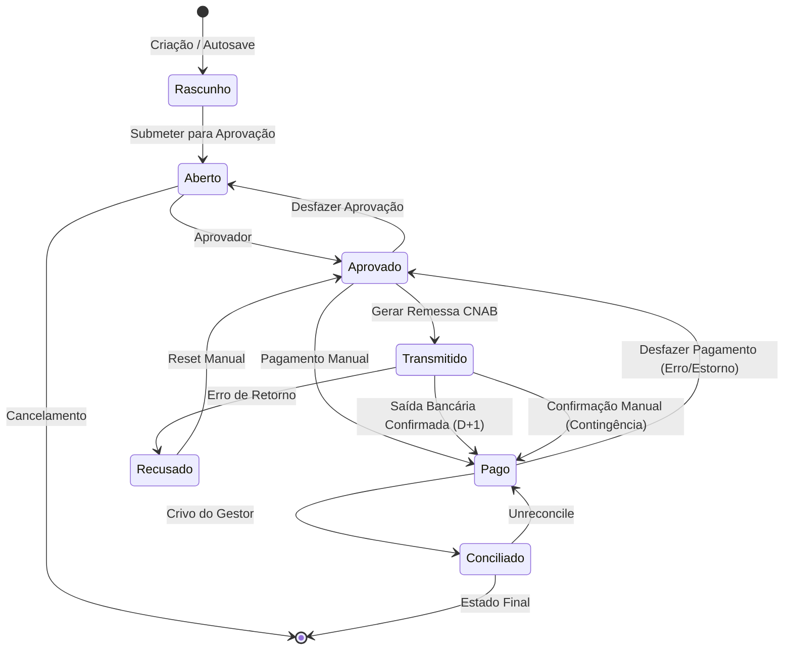

# 🧩 Bounded Context: Títulos e Liquidação

## 1. Papel no Mapa

Gere a vida financeira das obrigações. Sua missão é garantir que o fluxo de caixa do sistema reflita a realidade do banco, mas sempre sob o controle final do usuário (Governança).

## 2. Atores

* **Operador de Contas a Pagar**: Gera os arquivos de remessa (CNAB), monitora rejeições, registra pagamentos manuais e solicita reaberturas.
* **Aprovador (Perfil)**: Único que pode mover um título de `Aberto` para `Aprovado`.
* **Sistema (Integrador Bancário)**: Processa arquivos e muda status baseado em eventos técnicos (Retorno/Extrato).
* **Operador do Submódulo Conciliação**: Executa o processo de conciliação (casamento título/extrato) e pode autorizar o **Unreconcile**. Pode ser o mesmo usuário que o Aprovador/Gestor Financeiro, mas nunca um Operador/Analista de Contas a Pagar.

## 3. Agregados e Entidades

```ts
TituloFinanceiro {
  id: TituloID;
  origem: DocumentoID;
  status: StatusTitulo; // Rascunho, Aberto, Aprovado, Transmitido, Recusado, Pago, Conciliado
  flagsProcessamento: {
    acatadoPeloBanco: boolean; // Indicador lógico (não persistido como status): true quando retorno positivo
  };
  tipo: 'Pai' | 'Filho';
  tipoDocumentoOrigem: 'NFS-e' | 'DANFE' | 'RPA' | 'Fatura' | 'Boleto' | 'Recibo' | 'Imposto'; // Copiado do documento de origem
  formaPagamento: 'TED' | 'Transferencia_Bancaria' | 'PIX' | 'Boleto' | 'Cartao_Corporativo' | 'Cambio' | 'Guia_Recolhimento' | 'Outro';
  metodoPagamento: 'Remessa_Bancaria' | 'Manual_Externo';
  dadosPagamento: {
    valor: Money;
    vencimento: Date;
    saidaBancariaReal: Date; // Confirmado pelo extrato
    fitid: string; // Identificador único da transação para evitar duplicidade
  };
  camposEditaveis: string[]; // Lista de campos editáveis no status atual
}
```

## 4. Comandos / Casos de Uso Principais

| Comando | Quem chama | Pré-condições | Efeito | Evento Publicado |
| :--- | :--- | :--- | :--- | :--- |
| **SalvarRascunho** | Operador | — | Cria ou atualiza título com flag `is_draft`. | `RascunhoSalvo` |
| **SubmeterParaAprovacao** | Operador | Rascunho preenchido ou edição em Aberto | Move status para `Aberto`. Dispara validação de campos obrigatórios. | `TituloSubmetido` |
| **AprovarTitulo** | Aprovador | Título em `Aberto` | Habilita título para pagamento. Aprova automaticamente todos os filhos. | `TituloAprovado` |
| **GerarRemessa** | Operador | Títulos em `Aprovado` com forma de pagamento **TED** ou **Transferência Bancária** | Agrupa em CNAB e muda para `Transmitido`. | `TituloTransmitido` |
| **RegistrarPagamentoManual** | Operador | Título em `Aprovado` | Pula remessa (ex: Internet Banking) e define status como `Pago`. Habilita conciliação. | `TituloPagoManualmente` |
| **ProcessarRetornoBancario** | Sistema | Arquivo de retorno da VAN | Se erro: status `Recusado`. Se acatado: permanece `Transmitido` (flag `acatadoPeloBanco: true`). | `RetornoProcessado` |
| **SinalizarSaidaBancaria** | Sistema | Extrato D+1 confirmando débito | Move de `Transmitido` para `Pago`. | `SaidaBancariaConfirmada` |
| **MarcarPagoManualmente** | Operador | Título em `Transmitido` com flag `acatadoPeloBanco: true` (contingência) | Marca como `Pago` quando extrato D+1 falha. Também habilita conciliação. | `TituloPagoManualmente` |
| **AutorizarConciliacao** | Operador do Submódulo Conciliação | Título em `Pago` | Efetiva a conciliação final no sistema (casamento título/extrato). | `TituloConciliado` |
| **DesfazerPagamento** | Operador/Gestor | Título em `Pago` | Retorna status para `Aprovado` (erro ou estorno). | `PagamentoDesfeito` |
| **DesfazerConciliacao** | Operador do Submódulo Conciliação | Título em `Conciliado` | Retorna status para `Pago`. | `ConciliacaoDesfeita` |
| **DesfazerAprovacao** | Aprovador | Título em `Aprovado` | Move para `Aberto`. UX: botão "DESFAZER APROVAÇÃO" com alerta. Redireciona para tela de inclusão com campos habilitados. | `AprovacaoDesfeita` |
| **ResetarRecusado** | Operador | Título em `Recusado` | Move status para `Aprovado` para nova tentativa. | `TituloResetado` |

## 5. Invariantes e Regras de Negócio

* **R0 (Pré-requisito de Conciliação)**: **Somente títulos com status `Pago` podem ser conciliados.** Títulos em qualquer outro status (`Aprovado`, `Transmitido`, `Recusado`, etc.) não entram no submódulo Conciliação. Por isso existem os fluxos de pagamento manual: para permitir conciliação quando a confirmação automática falha.
* **R1 (Soberania da Aprovação)**: Somente títulos com status `Aprovado` (ou descendente) podem ser incluídos em arquivos de remessa ou marcados como `Pago`.
* **R2 (Anti-Duplicidade FITID)**: O sistema deve recusar a importação de qualquer transação de extrato (OFX, XLSX, PDF) cujo `FITID` já tenha sido processado anteriormente.
* **R3 (Diferenciação Retorno vs. Saída)**:
  * O sucesso no arquivo de retorno (acatamento) **não altera o status** do título (permanece `Transmitido`), mas ativa a flag lógica `acatadoPeloBanco: true`. O status `Pago` só é atingido após a confirmação da **Saída Bancária** real (extrato D+1) ou por ação manual explícita.
  * O estado `AguardandoAprovacao` é um **sub-estado lógico/transitório** (não persistido no banco) que representa o período entre o acatamento e a saída bancária.
* **R4 (Controle de Conciliação)**: A mudança de `Pago` para `Conciliado` nunca é automática. O sistema sugere o "casamento" dos dados, mas exige a autorização do Gestor. O desfazimento (`Unreconcile`) retorna o título para `Pago`.
* **R5 (Status Recusado)**: Títulos rejeitados no arquivo de retorno assumem o status `Recusado`. Para seguir novamente, um operador deve revisar o erro e alterar manualmente o status para `Aprovado`, permitindo nova inclusão em remessa.
* **R6 (Imutabilidade Transmitido)**: Uma vez `Transmitido`, o título entra em **lock total**. Alterações de qualquer natureza (incluindo vencimento) são proibidas via código para garantir a paridade com o arquivo enviado ao Bradesco.
* **R7 (Herança de Aprovação)**: A aprovação do Título **Pai** dispara o gatilho automático de aprovação para todos os **Filhos**.
* **R7.1 (Independência do Ciclo de Vida)**: Apesar da herança de aprovação, cada título (pai e filhos) possui **ciclo de vida financeiro independente**. O pagamento, a baixa e a conciliação de um título pai **não** se propagam automaticamente para os filhos. Cada filho é uma obrigação a pagar distinta e deve ser pago, baixado e conciliado individualmente.
* **R8 (Geração de Filhos por Tipo de Documento)**: Títulos filhos só são gerados para documentos de origem `NFS-e` (ISS, IRRF, INSS, CSRF) e `RPA` (IRRF, INSS, CSRF). Documentos `DANFE`, `Fatura`, `Boleto`, `Recibo` e `Imposto` **nunca** geram filhos.
* **R8.2 (Forma de Pagamento e Remessa CNAB)**: Somente títulos com forma de pagamento **TED** ou **Transferência Bancária** podem ser incluídos em arquivos de remessa CNAB e movidos para `Transmitido`. Títulos com outras formas (PIX, Boleto, Cartão Corporativo, Câmbio, Guia de Recolhimento, Outro) seguem o fluxo de **pagamento manual** (`Aprovado` → `Pago`).
* **R8.1 (Hard Delete em Edição)**: Ao desfazer a aprovação e **alterar valores** do Título Pai, os títulos filhos são marcados para **deleção física (hard delete)**. Novos filhos são instanciados após a nova aprovação para garantir que as obrigações fiscais reflitam a última alteração do documento. Se não houver alteração de valores, os filhos apenas perdem a aprovação e são reaproveitados.
* **R9 (Edição Granular por Tipo)**:
  * **Título Pai (em `Aberto`)**: Edição total permitida, com logs de alteração.
  * **Título Filho (em `Aberto`)**: Bloqueio de valor, favorecido, centro de custo, conta de despesa e demais campos. Permite apenas alteração de **DataVencimento** e campo **"Descrição"**.
  * **Título Pai e Filho (em `Aprovado`)**: Bloqueio de campos de valor, fornecedor, conta bancária e campos herdados do módulo de contratos. Permite unicamente a alteração de **DataVencimento** e campo **"Descrição"**.
* **R9.1 (Alteração de Vencimento em Lote)**: O operador pode selecionar múltiplos títulos no grid e alterar a data de vencimento de todos simultaneamente. **Restrições**:
  * Títulos em status `Transmitido`, `Recusado`, `Pago` ou `Conciliado` **não podem** ter o vencimento alterado.
  * Títulos filhos seguem a mesma regra: se o pai tiver o vencimento alterado, os filhos **não** são automaticamente atualizados (cada um tem seu próprio vencimento, geralmente igual ao pai, mas podem divergir em casos especiais).
  * A alteração em lote gera entrada na trilha de auditoria para cada título afetado.
* **R10 (Rascunho e Autosave)**: O estado `Rascunho` permite CRUD total. Dispara alertas de campos obrigatórios não preenchidos antes da promoção para `Aberto` ou se ocorrer interrupção de sessão.
* **R11 (Acatamento Lógico)**: Título `Transmitido` com flag `acatadoPeloBanco: true` indica que o banco aceitou o título para processamento, mas a saída bancária ainda não ocorreu. Permite transição direta para `Pago` de forma manual (fluxo contingencial) caso haja falha do sistema na leitura do extrato D+1. Bloqueio total de edição.
* **R12 (Desfazimento de Pagamento)**: O status `Pago` (tanto manual quanto automático) permite retorno para `Aprovado` mediante ação explícita do Operador ou Gestor. Essa transição é utilizada em casos de erro de lançamento, estorno bancário identificado ou necessidade de reprocessamento. O título volta a estar elegível para nova remessa ou pagamento manual.

## 6. Fluxos de Status e Transições

### O Caminho da Saída Bancária (Fluxo Padrão)

1. `RASCUNHO` → `ABERTO` (Operador submete para aprovação)
2. `ABERTO` → `APROVADO` (Ação do Aprovador)
3. `APROVADO` → `TRANSMITIDO` (Operador gera CNAB)
4. `TRANSMITIDO` (acatado pelo banco, flag `acatadoPeloBanco: true`)
5. `TRANSMITIDO` → `PAGO` (Confirmação de saída bancária em D+1 via extrato)
6. `PAGO` → `CONCILIADO` (Gestor autoriza a conciliação)

### O Caminho Manual (Fora da Remessa)

1. `RASCUNHO` → `ABERTO`
2. `ABERTO` → `APROVADO`
3. `APROVADO` → `PAGO` (Operador registra que pagou via Internet Banking, por exemplo)
4. `PAGO` → `CONCILIADO` (Gestor concilia com o extrato)

### O Caminho da Recuperação (Retorno com Erro)

1. `TRANSMITIDO` → `RECUSADO` (Erro no retorno do banco)
2. `RECUSADO` → `APROVADO` (Operador reset manual para nova tentativa)

### Desfazer Aprovação

1. `APROVADO` → `ABERTO` (Operador clica "DESFAZER APROVAÇÃO" no módulo Contas a Pagar)
   * Sistema exibe alerta: "Aprovação será desfeita. Os filhos terão sua aprovação desfeita."
   * Redireciona para tela de inclusão com campos habilitados
   * **Filhos**: perdem a aprovação automaticamente. Se o pai sofrer alteração de valores, os filhos sofrem **hard delete** e são recriados na nova aprovação para refletir as novas retenções.

### Desfazimento de Pagamento

1. `PAGO` → `APROVADO` (Operador/Gestor desfaz pagamento por erro ou estorno)

### Desfazimento de Conciliação

1. `CONCILIADO` → `PAGO` (Gestor executa `Unreconcile`)

## 7. Máquina de Estados do Título



## 8. Glossário Específico

* **FITID**: Identificador único da transação bancária que garante que um pagamento não seja lançado duas vezes se o arquivo for reimportado.
* **Saída Bancária**: O evento real de débito na conta da entidade, soberano sobre o arquivo de remessa.
* **Crivo de Conciliação**: Ato de governança onde o gestor confirma que o casamento entre título e extrato está correto.
* **Unreconcile**: Comando que desfaz a conciliação, retornando o título de `Conciliado` para `Pago`.
* **Desfazimento de Pagamento**: Comando que retorna o título de `Pago` para `Aprovado`, utilizado em casos de erro de lançamento ou estorno bancário.
* **Título Filho**: Obrigação tributária derivada de um documento fiscal.
* **Remessa**: Arquivo enviado ao banco com ordens de pagamento.
* **Retorno**: Arquivo recebido do banco confirmando o processamento ou erro.
* **Acatamento**: Confirmação do banco de que o título foi aceito para processamento.
