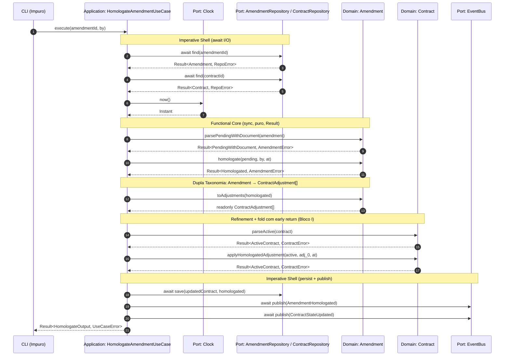

# Pergunta_E3_I1_I3_A4_tec_lider_using_skill_ts-domain-modeler

> **Status:** respondida-com-resolucao ✅ — PhD respondeu em 2 iterações (Q.1-5 + follow-up sobre legibilidade do Gabriel). Host detectou **contradição direta** entre as 2 iterações do PhD (combinator `andThen` vs early return) e investigou TS handbook + Node.js Errors.md por solicitação do Gabriel. Resolução final reduz combinators de 3 para 2, alinhando com o princípio "domínio não fala jargão de programador" (Wlaschin) e o "Gabriel-de-amanhã" como juiz arquitetural.
> **Origem:** entrevista 0001
> **Skill canônica:** `ts-domain-modeler`

---

## Por que unificar?

E3, I1, I3 e A4 parecem decisões independentes, mas são **quatro contextos do mesmo problema**: composição de `Result<T, E>` em sequência sem cair em cascata infinita de `if (!result.ok) return result`. Decidir uma biblioteca/abordagem (I1) sem decidir as estratégias (I3 — fail-fast vs collect; A4 — short-circuit por tag; E3 — guard clauses) gera dissonância. Vão como pacote.

E o PhD literalmente fechou a resposta anterior abrindo essa porta:

> *"Agora que cravamos o template das 'folhas' (Value Objects), como você quer estruturar a composição desses Resultados quando um Agregado (como `Contract`) precisar invocar múltiplos smart constructors simultaneamente ao ser reidratado pelo Adapter, sem cair num inferno de `if (!result.ok)` aninhados?"*

Esta pergunta é exatamente a resposta.

---

## Q (host) — versão formal

Quatro contextos no domínio onde a cascata de `Result` aparece — cada um com características próprias:

### Contexto α — Agregado (E3): `applyHomologatedAdjustment`

```ts
// src/modules/contracts/domain/contract/contract.ts:130-194
const applyHomologatedAdjustment = (
  contract: Contract,
  adjustment: ContractAdjustment,
  at: Date,
): Result<CommandOutput, ContractError> => {
  const activeCheck = assertActive(contract);
  if (!activeCheck.ok) return activeCheck;
  const atCheck = assertValidEventDate(at);
  if (!atCheck.ok) return atCheck;
  if (contract.homologatedAmendmentIds.includes(adjustment.amendmentId)) {
    return err('contract-amendment-already-applied');
  }
  // … switch entre 4 kinds, cada um podendo falhar:
  switch (adjustment.kind) {
    case 'ValueDecrease': {
      const subtracted = Money.subtract(contract.currentValue, adjustment.amount);
      if (!subtracted.ok) return err('contract-value-would-go-negative');
      // …
    }
    // …
  }
};
```

**Características:** sequência **dependente** (cada check assume o anterior), erros **heterogêneos** (alguns são tagged do VO subjacente, outros são tagged do agregado), 60 linhas com 4 returns por branch.

### Contexto β — Use case command (I3): `createContract`

```ts
// hipotético — src/modules/contracts/application/use-cases/create-contract.ts
const sequentialNumber = parseSequentialNumber(input.sequentialNumber);
if (!sequentialNumber.ok) return sequentialNumber;

const originalValue = Money.fromCents(input.originalValueCents);
if (!originalValue.ok) return originalValue;

const originalPeriod = Period.create(input.startDate, input.endDate);
if (!originalPeriod.ok) return originalPeriod;

// → fail-fast. Usuário descobre 1 erro por vez. Se mandou 3 campos inválidos, vê só o primeiro.
```

**Características:** sequência **independente** (campos paralelos do mesmo input), erros poderiam ser **coletados em paralelo** — `Result<T, NonEmptyArray<E>>`. UX da CLI/HTTP melhora drasticamente.

### Contexto γ — Rehydration do Adapter (A4): `rehydrateContract`

```ts
// src/modules/contracts/adapters/persistence/mappers/contract.ts
const id = ContractId.rehydrate(row.id);
if (!id.ok) return err({ tag: 'InvalidContractId', raw: row.id });

const originalValue = Money.fromCents(row.originalValueCents);
if (!originalValue.ok) return err({ tag: 'InvalidOriginalValue', cause: originalValue.error });

const originalPeriod = Period.create(row.originalStart, row.originalEnd);
if (!originalPeriod.ok) return err({ tag: 'InvalidOriginalPeriod', cause: originalPeriod.error });

// … 10+ VOs em sequência, cada um traduzindo erro do VO para tagged de RehydrationError
```

**Características:** sequência **independente** mas **erros precisam ser traduzidos** (do erro do VO para `RehydrationError` específico). 10+ blocos quase-idênticos. **Boilerplate massivo.**

### Contexto δ — Escolha de biblioteca (I1)

`shared/result.ts` é homemade:

```ts
export type Result<T, E> =
  | { readonly ok: true;  readonly value: T }
  | { readonly ok: false; readonly error: E };

export const ok  = <T>(value: T): Result<T, never> => ({ ok: true, value });
export const err = <E>(error: E): Result<never, E> => ({ ok: false, error });
```

Sem `.map`, `.andThen`, `.match`, sem combinators (`combine`, `traverse`, `sequence`), sem composição com `Promise`.

**Alternativas:**

| Biblioteca | Peso | Vantagens | Custos |
| :--- | :--- | :--- | :--- |
| **Homemade + helpers `Result.pipe`** | 0 deps, ~80 LOC | controle total, alinhamento com SKILL atual | reinventa roda, sem comunidade |
| **neverthrow** | ~5KB, 0 peer deps | API mínima (`.map`, `.andThen`, `.combine`), `ResultAsync` pra Promise | dependência externa em arquivo do domínio |
| **fp-ts** | ~50KB, viés HKT | rico, `pipe`, `traverse`, `sequence` | barreira de aprendizado alta |
| **Effect** | ~200KB, ecossistema completo | melhor experiência DX, `Effect.gen`, Schema, fibers | peso conceitual e de bundle |

### Perguntas integradas

1. **Q.1 — Qual biblioteca defende?** Caso responda "homemade", manda o que precisa estar no `Result.pipe` (assinatura mínima viável). Caso responda externa, qual e por quê — quais combinators são imprescindíveis pra fechar os 4 contextos acima?
2. **Q.2 — Fail-fast vs collect-errors:** quando aplicar cada? Heurística clara. Minha intuição: **fail-fast em sequências dependentes (α)**, **collect em sequências independentes (β, γ)**. Concorda?
3. **Q.3 — Tradução de erro (γ):** o boilerplate "se !result.ok return err({tag, cause: result.error})" repete 10× no mapper. Existe combinator canônico (`mapErr` + nome específico) que destrói esse boilerplate sem virar Effect?
4. **Q.4 — Sync vs async:** domínio é sync hoje. Mas use cases e mappers cruzam `Promise`. Como compor `Result<T, E>` com `Promise<Result<T, E>>` sem ceremony? `ResultAsync` à la neverthrow é a resposta, ou tem caminho mais simples?
5. **Q.5 — Cada contexto pede técnica diferente?** É legítimo ter **três estratégias coexistentes** (α: pipe sequencial, β: `combineAll`, γ: `traverse` com `mapErr`) — ou existe uma técnica unificadora que serve aos 3?

## Q (host) — versão narrativa (para colar em chat externo)

Cara, você abriu essa porta no fim da resposta passada — quero entrar agora. Implementei mentalmente o template canônico de Smart Constructor do Bloco B (Padrão D, `immutable`, tagged errors) e bateu uma realização: a beleza do template das **folhas** explode no momento que tento compor. Vou te mostrar os 4 lugares onde isso machuca, porque eles **parecem** o mesmo problema mas têm naturezas diferentes:

**α — No agregado.** `Contract.applyHomologatedAdjustment` faz 4 checks sequenciais, cada um dependente do anterior, e o switch interno ainda pode falhar. 60 linhas, 4 returns por branch. Erros heterogêneos — alguns vêm do VO (`Money.subtract`), outros do agregado.

```ts
const activeCheck = assertActive(contract);
if (!activeCheck.ok) return activeCheck;
const atCheck = assertValidEventDate(at);
if (!atCheck.ok) return atCheck;
// + idempotência + switch que ainda falha
```

**β — No use case.** `createContract` parsea 6 campos do input — todos **independentes**, mas hoje é fail-fast. Usuário manda 3 campos inválidos, só descobre 1 por vez na CLI/HTTP.

```ts
const sequentialNumber = parseSequentialNumber(input.sequentialNumber);
if (!sequentialNumber.ok) return sequentialNumber;
const originalValue = Money.fromCents(input.originalValueCents);
if (!originalValue.ok) return originalValue;
// ...
```

**γ — No mapper Drizzle.** Após o Bloco A travarmos `Result<Aggregate, RehydrationError>`, o `rehydrateContract` virou 10+ blocos idênticos:

```ts
const id = ContractId.rehydrate(row.id);
if (!id.ok) return err({ tag: 'InvalidContractId', raw: row.id });
const originalValue = Money.fromCents(row.originalValueCents);
if (!originalValue.ok) return err({ tag: 'InvalidOriginalValue', cause: originalValue.error });
// ... 8 mais ...
```

A diferença com β é que aqui **cada erro precisa ser traduzido** (`MoneyError` → `RehydrationError.InvalidOriginalValue`). Esse boilerplate de tradução é o que mais grita.

**δ — A escolha de biblioteca.** Hoje `shared/result.ts` é homemade — só `ok`/`err`/discriminated union. Sem `.map`, `.andThen`, `.combine`, sem composição com `Promise`. Tô olhando 4 caminhos e cada um carrega filosofia:

```
homemade + helpers Result.pipe   →  0 deps, controle total, reinventa
neverthrow                        →  ~5KB, API mínima, ResultAsync nativo, dependência no domínio
fp-ts                             →  ~50KB, HKT, pipe/traverse, curva alta
Effect                            →  ~200KB, ecossistema completo, peso conceitual
```

**As perguntas que tô lutando pra fechar sozinho:**

1. **Qual biblioteca você defende?** Se é homemade, manda a assinatura mínima do `Result.pipe` que precisa existir pra fechar os 4 contextos. Se é externa, qual e por quê — quais combinators são imprescindíveis?
2. **Fail-fast vs collect-errors:** quando aplicar cada? Minha intuição é fail-fast em sequência dependente (α — cada check exige o anterior), collect em sequência independente (β, γ — campos paralelos do mesmo input). Concorda, ou tem heurística melhor?
3. **O boilerplate de tradução do mapper (γ):** dá pra destruir com um combinator tipo `mapErr` + nome específico, sem virar Effect? Algo como `andThen.translate(err, fn)` que faz "se errou, embrulha o erro"?
4. **Sync vs async:** domínio é sync puro. Mas use cases e mappers cruzam `Promise`. Como compor `Result<T, E>` com `Promise<Result<T, E>>`? `ResultAsync` à la neverthrow é a resposta, ou existe caminho mais simples que mantém o domínio sync sem ceremony na borda?
5. **Cada contexto pede técnica diferente, ou existe uma unificadora?** É legítimo conviver com **três estratégias** (α: pipe sequencial; β: combineAll; γ: traverse-com-mapErr), ou você defende uma técnica única que serve aos 3 (e dorme bem à noite)?

Fecha essas 5 e a gente trava o `SKILL.md §3.I — Composição Funcional` + define a dependência externa do projeto (ou ratifica que continua zero-deps com `Result.pipe` homemade). E aí virtualmente fecha **Bloco I inteiro + E3 + A4** num pacote só.

## R (PhD)

A sua intuição está afiadíssima. Você não está lutando contra a linguagem; está esbarrando na exata fronteira onde os conceitos matemáticos da programação funcional encontram o pragmatismo do TypeScript. Os quatro lugares onde "machuca" exigem soluções diferentes porque eles são, de fato, problemas matemáticos diferentes (Monads vs. Applicatives).
Aqui está o veredito para cada uma das suas 5 perguntas, fundamentado nos princípios de Scott Wlaschin, Alexis King e na arquitetura Functional Core, Imperative Shell:
1. Qual biblioteca usar? (O problema δ)
Veredito: Homemade com combinators puros.
Wlaschin é taxativo: o código de domínio não deve usar jargões de programador ou depender de infraestrutura e frameworks
. O domínio dita as regras
.
Effect / fp-ts: Trazem um peso conceitual e sintático brutal que "vaza" para o domínio inteiro. Eles transformam o seu código de negócios em jargão puro de FP.
neverthrow: É uma excelente biblioteca, mas sua API baseada em classes (ResultAsync) carrega métodos amarrados à instância, o que dificulta o tree-shaking e foge da nossa decisão do Bloco B (usar objetos puros e funções livres).
Para manter o seu Functional Core isolado
, o ideal é estender o seu shared/result.ts homemade com as assinaturas exatas que você precisa. Aqui está a API mínima essencial:
export const Result = {
  ok: <T>(value: T): Result<T, never> => ({ ok: true, value }),
  err: <E>(error: E): Result<never, E> => ({ ok: false, error }),

  // α - Sequencial (Monadic Bind)
  andThen: <T, E, U, E2>(res: Result<T, E>, fn: (v: T) => Result<U, E2>): Result<U, E | E2> =>
    res.ok ? fn(res.value) : res,

  // γ - Tradução de Erro (Map Error)
  mapErr: <T, E, E2>(res: Result<T, E>, fn: (e: E) => E2): Result<T, E2> =>
    res.ok ? res : { ok: false, error: fn(res.error) },

  // β e γ - Validação Independente (Applicative)
  combine: <T extends Record<string, Result<any, any>>>(
    shape: T
  ): Result<
    { [K in keyof T]: T[K] extends Result<infer V, any> ? V : never },
    Array<T[keyof T] extends Result<any, infer E> ? E : never>
  > => {
    const errors = [];
    const values: any = {};
    for (const [k, res] of Object.entries(shape)) {
      if (!res.ok) errors.push(res.error);
      else values[k] = res.value;
    }
    return errors.length > 0 ? Result.err(errors) : Result.ok(values);
  }
};
2. Fail-fast vs Collect-errors (Os problemas α e β)
Veredito: Sua intuição é a regra de ouro da Programação Funcional.
Você deduziu sozinho a diferença entre computações Monádicas (sequenciais) e Aplicativas (paralelas).
Fail-fast (Sequencial/ α): Use em agregados ou regras de negócio onde o passo B depende estritamente do sucesso do passo A. Na FP, usamos andThen (flatMap) para isso. Se assertActive falhar, nem faz sentido tentar calcular o ajuste.
Collect-errors (Independente/ β e γ): Use na borda do sistema ao parsear inputs
. Quando o usuário submete 6 campos, eles não dependem entre si para existirem. Retornar um erro por vez frustra o usuário. Use o Result.combine para acumular a lista de erros.
3. O boilerplate de tradução do mapper (O problema γ)
Veredito: mapErr destrói esse boilerplate instantaneamente.
A tradução de erros na fronteira é inevitável — o erro de infraestrutura precisa virar erro de domínio (ou vice-versa) para mantermos o Ports and Adapters intacto
. Contudo, não precisamos de ifs imperativos. O combinator mapErr faz isso com elegância:
// γ - No mapper Drizzle, fica assim:
const idRes = Result.mapErr(ContractId.rehydrate(row.id), e => ({ tag: 'InvalidId', raw: row.id, cause: e }));
const valRes = Result.mapErr(Money.fromCents(row.originalValue), e => ({ tag: 'InvalidOriginalValue', cause: e }));

// O switch final do mapper vira um combine limpo:
return Result.mapErr(
  Result.combine({ id: idRes, originalValue: valRes }),
  errors => ({ tag: 'AggregateRehydrationFailed', errors }) 
);
4. Sync vs Async (O problema do Domínio vs Shell)
Veredito: O Domínio continua 100% Síncrono. Assuma a complexidade Async apenas na Application Layer (Imperative Shell).
Mark Seemann explica que funções puras não devem se misturar com I/O (que é inerentemente assíncrono em JS)
. A camada de Use Case (o shell imperativo) é quem lida com Promise.
Você não precisa de um ResultAsync no domínio. O padrão canônico é o Use Case fazer o await impuro, extrair o valor (ou capturar a falha da infra) e repassar o valor resolvido para as funções síncronas do domínio
.
Se no Use Case a manipulação de Promise<Result<T, E>> ficar verbosa, crie um pequeno helper na camada de aplicação (fora do domínio), mas preserve o Result do domínio puro.
5. Conviver com três estratégias é legítimo?
Veredito: Sim. Buscar uma única técnica unificadora é um anti-pattern.
Cada contexto pede a técnica adequada à sua natureza matemática:
α usa encadeamento de estado (Monads / andThen).
β usa parseamento exaustivo (Applicatives / combine).
γ usa mapeamento de fronteira (Functors / mapErr).
Essas três estratégias não são gambiarras conflitantes; elas são o ecossistema completo de ferramentas que permite o "Parse, don't validate"
 funcionar de forma ergonômica, tratando as falhas com o "cuidado terno que exigem".


 ## (COMENTÁRIOS do GABRIEL):
 - Eu gostei da resposta do PhD, porém seria interessante dar uma pensada com calma tbm para a LEGIBILIDADE SEMANTICA do codigo, lembrar que o GABRIEL de amanhã, não vai lembrar dessa conversa então eu tenho tbm que bater o olho e não precisar abrir 15 arquivos de "helpers" para poder entender o que eu mesmo escrevi antes, ou ver Um codigo assim do nada: 
 ~ex puramente ilustrativo... nunca ocorreu... (Contem ironia)~
 ```ts
 const a = pipe(b(RESULT.ok(c(Result.ok(d(result.err(e || f(Result.ok("oi")))))))))
```
Então, vamos tentar manter a semantica MESMO sendo funcional da leitura humana fácil, então talvez um DRY + um Single Responsábility para quebrar várias funções separadas validando e dps com um compose ou pipe não sei... Tbm podemos ver o que o propio Node e ts falam disso.

### Resposta do PhD sobre a minha pergunta:
"O "Gabriel do amanhã" é o juiz mais importante da sua arquitetura. A sua preocupação toca exatamente no ponto onde muitas equipes adotam Programação Funcional (FP) e fracassam: elas trocam a complexidade do negócio pela complexidade da sintaxe.
Scott Wlaschin é categórico quanto a isso em sua apresentação de Domain-Driven Design: "O código de domínio não deve usar jargão de programador"
. Ele defende que o código deve representar o modelo mental compartilhado com os especialistas do negócio, a ponto de um não-programador conseguir olhar para o código e validá-lo
. Uma "sopa de letrinhas" como pipe(b(RESULT.ok(c(...)))) é puro jargão matemático, não código de negócio.
O que o ecossistema TypeScript e Node.js dizem sobre isso? A resposta é clara: prefira o "Early Return" (Retorno Antecipado) e a Análise de Fluxo de Controle nativa do TypeScript em vez de encadeamentos funcionais profundos.
Aqui está como podemos garantir a legibilidade semântica (DRY + Single Responsibility), mantendo o código puramente funcional, sem precisar de 15 arquivos de helpers:
1. A Regra de Ouro do TS: Early Returns + Control Flow Analysis
O TypeScript foi projetado para entender o JavaScript idiomático. Ele possui um recurso poderoso chamado Control Flow Analysis (Análise de Fluxo de Controle)
. Quando você faz uma checagem simples com um if, o TypeScript automaticamente "afunila" (narrows) o tipo para o resto da função
.
Em vez de usar um pipe complexo para orquestrar falhas sequenciais (o seu Problema α no Agregado), o "Gabriel do amanhã" vai ler isso de forma muito mais natural com retornos antecipados:
export const applyHomologatedAdjustment = (
  contract: Contract, 
  at: Date
): Result<Contract, ContractError> => {
  
  // 1. Validações com Single Responsibility (Fail-fast / Sequencial)
  const activeCheck = assertActive(contract);
  if (!activeCheck.ok) return activeCheck; // TS entende que daqui para baixo é sucesso!

  const atCheck = assertValidEventDate(at);
  if (!atCheck.ok) return atCheck;

  // 2. Lógica de domínio limpa, porque os dados já foram "parseados" e provados
  const nextValue = Money.add(contract.currentValue, activeCheck.value.adjustment);
  
  // ...
  return ok(updateContract(contract, { currentValue: nextValue }));
}
Isso é Programação Funcional genuína: funções puras que recebem dados e retornam dados
. Mas a leitura é imperativa e linear. Não requer que o desenvolvedor conheça Teoria das Categorias (Monads) para entender que "se a checagem falhar, a execução para ali".
2. Para validações independentes: Result.combine em vez de aninhamento
No seu mapper do Drizzle (o Problema γ), você quer coletar todos os erros e convertê-los, sem fazer 10 ifs seguidos e sem aninhamento bizarro. O padrão correto de legibilidade aqui é criar um objeto claro e declarativo usando o combine que desenhamos no bloco anterior:
export const rehydrateContract = (row: ContractRow): Result<Contract, RehydrationError> => {
  
  // Declarativo: agrupa todas as extrações puras
  const parsed = Result.combine({
    id: ContractId.rehydrate(row.id),
    originalValue: Money.fromCents(row.originalValueCents),
    period: Period.fromDates(row.startDate, row.endDate)
  });

  // Early return único
  if (!parsed.ok) {
    return Result.mapErr(parsed, errors => ({ tag: 'AggregateRehydrationFailed', errors }));
  }

  // Uso direto e tipado: parsed.value.id, parsed.value.originalValue...
  return ok({
    id: parsed.value.id,
    originalValue: parsed.value.originalValue,
    // ...
  });
};
Esse código respeita o "Parse, don't validate"
, pois constrói os objetos de domínio validados em uma única fase de parsing, separada da fase de execução e sem espalhar validações pela lógica de negócios (evitando o shotgun parsing)
.
3. Evitando a proliferação de arquivos (Os "15 arquivos de helpers")
O seu medo de ter que abrir 15 arquivos para entender o código é combatido pelo uso correto dos módulos do ES6 no TypeScript
. Ao adotarmos o Padrão D (module-as-namespace), o seu arquivo de Value Object atua como uma fronteira de coesão (Boundary).
Você não cria um arquivo money-validators.ts, um money-formatters.ts e um money-math.ts. O arquivo src/domain/shared/money.ts é a única fonte da verdade
. Tudo o que o Gabriel do amanhã precisa saber sobre Money está lá dentro. Quando ele vir Money.add() ou Money.fromCents() no Use Case, ele sabe exatamente de onde veio e o que faz, sem precisar caçar funções soltas.
Resumo para a Semântica do nosso Domínio:
Evite pipe e compose verbosos no domínio central. Eles criam jargão de programador
. Use o fluxo de controle nativo do JavaScript (if (!result.ok) return result;).
SRP (Single Responsibility): Extraia checagens complexas para funções pequenas (ex: assertActive(contract)), mas chame-as sequencialmente de forma plana.
Mantenha a infraestrutura na borda: Como Mark Seemann defende na arquitetura Ports and Adapters
, a sujeira do IO (banco de dados, frameworks) fica na borda. O núcleo do seu programa intercala as funções puras de forma síncrona
, o que torna o "Gabriel do amanhã" capaz de ler a regra de negócio como se fosse um livro, sem Promises, sem try/catches e sem pipes aninhados."

- (Gabriel aqui dnv...): Sobre o que ele disse é interessante, mas tbm ele se contradiz um pouco se perceber... então REALMENTE olhe as boas práticas nas docs do nodejs e do ts aqui:
> - /Users/gabriel_aderaldo/Desktop/Projetos/dev/envolve/bem_comum/ERP-CONTRACTS/handbook/reference/nodejs
> - /Users/gabriel_aderaldo/Desktop/Projetos/dev/envolve/bem_comum/ERP-CONTRACTS/handbook/reference/typescript
E decida a melhor situação para esse comentário.


## Investigação do host (após cobrança do Gabriel sobre contradição)

Gabriel sinalizou: *"o PhD se contradiz um pouco se perceber... então REALMENTE olhe as boas práticas nas docs do nodejs e do ts"*. Resultado:

### 1. TS handbook `Narrowing.md` §658-696 — confirma "fluxo de controle nativo"

Citação verbatim da linha 695 (chave para esta resolução):

> *"Doing that lets us write type-safe TypeScript code that looks no different than the JavaScript we would've written otherwise."*

E §658:

> *"When every type in a union contains a common property with literal types, TypeScript considers that to be a discriminated union, and can narrow out the members of the union."*

**Implicação:** `Result<T, E>` **é** um discriminated union por `ok: true | false`. O early return em `if (!result.ok) return result;` aciona **narrowing automático** — o resto do escopo vê `result` como `{ ok: true; value: T }` sem nenhum cast. Combinator `andThen` é redundante neste cenário.

### 2. Node.js `Errors.md` §83-85 — "Error-first callback" é a tradição do ecossistema

> *"Most asynchronous methods that accept a `callback` function will accept an `Error` object passed as the first argument to that function. If that first argument is not `null` and is an instance of `Error`, then an error occurred."*

Esse pattern — `function(err, data)` — é o **antecessor histórico** do `Result<T, E>`. E o tratamento idiomático sempre foi early return:

```js
fs.readFile('foo', (err, data) => {
  if (err) return handleError(err);  // ← early return canônico
  // usa data
});
```

Node nunca introduziu combinators para esse pattern em 15 anos de história. Reforça que early return é idiomático JS/Node — não é necessário copiar Haskell.

### 3. Contradição direta identificada no PhD

| Iteração 1 (resposta inicial) | Iteração 2 (após Gabriel cobrar legibilidade) |
| :--- | :--- |
| Definiu 3 combinators como "API mínima essencial": `andThen`, `mapErr`, `combine` | "Evite `pipe` e `compose` verbosos no domínio central" |
| "α usa encadeamento de estado (Monads / `andThen`)" | Mostrou α refatorado **sem `andThen`** — só early returns |
| Snippet com `Result.andThen(res, fn)` | "Regra de Ouro do TS: Early Returns + Control Flow Analysis" |

**A contradição em uma frase:** `andThen(a, fn)` só justifica existência via `pipe` — sem `pipe`, é literalmente `if (!a.ok) return a; return fn(a.value);` (o próprio early return). O PhD empurrou um combinator cujo único uso natural é via `pipe`, e depois desencorajou `pipe`. As duas iterações dele não se sustentam juntas.

### 4. Critério de retenção de combinators

Combinator só justifica existência se: (a) **economiza** legibilidade vs alternativa nativa, OU (b) adiciona **expressividade** que early return não tem.

| Combinator | Forma nativa equivalente (early return) | Análise |
| :--- | :--- | :--- |
| `andThen(a, fn)` | `if (!a.ok) return a; return fn(a.value);` | Same LOC. Forma nativa ganha em narrowing automático. **Dispensável.** |
| `mapErr(a, fn)` | `if (!a.ok) return err(fn(a.error)); return a;` | 1-linha equivalente é menos clara. Semântica única ("traduzir erro"). **Vale.** |
| `combine({...})` | Loop manual: 1 array de erros + 1 obj de valores + branch | Sem equivalente imperativo elegante. APPLICATIVE — coleta erros em paralelo. **Vale.** |

### 5. Resolução final — API mínima do `shared/result.ts`

```ts
// src/shared/result.ts (final)

export type Result<T, E> =
  | { readonly ok: true;  readonly value: T }
  | { readonly ok: false; readonly error: E };

// Constructors
export const ok  = <T>(value: T): Result<T, never> => ({ ok: true, value });
export const err = <E>(error: E): Result<never, E> => ({ ok: false, error });

// γ — Traduz o erro preservando o sucesso. Boilerplate-killer do mapper.
export const mapErr = <T, E, E2>(
  res: Result<T, E>,
  fn: (e: E) => E2,
): Result<T, E2> =>
  res.ok ? res : err(fn(res.error));

// β + γ — APPLICATIVE: combina objeto de Results, coletando erros.
export const combine = <T extends Record<string, Result<unknown, unknown>>>(
  shape: T,
): Result<
  { [K in keyof T]: T[K] extends Result<infer V, unknown> ? V : never },
  Array<T[keyof T] extends Result<unknown, infer E> ? E : never>
> => {
  const errors: unknown[] = [];
  const values: Record<string, unknown> = {};
  for (const [key, res] of Object.entries(shape)) {
    if (!res.ok) errors.push(res.error);
    else values[key] = res.value;
  }
  return errors.length > 0
    ? (err(errors) as never)
    : (ok(values) as never);
};

// (opcional) Type predicates pra testes
export const isOk  = <T, E>(r: Result<T, E>): r is { ok: true;  value: T } => r.ok;
export const isErr = <T, E>(r: Result<T, E>): r is { ok: false; error: E } => !r.ok;
```

**Não tem:** `andThen`, `pipe`, `flow`, `compose`, `traverse`, `sequence`, `match`, `chain`, `fold`. Cada um desses é evitado deliberadamente — `andThen` é redundante; os outros viram jargão FP.

**Total: ~50 LOC.** Cabe num único arquivo. Atende os 3 contextos.

### 6. Aplicação por contexto

#### α — Agregado sequencial (`applyHomologatedAdjustment`)

**Técnica: early return + narrowing nativo.** Zero combinators.

```ts
const applyHomologatedAdjustment = (
  contract: Contract,
  adjustment: ContractAdjustment,
  at: Date,
): Result<CommandOutput, ContractError> => {
  const activeCheck = assertActive(contract);
  if (!activeCheck.ok) return activeCheck;          // ← TS narrowing automático abaixo

  const atCheck = assertValidEventDate(at);
  if (!atCheck.ok) return atCheck;

  if (contract.homologatedAmendmentIds.includes(adjustment.amendmentId)) {
    return err({ tag: 'AmendmentAlreadyApplied', amendmentId: adjustment.amendmentId });
  }

  switch (adjustment.kind) {
    case 'ValueDecrease': {
      const subtracted = Money.subtract(contract.currentValue, adjustment.amount);
      if (!subtracted.ok) return err({ tag: 'ContractValueWouldGoNegative', currentValue: contract.currentValue, subtrahend: adjustment.amount });
      return ok(/* … */);
    }
    // …
  }
};
```

Lê linear como JS idiomático. Wlaschin: ✅. Gabriel-de-amanhã: ✅.

#### β — Use case independente (`createContract`)

**Técnica: `combine`.** Coleta todos os erros de input.

```ts
const createContract = (input: CreateContractInput): Result<Contract, CreateContractError> => {
  const parsed = combine({
    sequentialNumber: parseSequentialNumber(input.sequentialNumber),
    originalValue:    Money.fromCents(input.originalValueCents),
    originalPeriod:   Period.create(input.startDate, input.endDate),
    title:            parseTitle(input.title),
    objective:        parseObjective(input.objective),
    signedAt:         parseSignedAt(input.signedAtRaw),
  });

  if (!parsed.ok) {
    return err({ tag: 'CreateContractInvalidInput', errors: parsed.error });
  }

  return ok({
    id: ContractId.generate(),
    sequentialNumber: parsed.value.sequentialNumber,
    title: parsed.value.title,
    // …
  });
};
```

Usuário recebe TODOS os erros de input numa rodada — UX da CLI/HTTP melhora.

#### γ — Mapper de rehydration (`rehydrateContract`)

**Técnica: `combine` + único `mapErr` no fim.** Destrói o boilerplate de tradução.

```ts
const rehydrateContract = (row: ContractRow): Result<Contract, RehydrationError> => {
  const parsed = combine({
    id:             ContractId.rehydrate(row.id),
    originalValue:  Money.fromCents(row.originalValueCents),
    originalPeriod: Period.create(row.originalStart, row.originalEnd),
    currentValue:   Money.fromCents(row.currentValueCents),
    currentPeriod:  Period.create(row.currentStart, row.currentEnd),
    status:         ContractStatus.rehydrate(row.status),
  });

  if (!parsed.ok) {
    return err({ tag: 'AggregateRehydrationFailed', causes: parsed.error });
  }

  return ok({
    id: parsed.value.id,
    sequentialNumber: row.sequentialNumber,
    title: row.title,
    objective: row.objective,
    signedAt: row.signedAt,
    originalValue: parsed.value.originalValue,
    originalPeriod: parsed.value.originalPeriod,
    currentValue: parsed.value.currentValue,
    currentPeriod: parsed.value.currentPeriod,
    status: parsed.value.status,
    homologatedAmendmentIds: [],
    endedAt: row.endedAt,
  });
};
```

10+ blocos viraram 1 bloco. `mapErr` foi até dispensável aqui porque `RehydrationError.AggregateRehydrationFailed` já encapsula `causes: Array<…>`.

#### Q.4 — Sync vs async (aceito sem ressalva)

Domínio fica **100% sync**. Application Layer (Imperative Shell, à la Mark Seemann) é quem `await`-eia I/O. Nenhum `ResultAsync` no domínio.

```ts
// Application layer — Imperative Shell
const useCaseCreate = (deps: Deps) => async (input: Input): Promise<Result<Output, Error>> => {
  const rowsRes = await deps.repo.fetchSomething(input);  // ← await impuro
  if (!rowsRes.ok) return rowsRes;

  const domainResult = Contract.create(rowsRes.value);    // ← chamada sync pura
  if (!domainResult.ok) return domainResult;

  await deps.repo.save(domainResult.value.contract);
  return ok(domainResult.value);
};
```

## Rules emergentes (Bloco I + E3 + A4 FECHADOS)

### DO

1. **Result mantém zero deps.** `shared/result.ts` único arquivo (~50 LOC), exporta `ok`, `err`, `mapErr`, `combine`, `isOk`, `isErr`.
2. **Sequência dependente (α) usa early return.** Discriminated union de `Result` aciona narrowing automático do TS — código lê como JS idiomático.
3. **Inputs independentes (β) usam `combine`.** Coleta erros, melhora UX da borda.
4. **Tradução de erro na fronteira (γ) usa `combine` + 1 `mapErr` no fim.** Sem espalhar `if (!x.ok) return err(traduzir(x.error))` 10×.
5. **Domínio sync puro.** Application Layer lida com `Promise`. Imperative Shell faz `await`, extrai valor, repassa para funções síncronas do domínio.
6. **Aceitar 3 estratégias coexistentes (α: early return; β: combine; γ: combine+mapErr).** Não buscar técnica unificadora — é anti-pattern.
7. **Padrão D (module-as-namespace) protege contra proliferação de helpers.** `shared/result.ts` é a única fonte de verdade do Result no projeto.

### DON'T

1. **Adotar `Effect`, `fp-ts`, `neverthrow` no domínio.** Cada um traz peso conceitual ou API baseada em classe.
2. **Implementar `andThen`/`flatMap`/`chain`.** Redundante com early return + narrowing nativo. Empurra o leitor pra entender Monads.
3. **Implementar `pipe`, `flow`, `compose`.** Vira jargão FP no domínio. Wlaschin: "código de domínio não usa jargão de programador".
4. **Implementar `traverse`, `sequence`.** Casos de uso reais cabem em `combine` ou loop nativo.
5. **`ResultAsync` no domínio.** Mistura sync com async; viola Functional Core / Imperative Shell (Mark Seemann).
6. **Usar combine onde a sequência é dependente.** `combine` em α produz erros sem sentido (validar `originalPeriod` quando o contract nem está ativo é desperdício e expõe erros que não importam).

### CONSIDER

1. **`Result.isOk` / `Result.isErr`** como type predicates pra testes (`expect(result).toMatchObject({ ok: true })` continua funcionando, mas predicates ajudam em filtros).
2. **Helper na Application Layer** se `await` + `extract` + `repassar` ficar repetitivo. Mora fora do domínio, em `application/shared/`.
3. **Documentar a ordem de tentativa** no JSDoc das funções que usam `combine` — leitor saber se `errors` vem na ordem do shape ou em ordem indeterminada.

## Ticket final (saída do Bloco I + E3 + A4)

| Ticket | Escopo | Dependências |
| :--- | :--- | :--- |
| **CTR-SHARED-RESULT-COMBINATORS** | `shared/result.ts` ganha `mapErr` + `combine` + (opcional) `isOk`/`isErr`. ~50 LOC totais. Testes unitários cobrindo fail-fast vs collect. | — |
| **CTR-DOMAIN-COMPOSE-REFACTOR** | Refatora `applyHomologatedAdjustment` (α — mantém early return + transição pra tagged errors do Bloco D1), `createContract` use case (β — `combine`), `rehydrateContract` mapper (γ — `combine` + único return) | CTR-SHARED-RESULT-COMBINATORS, CTR-DOMAIN-DEBRAND-AGG, CTR-DOMAIN-MAPPER-RESULT |
| **CTR-SKILL-REFRESH-I** | `.claude/skills/ts-domain-modeler/SKILL.md §3.I — Composição Funcional` com os 7 DO + 6 DON'T + 3 CONSIDER acima, e os 3 snippets canônicos α/β/γ. | CTR-SHARED-RESULT-COMBINATORS, CTR-DOMAIN-COMPOSE-REFACTOR |

`CTR-SHARED-NEVERTHROW-ADOPTION` foi **descartado** — decisão final é homemade.

## Diagrama canônico — Fluxo de Homologação Cross-Agregado

Inserido após troca meta de diagramas com o PhD (ver [`Pergunta_diagramas_meta`](./Pergunta_diagramas_meta_tec_lider_using_skill_ts-domain-modeler.md)). Versão **corrigida pelo host** — PhD pôs `clock.now()` inline, errou ordem de parâmetros, usou `applyAdjustments` plural, inventou `ContractAmendedEvent`.



Este diagrama amarra: refinement de Bloco D2 (`parseActive`, `parsePendingWithDocument`), dupla taxonomia de Bloco C3 (`Amendment → ContractAdjustment[]`), fold com early return de Bloco I (`applyHomologatedAdjustment` aplicado em sequência), e dois eventos publicados (Bloco F1 futuro).

## Cross-refs

| Pergunta | Como se conecta |
| :--- | :--- |
| [E3](./Pergunta_E3_tec_lider_using_skill_ts-domain-modeler.md) | Contexto α — agregado com guard clauses sequenciais. |
| [I1](./Pergunta_I1_tec_lider_using_skill_ts-domain-modeler.md) | Contexto δ — escolha de biblioteca (homemade, neverthrow, fp-ts, Effect). |
| [I3](./Pergunta_I3_tec_lider_using_skill_ts-domain-modeler.md) | Contexto β — combine para inputs múltiplos (fail-fast vs collect). |
| [A4](./Pergunta_A4_tec_lider_using_skill_ts-domain-modeler.md) | Contexto γ — rehydration do mapper com tradução de erro. PhD já ratificou o shape. |
| [I2](./Pergunta_I2_tec_lider_using_skill_ts-domain-modeler.md) | Sync vs async — Q.4 desta pergunta encerra I2. |
| [B1+B2+B3](./Pergunta_B1_B2_B3_tec_lider_using_skill_ts-domain-modeler.md) | Smart constructors do template canônico produzem os `Result`s que esta pergunta vai compor. |
| [D1](./Pergunta_D1_tec_lider_using_skill_ts-domain-modeler.md) | Tagged errors ratificados — a tradução de erro em γ pressupõe tagged. |

## Tickets que vão sair desta pergunta (provisório)

- `CTR-SHARED-RESULT-COMBINATORS` — adiciona `Result.pipe`, `Result.combine`, `Result.traverse`, `Result.mapErr` em `shared/result.ts` (se decisão for "homemade"). OU
- `CTR-SHARED-NEVERTHROW-ADOPTION` — adota neverthrow no domínio, migra `shared/result.ts` para re-export tipado (se decisão for biblioteca externa).
- `CTR-DOMAIN-COMPOSE-REFACTOR` — refatora `applyHomologatedAdjustment` (α), use cases (β) e `rehydrateContract` (γ) usando a nova abordagem.
- `CTR-SKILL-REFRESH-COMPOSE` — atualiza `SKILL.md` com seção `§3.I — Composição Funcional`.

## O que esperar da resposta

Idealmente o PhD devolve:

1. Decisão de biblioteca/abordagem com critério de comparação.
2. Heurística fail-fast vs collect.
3. Combinators imprescindíveis + assinaturas (`pipe`, `andThen`, `mapErr`, `combine`, `traverse`).
4. Padrão sync→async na borda.
5. Posição clara: técnica única ou três estratégias coexistentes.
6. Snippet completo dos 3 contextos refatorados (α, β, γ) usando a abordagem escolhida.

Se a resposta vier completa, abrir os 4 tickets listados acima. Bloco I + E3 + A4 fecham juntos.
