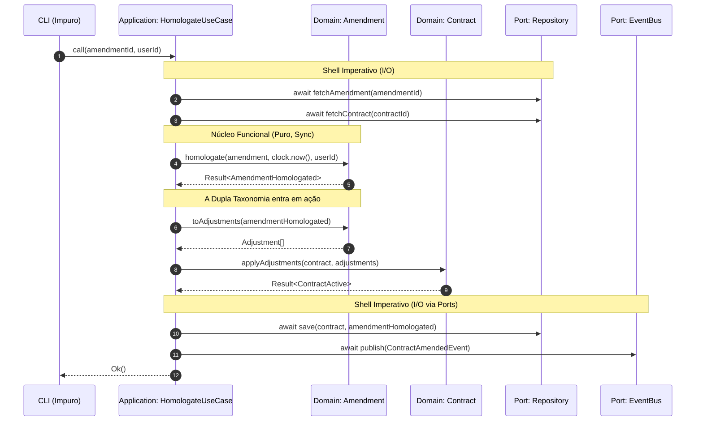
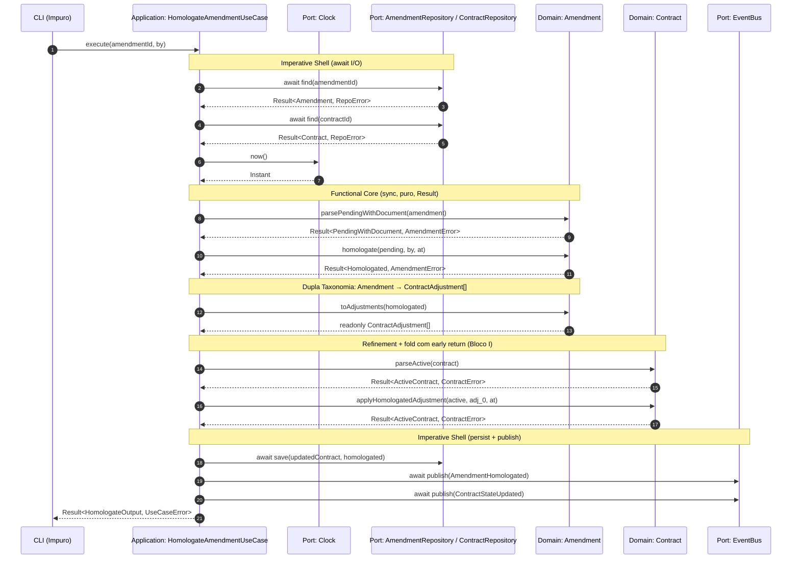

# Pergunta_diagramas_meta_tec_lider_using_skill_ts-domain-modeler

> **Status:** respondida-com-correcoes-do-host — PhD entregou 3 diagramas com estrutura correta mas **erros factuais nos detalhes** (eixo `kind` ausente, `infra/` em vez de `adapters/`, faltam `public-api/`/`cli/`/`amendment/repository.ts`, naming `singular`, anotações de bloco erradas). Host corrigiu via autoridade das decisões já cravadas (Blocos C/H). Diagramas corrigidos são inseridos nos arquivos de bloco correspondentes.
> **Origem:** entrevista 0001 — meta troca após Bloco G
> **Skill canônica:** `ts-domain-modeler`

---

## Pergunta meta do PhD

Após responder G1+G2, o PhD ofereceu:

> *"Gostaria de aproveitar para sugerir a criação de artefatos visuais ou relatórios (via ferramentas da plataforma) sobre essa arquitetura imutável de DDD, ou avançamos para resolver as pendências restantes, como IDs ou infraestrutura (Blocos J/K/L)?"*

## Contra-proposta do host

Aceitar a oferta, mas com **escopo cirúrgico**: 3 diagramas em **Mermaid texto** (não imagem, porque o projeto vive em `.md` versionado no Git). Justificativa: Mermaid renderiza em GitHub/VSCode/Claude, dá diff perfeito, é regenerável, mantém versionamento. Imagens binárias quebram esses 4 atributos.

Os 3 diagramas pedidos:

1. **`stateDiagram-v2` do `Amendment`** — `PendingWithoutDocument → PendingWithDocument → Homologated` com transições nomeadas (`create`/`attachSignedDocument`/`homologate`) e campos refinados de cada estado.
2. **`sequenceDiagram` do fluxo de homologação cross-agregado** — CLI → use case → domain → repo → bus, mostrando dupla taxonomia + composição de Results.
3. **`graph TD` ou árvore ASCII do layout canônico de pastas** com anotações dos blocos que cravaram cada decisão.

---

## R (PhD) — diagramas originais entregues

### 1. State Machine do Amendment

```mermaid
stateDiagram-v2
    direction TB

    [*] --> PendingWithoutDocument : create(...)

    state PendingWithoutDocument {
        note "id: AmendmentId\ncontractId: ContractId\ntype: AmendmentType\ncreatedAt: Instant" as N1
    }

    PendingWithoutDocument --> PendingWithDocument : attachSignedDocument(...)

    state PendingWithDocument {
        note "Mantém campos anteriores +\ndocumentRef: StorageRef\nuploadedAt: Instant" as N2
    }

    PendingWithDocument --> Homologated : homologate(...)

    state Homologated {
        note "Mantém campos anteriores +\nhomologatedAt: Instant\nhomologatedBy: UserId" as N3
    }

    Homologated --> [*]
```

### 2. Fluxo de Homologação Cross-Agregado



### 3. Layout do PhD (com erros factuais marcados pelo host)

```text
src/
├── shared/
│   ├── kernel/
│   │   ├── instant.ts
│   │   ├── money.ts
│   │   └── period.ts
│   ├── brand.ts
│   └── result.ts
│
└── modules/
    └── contract/                       ← ❌ T2 do Bloco H: deveria ser "contracts/" (plural)
        ├── domain/
        │   ├── contract/
        │   │   ├── types.ts
        │   │   ├── errors.ts
        │   │   ├── repository.ts
        │   │   ├── contract.ts
        │   │   └── index.ts
        │   │
        │   └── amendment/
        │       ├── types.ts
        │       ├── amendment.ts        ← ❌ Faltam: errors.ts, events.ts, repository.ts (T3 do Bloco H)
        │       └── index.ts
        │
        ├── application/
        │   ├── ports/
        │   │   ├── clock.ts
        │   │   ├── event-bus.ts
        │   │   ├── document-storage.ts
        │   │   └── document-storage.types.ts
        │   │
        │   └── use-cases/
        │       └── homologate-amendment.ts
        │
        └── infra/                      ← ❌ T1 do Bloco H: deveria ser "adapters/"
            ├── repositories/
            └── storage/
                                        ← ❌ Faltam: cli/ (T5 do Bloco H), public-api/ (T4 do Bloco H)
```

## Avaliação crítica do host

### O que ficou bom ✅

1. **Mermaid em texto** — respeitou a restrição.
2. **Estrutura geral dos 3 diagramas correta.**
3. **Sequence diagram com separação visual entre Shell Imperativo e Functional Core** — pedagogicamente forte.
4. **Anotações dentro de cada estado** no `stateDiagram-v2` (campos refinados por estado).

### Erros factuais detectados — 6 ⚠️

#### Diagrama 1 (State Machine do Amendment)

- **E1.1** — `type: AmendmentType` deveria ser `kind: AmendmentKind`. PhD usou `type` (reservado pra eventos no nosso projeto).
- **E1.2** — `documentRef: StorageRef` deveria ser `signedDocumentRef: DocumentId`. Trocou nome e tipo. `DocumentId` é UUID; `StorageRef` é o caminho S3 (interno do `Document` agregado futuro).
- **E1.3** — `uploadedAt: Instant` **não existe** no modelo cravado. PhD inventou.
- **E1.4** — **O eixo `kind` desapareceu novamente.** PhD aprovou aninhamento status × kind em texto no Bloco C, mas continua omitindo no diagrama. Falta indicar que dentro de cada estado mora `Addition | Suppression | TermChange | Misc`.
- **E1.5** — Faltam campos do core (`amendmentNumber`, `description`, `createdAt: Instant`).

#### Diagrama 2 (Sequence)

- **E2.1** — `clock.now()` aparece como **argumento inline** de `homologate`. Mas `clock.now(): Instant` é uma chamada de port (impura) — deveria ser uma seta separada `UC → Clock → UC` antes de chamar `Am.homologate`.
- **E2.2** — Ordem de parâmetros `homologate(amendment, clock.now(), userId)` não bate com `homologate(a: PendingWithDocument, by: UserRef, at: Instant)`.
- **E2.3** — `applyAdjustments` (plural) — mas `Contract.applyHomologatedAdjustment` é singular. O array vem de `toAdjustments` e é aplicado em sequência (fold com early return — Bloco I).
- **E2.4** — `ContractAmendedEvent` — não existe nos nossos events. São `AmendmentHomologated` + `ContractStateUpdated` (2 eventos, não 1).
- **E2.5** — Falta o `parseActive(contract)` e `parsePendingWithDocument(amendment)` — refinement de estado (Bloco D2) que aciona o narrowing nativo.

#### Diagrama 3 (Layout ASCII)

- **E3.1** — `contract/` (singular) → deveria ser `contracts/` (plural). T2 do Bloco H **já corrigido** anteriormente, mas PhD não internalizou.
- **E3.2** — `infra/` → deveria ser `adapters/`. T1 do Bloco H **já corrigido** anteriormente, mas PhD repetiu o erro.
- **E3.3** — `amendment/` sem `errors.ts`, `events.ts`, `repository.ts`. T3 do Bloco H **já apontado** anteriormente.
- **E3.4** — Falta `cli/`. T5 do Bloco H **já apontado** anteriormente.
- **E3.5** — Falta `public-api/`. T4 do Bloco H **já apontado** anteriormente.
- **E3.6** — Anotação `contract.ts ← [Bloco D: Module-as-namespace free functions]` — Module-as-namespace é Bloco **B**, não Bloco D. Bloco D é tagged errors.

### Padrão observado: PhD não retém correções entre turnos

Sem exceção, **todas as 6 correções do Bloco H que apliquei** voltaram a aparecer como erro no diagrama. Idem com a correção T1 do Bloco C (`kind` ausente). **Mesmo após admitir as correções em prosa**, o PhD esquece quando gera novo artefato concreto.

**Implicação:** vamos sempre precisar de corretagem do host ao receber artefatos do PhD. Não confiar em diagramas/snippets de outro turno sem revisar contra as decisões cravadas.

---

## Diagramas corrigidos (host — fonte canônica do projeto)

### 1. State Machine do Amendment (CORRIGIDO)

```mermaid
stateDiagram-v2
    direction TB

    [*] --> PendingWithoutDocument : create(input)

    state PendingWithoutDocument {
        note "AmendmentCore:\n  id: AmendmentId\n  contractId: ContractId\n  amendmentNumber: string\n  description: string\n  createdAt: Instant\n\n+ AmendmentPayload (eixo kind):\n  Addition { impactValue: NonZeroMoney }\n  | Suppression { impactValue: NonZeroMoney }\n  | TermChange { newEndDate: Instant }\n  | Misc {}" as N1
    }

    PendingWithoutDocument --> PendingWithDocument : attachSignedDocument(ref)

    state PendingWithDocument {
        note "Core + Payload +\n  signedDocumentRef: DocumentId" as N2
    }

    PendingWithDocument --> Homologated : homologate(by, at)

    state Homologated {
        note "Core + Payload +\n  signedDocumentRef: DocumentId +\n  homologatedAt: Instant +\n  homologatedBy: UserRef" as N3
    }

    Homologated --> [*]
```

**Diferenças do original (E1.1-E1.5 corrigidas):**
- `kind` em vez de `type`.
- `signedDocumentRef: DocumentId` em vez de `documentRef: StorageRef`.
- Sem `uploadedAt` (não existe no modelo).
- `AmendmentPayload` (eixo `kind`) explicitado dentro do `PendingWithoutDocument` — todos os 3 estados carregam o payload aninhado.
- Core completo (`amendmentNumber`, `description`, `createdAt`).

### 2. Fluxo de Homologação Cross-Agregado (CORRIGIDO)



**Diferenças do original (E2.1-E2.5 corrigidas):**
- `Clock.now()` como seta explícita (não argumento inline) — port impuro tem que aparecer no sequence.
- Ordem de parâmetros `homologate(pending, by, at)` correta.
- `applyHomologatedAdjustment` (singular) — array do `toAdjustments` é aplicado **em fold sequencial**.
- 2 eventos publicados (`AmendmentHomologated` + `ContractStateUpdated`), não 1.
- Inclui `parseActive` e `parsePendingWithDocument` — refinement de Bloco D2.

### 3. Layout Canônico — Árvore ASCII Anotada (CORRIGIDO)

```text
src/
├── shared/                                  ← [Bloco H3: Shared Kernel cross-BC]
│   ├── kernel/
│   │   ├── instant.ts                       ← [Bloco G β: Brand<number, 'Instant'> + Clock-friendly]
│   │   ├── money.ts                         ← VO puro reusado cross-BC
│   │   ├── period.ts                        ← VO puro reusado cross-BC
│   │   └── ids.ts                           ← genéricos: UserRef
│   ├── brand.ts                             ← [Bloco B-followup: Brand<T,K> via unique symbol global]
│   ├── immutable.ts                         ← [Bloco B-followup: immutable() facade Object.freeze]
│   └── result.ts                            ← [Bloco I: Result + mapErr + combine (~50 LOC, zero deps)]
│
└── modules/
    └── contracts/                           ← [Bounded Context (PLURAL, ADR-0006)]
        ├── domain/                          ← FUNCTIONAL CORE (sync, puro, zero throw)
        │   ├── shared/                      ← [Bloco H3: VOs específicos do BC]
        │   │   ├── contract-id.ts
        │   │   ├── amendment-id.ts
        │   │   ├── document-id.ts
        │   │   ├── non-zero-money.ts        ← [Bloco D5 rota α: subtype contextual]
        │   │   └── contract-status.ts
        │   │
        │   ├── contract/                    ← [Bloco H1 Opção A: granularidade 4-6 arqs]
        │   │   ├── types.ts                 ← [Bloco D2 + C: Active | Expired | Terminated]
        │   │   ├── errors.ts                ← [Bloco D + D-followup: tagged errors via free functions]
        │   │   ├── events.ts                ← ContractEvent union
        │   │   ├── repository.ts            ← [Bloco H2: port de invariância no domain]
        │   │   ├── contract.ts              ← [Bloco B + I: free functions, early return + narrowing]
        │   │   └── index.ts                 ← [Bloco B: export * as Contract (Padrão D)]
        │   │
        │   └── amendment/                   ← [Bloco C: state machine status × kind aninhado]
        │       ├── types.ts                 ← PendingWithoutDocument | PendingWithDocument | Homologated
        │       ├── errors.ts                ← [Bloco D-followup: tagged errors via free functions]
        │       ├── events.ts                ← AmendmentEvent union
        │       ├── repository.ts            ← [Bloco H2: Amendment tem state machine → tem port]
        │       ├── amendment.ts             ← transições tipadas: create / attachSignedDocument / homologate
        │       └── index.ts                 ← export * as Amendment
        │
        ├── application/                     ← IMPERATIVE SHELL (async/await, orquestração I/O)
        │   ├── ports/                       ← [Bloco H2 critério: não-invariância → application]
        │   │   ├── clock.ts                 ← [Bloco G G1.b: Clock { now: () => Instant }]
        │   │   ├── event-bus.ts
        │   │   ├── document-storage.ts      ← port interface
        │   │   └── document-storage.types.ts ← [Bloco H3 Opção C: BucketName, StorageKey, StorageRef]
        │   │
        │   └── use-cases/                   ← orquestra ports → domain → save
        │       ├── create-contract.ts
        │       ├── create-amendment.ts
        │       ├── attach-signed-document.ts
        │       ├── homologate-amendment.ts
        │       ├── get-contract.ts
        │       └── list-contracts.ts
        │
        ├── adapters/                        ← [convenção do projeto — NÃO "infra/"]
        │   ├── *.in-memory.ts               ← adapters in-memory para testes/CLI
        │   └── persistence/
        │       ├── schema/                  ← Drizzle MySQL
        │       ├── mappers/                 ← [Bloco A4: rehydrate*(row) → Result<Aggregate, RehydrationError>]
        │       ├── repositories/            ← implementa domain/<aggregate>/repository.ts
        │       └── migrations/
        │
        ├── cli/                             ← [UX primária do projeto — CLI da P.O.]
        │   ├── main.ts
        │   ├── registry.ts
        │   ├── parse-flags.ts
        │   ├── drivers/{memory,mysql}.ts
        │   ├── commands/
        │   └── formatters/                  ← PT-BR (date, money, error, contract, amendment)
        │
        └── public-api/                      ← [Bloco H: eventos cross-MÓDULO (ADR-0006)]
            ├── events.ts                    ← ContractCreated, AmendmentHomologated, ...
            └── commands.ts                  ← (futuro) commands aceitos de outros módulos
```

**Diferenças do original (E3.1-E3.6 corrigidas):**
- `contracts/` (plural) em vez de `contract/`.
- `adapters/` em vez de `infra/`.
- `amendment/` agora com `errors.ts`, `events.ts`, `repository.ts`.
- Inclui `cli/` e `public-api/`.
- Anotação `contract.ts ← [Bloco B + I]` (corrigido de "Bloco D").
- Adicionei `domain/shared/` (VOs específicos do BC — `contract-id`, `non-zero-money`, etc).

---

## Plano de inserção nos arquivos de bloco

| Diagrama (corrigido) | Arquivo de destino | Posição |
| :--- | :--- | :--- |
| State Machine do Amendment | `Pergunta_C1_C2_C3_C4_tec_lider_using_skill_ts-domain-modeler.md` | Após "Tickets confirmados", antes de "Cross-refs" |
| Fluxo de Homologação Cross-Agregado | `Pergunta_E3_I1_I3_A4_tec_lider_using_skill_ts-domain-modeler.md` | Após "Tickets", antes de "Cross-refs" |
| Layout Canônico | `Pergunta_H1_H2_H3_tec_lider_using_skill_ts-domain-modeler.md` | Após "Tickets confirmados", antes de "Cross-refs" |

E **seção "Diagramas canônicos"** adicionada no master `0001-functional-ddd-domain-refresh.md` linkando os 3 arquivos de bloco.

## Próximo passo

Após inserção dos 3 diagramas nos arquivos de bloco + atualização do master, **avançar pra `Pergunta_J_K_L`** (refinamentos finais: imports + tipos avançados + síntese DO/CONSIDER/AVOID/DON'T).
