# Modelo de Dados — ERP Bem Comum (diagrama ER)

> Fonte de verdade: entities TypeORM em `src/modules/**/entities/*.entity.ts`.
> Banco: **MySQL**. Todas as tabelas herdam de `AbstractEntity`:
> `id` (PK, auto-increment), `createdAt` e `updatedAt` (`DATETIME(6)`).
>
> Nos diagramas Mermaid, as tabelas `bank-reconciliation` e `bank-record-api` aparecem
> como `bank_reconciliation` e `bank_record_api` (o Mermaid não aceita hífen em nomes de
> entidade); os nomes reais no banco mantêm o hífen.
>
> Para o esquema com **tipos exatos de coluna**, veja [`database.dbml`](./database.dbml)
> (cole em [dbdiagram.io](https://dbdiagram.io)). O diagrama abaixo foca nas
> **relações** entre tabelas e renderiza diretamente no GitHub/VS Code (Mermaid).

## Visão geral por domínio

| Domínio | Tabelas |
|---|---|
| **Parceiros / cadastros** | `users`, `collaborators`, `collaborator_history`, `financiers`, `suppliers`, `partner_states`, `partner_municipalities`, `programs` |
| **Planejamento orçamentário** | `budget_plans`, `cost_centers`, `cost_centers_categories`, `cost_centers_sub_categories`, `budgets`, `budget_results`, `share_budget_plans` |
| **Contratos** | `contracts`, `history` |
| **Financeiro** | `accounts`, `payables`, `approvals`, `receivables`, `installments`, `creditCard`, `cardMovimentation`, `bank-reconciliation`, `bank-record-api` |
| **Integração** | `categorization` (liga lançamentos financeiros à árvore orçamentária) |
| **Arquivos / Auth** | `files`, `token`, `forgot_password` |

> ⚠️ **Colunas embedded**: os objetos `bancaryInfo`, `pixInfo`, `contractPeriod` e
> `recurenceData` são *value objects* do TypeORM. No MySQL viram colunas achatadas
> com o **nome da propriedade como prefixo** — ex.: `suppliers.bancaryInfoBank`,
> `payables.recurenceDataDueDay`. Veja o DBML para a lista completa.

---

## Diagrama ER (relacionamentos)

```mermaid
erDiagram
  %% ----------------- Parceiros / cadastros -----------------
  collaborators ||--o{ users : "collaboratorId"
  collaborators ||--o{ collaborator_history : "collaboratorId"
  collaborators ||--o{ contracts : "collaboratorId"
  collaborators ||--o{ payables : "collaboratorId"
  collaborators ||--o{ approvals : "collaboratorId"

  users ||--o{ approvals : "userId"
  users ||--o{ history : "userId"
  users ||--o| forgot_password : "userId"
  users ||--o{ budget_plans : "updatedById"

  programs ||--o{ budget_plans : "programId"
  programs ||--o{ contracts : "programId"
  programs ||--o{ categorization : "programId"

  financiers ||--o{ receivables : "financierId"
  financiers ||--o{ contracts : "financierId"

  suppliers ||--o{ payables : "supplierId"
  suppliers ||--o{ contracts : "supplierId"

  %% ----------------- Planejamento orçamentário -----------------
  budget_plans ||--o{ budget_plans : "parentId (árvore)"
  budget_plans ||--o{ cost_centers : "budgetPlanId"
  budget_plans ||--o{ budgets : "budgetPlanId"
  budget_plans ||--o{ contracts : "budgetPlanId"
  budget_plans ||--o{ categorization : "budgetPlanId"

  cost_centers ||--o{ cost_centers_categories : "costCenterId"
  cost_centers ||--o{ categorization : "costCenterId"
  cost_centers_categories ||--o{ cost_centers_sub_categories : "costCenterCategoryId"
  cost_centers_categories ||--o{ budget_results : "costCenterCategoryId"
  cost_centers_categories ||--o{ categorization : "categoryId"
  cost_centers_sub_categories ||--o{ budget_results : "costCenterSubCategoryId"
  cost_centers_sub_categories ||--o{ categorization : "subCategoryId"

  partner_states ||--o{ budgets : "partnerStateId"
  partner_municipalities ||--o{ budgets : "partnerMunicipalityId"
  budgets ||--o{ budget_results : "budgetId"

  %% ----------------- Contratos -----------------
  contracts ||--o{ contracts : "parentId (aditivos)"
  contracts ||--o{ history : "contractId"
  contracts ||--o{ files : "contractId"
  contracts ||--o{ payables : "contractId"
  contracts ||--o{ receivables : "contractId"

  %% ----------------- Financeiro -----------------
  accounts ||--o{ payables : "accountId"
  accounts ||--o{ receivables : "accountId"
  accounts ||--o{ creditCard : "accountId"
  accounts ||--o{ bank_reconciliation : "accountId"
  accounts ||--o| bank_reconciliation : "transferedById"

  payables ||--o{ approvals : "payableId"
  payables ||--o{ installments : "payableId"
  payables ||--o{ files : "payableId"
  payables ||--o{ cardMovimentation : "payableId"

  receivables ||--o{ installments : "receivableId"
  receivables ||--o{ files : "receivableId"

  installments ||--o| installments : "relatedLiquidInstallmentId"
  installments ||--o| bank_reconciliation : "recordSystemId"

  creditCard ||--o{ cardMovimentation : "cardId"
  bank_record_api ||--o| bank_reconciliation : "recordApiId"

  %% ----------------- Categorização (1:1 com cada lançamento) -----------------
  payables ||--o| categorization : "payableRelationalId"
  receivables ||--o| categorization : "receivableRelationalId"
  cardMovimentation ||--o| categorization : "cardMovRelationalId"
  bank_record_api ||--o| categorization : "bankRecordApiId"
```

---

## Diagrama ER detalhado (colunas principais)

> Versão com atributos por tabela. Os tipos seguem o mapeamento TypeORM → MySQL.
> Datas de auditoria (`createdAt`/`updatedAt`) omitidas para concisão.

```mermaid
erDiagram
  users {
    int id PK
    varchar name
    varchar email UK
    varchar cpf UK "len 11"
    varchar telephone
    varchar imageUrl "null"
    varchar password "select:false"
    boolean active "def true"
    boolean massApprovalPermission "def false"
    int collaboratorId FK "null"
  }

  collaborators {
    int id PK
    varchar name
    varchar email UK
    varchar cpf UK "len 11"
    varchar rg UK "null"
    enum occupationArea "PARC|DDI|DCE|EPV"
    varchar role "null"
    timestamp startOfContract
    datetime dateOfBirth "null"
    enum employmentRelationship "CLT|PJ"
    enum genderIdentity "null"
    enum race "null"
    enum education "null"
    enum foodCategory "null"
    enum disableBy "null"
    enum status "PRE_CADASTRO|CADASTRO_COMPLETO"
    boolean active "def true"
  }

  collaborator_history {
    int id PK
    int collaboratorId FK
    varchar previousRole "null"
    varchar newRole "null"
    timestamp previousStartOfContract "null"
    timestamp newStartOfContract "null"
    decimal previousRemuneration "10,2 null"
    decimal newRemuneration "10,2 null"
    boolean previousActive "null"
    boolean newActive "null"
    enum previousDisableBy "null"
    enum newDisableBy "null"
    varchar changedField "null"
    varchar previousOccupationArea "null"
    varchar newOccupationArea "null"
    varchar historico_antes "len 1000"
    varchar historico_depois "len 1000"
  }

  financiers {
    int id PK
    varchar name
    varchar corporateName
    varchar legalRepresentative
    varchar cnpj UK "len 14"
    varchar telephone
    varchar address
    boolean active "def true"
  }

  suppliers {
    int id PK
    varchar name
    varchar email
    varchar cnpj UK "len 14"
    varchar corporateName
    varchar fantasyName
    enum serviceCategory
    int serviceEvaluation "null"
    varchar commentEvaluation "null"
    varchar bancaryInfoBank "embedded null"
    varchar bancaryInfoAgency "embedded null"
    varchar bancaryInfoAccountNumber "embedded null"
    varchar bancaryInfoDv "embedded null"
    enum pixInfoKey_type "embedded null"
    varchar pixInfoKey "embedded null"
    boolean active "def true"
  }

  partner_states {
    int id PK
    varchar name UK
    varchar abbreviation UK "len 2"
  }

  partner_municipalities {
    int id PK
    varchar name
    varchar uf "len 2"
    varchar cod UK "IBGE"
  }

  programs {
    int id PK
    varchar name
    varchar abbreviation UK
    varchar director
    longtext description
    varchar logo "null"
    boolean active "def true"
  }

  budget_plans {
    int id PK
    int year
    varchar scenarioName "null"
    float version
    bigint totalInCents "def 0"
    enum status "APROVADO|EM_CALIBRACAO|RASCUNHO"
    int programId FK
    int updatedById FK
    int parentId FK "null, árvore"
  }

  cost_centers {
    int id PK
    varchar name
    varchar type "A PAGAR|A RECEBER"
    boolean active "def true"
    int budgetPlanId FK
  }

  cost_centers_categories {
    int id PK
    varchar name
    int costCenterId FK
    boolean active "def true"
  }

  cost_centers_sub_categories {
    int id PK
    varchar name
    enum type "INSTITUCIONAL|REDE"
    enum releaseType "IPCA|CAED|DESPESAS_PESSOAIS|DESPESAS_LOGISTICAS"
    boolean active "def true"
    int costCenterCategoryId FK
  }

  budgets {
    int id PK
    bigint valueInCents "def 0"
    int budgetPlanId FK
    int partnerStateId FK "null"
    int partnerMunicipalityId FK "null"
  }

  budget_results {
    int id PK
    int month
    bigint valueInCents "def 0"
    int budgetId FK
    int costCenterSubCategoryId FK
    int costCenterCategoryId FK
    json data "memória de cálculo"
  }

  share_budget_plans {
    int id PK
    varchar username UK "null"
    varchar password UK
    simplearray budgetPlanIds
  }

  contracts {
    int id PK
    varchar contractCode "len 30"
    varchar contractType "len 30"
    varchar contractModel "len 30"
    varchar contractStatus "def Pendente"
    varchar object "len 100"
    float totalValue
    boolean agreement "def false"
    int budgetPlanId FK "null"
    int programId FK "null"
    timestamp contractPeriodStart "embedded"
    timestamp contractPeriodEnd "embedded"
    boolean contractPeriodIsIndefinite "embedded"
    int supplierId FK "null"
    int financierId FK "null"
    int collaboratorId FK "null"
    varchar signedContractUrl "null"
    varchar settleTermUrl "null"
    varchar withdrawalUrl "null"
    int parentId FK "null, aditivos"
  }

  history {
    int id PK
    varchar actionType "len 10"
    int contractId FK
    int userId FK
  }

  accounts {
    int id PK
    varchar name "len 200"
    int apiAccountId "null"
    double initialBalance "def 0"
    double balance "def 0"
    double systemBalance "def 0"
    varchar integracao "null"
    varchar bank
    varchar agency
    varchar accountNumber
    varchar dv
    datetime lastReconciliation "null"
  }

  payables {
    int id PK
    varchar identifierCode "null"
    varchar debtorType "def FORNECEDOR"
    int supplierId FK "null"
    int collaboratorId FK "null"
    varchar payableStatus "def EM APROVAÇÃO"
    varchar paymentType
    float liquidValue
    float taxValue
    float totalValue
    varchar paymentMethod "null"
    varchar docType "null"
    int accountId FK "null"
    int contractId FK "null"
    boolean recurrent "def false"
    timestamp dueDate "null"
    timestamp paymentDate "null"
    date competence_date "null"
    int createdById
    int updatedById "null"
  }

  approvals {
    int id PK
    int collaboratorId FK "null"
    int userId FK "null"
    int payableId FK
    varchar password
    boolean approved "null"
    varchar obs "null"
  }

  receivables {
    int id PK
    varchar identifierCode UK "null"
    int financierId FK
    varchar receivableStatus "def APROVADO"
    varchar receivableType
    float totalValue
    varchar receiptMethod "null"
    varchar docType "null"
    int accountId FK "null"
    int contractId FK "null"
    varchar description "null"
    boolean recurrent "def false"
    timestamp dueDate "null"
  }

  installments {
    int id PK
    int payableId FK "null"
    int receivableId FK "null"
    int relatedLiquidInstallmentId FK "null"
    int installmentNumber
    int totalInstallments
    varchar type "def LIQUIDO"
    datetime dueDate
    float value
    varchar status "def PENDENTE"
  }

  creditCard {
    int id PK
    varchar name "len 200"
    varchar lastDigits "len 4"
    varchar responsible "len 200"
    varchar instituition "len 200"
    int accountId FK "null"
    int dueDay "def 1"
    boolean active "def true"
  }

  cardMovimentation {
    int id PK
    varchar description "len 200"
    timestamp purchaseDate
    timestamp referenceDate
    boolean hasInstallments
    varchar installmentId "uuid"
    int numberOfInstallments "def 1"
    int currentInstallment "def 1"
    float value "def 0"
    int cardId FK
    int payableId FK "null"
    enum status "NÃO FATURADO|FATURADO"
  }

  bank_reconciliation {
    int id PK
    int accountId FK
    enum type "TRANSACTION_ENTRY|TRANSFER|PROFIT|TAX"
    int recordSystemId FK "null"
    int transferedById FK "null"
    int recordApiId FK "null"
  }

  bank_record_api {
    int id PK
    varchar documentNumber
    float transactionAmount
    timestamp transactionDate
    varchar fullTransactionDescription
  }

  categorization {
    int id PK
    int programId FK
    int budgetPlanId FK
    int costCenterId FK
    int categoryId FK
    int subCategoryId FK
    int payableRelationalId FK "null"
    int receivableRelationalId FK "null"
    int cardMovRelationalId FK "null"
    int bankRecordApiId FK "null"
  }

  files {
    int id PK
    int payableId FK "null"
    int receivableId FK "null"
    int contractId FK "null"
    varchar fileUrl
  }

  token {
    int id PK
    text token
    timestamp expirationDate
  }

  forgot_password {
    int id PK
    varchar token UK
    boolean isValid "def true"
    int userId FK
  }

  users ||--o{ approvals : ""
  users ||--o| forgot_password : ""
  users ||--o{ budget_plans : ""
  collaborators ||--o{ users : ""
  collaborators ||--o{ collaborator_history : ""
  collaborators ||--o{ approvals : ""
  programs ||--o{ budget_plans : ""
  programs ||--o{ categorization : ""
  financiers ||--o{ receivables : ""
  suppliers ||--o{ payables : ""
  budget_plans ||--o{ budget_plans : ""
  budget_plans ||--o{ cost_centers : ""
  budget_plans ||--o{ budgets : ""
  budget_plans ||--o{ categorization : ""
  cost_centers ||--o{ cost_centers_categories : ""
  cost_centers ||--o{ categorization : ""
  cost_centers_categories ||--o{ cost_centers_sub_categories : ""
  cost_centers_categories ||--o{ budget_results : ""
  cost_centers_categories ||--o{ categorization : ""
  cost_centers_sub_categories ||--o{ budget_results : ""
  cost_centers_sub_categories ||--o{ categorization : ""
  partner_states ||--o{ budgets : ""
  partner_municipalities ||--o{ budgets : ""
  budgets ||--o{ budget_results : ""
  contracts ||--o{ contracts : ""
  contracts ||--o{ history : ""
  contracts ||--o{ files : ""
  contracts ||--o{ payables : ""
  contracts ||--o{ receivables : ""
  accounts ||--o{ payables : ""
  accounts ||--o{ receivables : ""
  accounts ||--o{ creditCard : ""
  accounts ||--o{ bank_reconciliation : ""
  payables ||--o{ approvals : ""
  payables ||--o{ installments : ""
  payables ||--o{ files : ""
  payables ||--o{ cardMovimentation : ""
  payables ||--o| categorization : ""
  receivables ||--o{ installments : ""
  receivables ||--o{ files : ""
  receivables ||--o| categorization : ""
  installments ||--o| installments : ""
  installments ||--o| bank_reconciliation : ""
  creditCard ||--o{ cardMovimentation : ""
  cardMovimentation ||--o| categorization : ""
  bank_record_api ||--o| bank_reconciliation : ""
  bank_record_api ||--o| categorization : ""
```

---

## Notas de integridade observadas no código

- **Árvores (`@Tree("materialized-path")`)**: `budget_plans` (versões/cenários via `parentId`)
  e `contracts` (aditivos via `parentId`). O TypeORM cria uma coluna auxiliar de path (`mpath`).
- **`ON DELETE CASCADE`** declarado nas relações: `budgets`→`budget_plans`/`partner_*`,
  `budget_results`→`budgets`/`cost_centers_*`, `cost_centers*` em cadeia, `approvals`/`installments`→`payables`,
  e todas as relações de `categorization`.
- **`categorization`** funciona como *hub* 1:1 entre um lançamento financeiro
  (`payable` **ou** `receivable` **ou** `cardMov` **ou** `bankRecordApi`) e a árvore
  orçamentária (`program`/`budgetPlan`/`costCenter`/`category`/`subCategory`).
- **`installments.relatedLiquidInstallmentId`** é auto-relacionamento 1:1 (parcela de imposto
  vinculada à parcela líquida).
- **Unicidades compostas** relevantes: `budgets(budgetPlanId, partnerStateId)` e
  `budgets(budgetPlanId, partnerMunicipalityId)`; `budget_results(budgetId, costCenterSubCategoryId, month)`;
  `budget_plans(year, programId, version, parentId)`; `partner_municipalities(name, uf)`.
