# 🏭 Fluxo de Engenharia do `core-api` — Pipeline W0→W3 + SDD + Agentes/Skills/Templates

> **Público-alvo:** um agente (Claude Code ou equivalente) ou uma pessoa que precisa operar este
> repositório **sem contexto prévio**. Este documento descreve **como se trabalha aqui**: a esteira
> de produção (pipeline fail-first W0→W3), a nossa implementação própria do **spec-kit** (workflow
> `core-api-sdd`), os **templates** que materializam cada fase, e **como agentes e skills foram
> construídos**.
>
> **Status:** documentação descritiva do estado real em **2026-07-26**.
> **Fonte de verdade:** este doc é **derivado** — nunca vence os ADRs nem o `AGENTS.md`. Ver
> [§2 Hierarquia de fontes](#2-hierarquia-de-fontes-quem-vence-quando-há-conflito).
>
> ⚠️ **A Parte I (pipeline W0→W3) descreve um aparato em aposentadoria** — spec
> `038-retire-pipeline-w0w3`. Os hooks de injeção de contexto e a CLI `pnpm run pipeline:*` **já não
> existem**; as seções que os citam ficam como registro histórico do que a esteira foi, não como
> instrução operável. O **SDD** (Parte II) é o fluxo vigente. Sobrevivem à aposentadoria: **TDD como
> disciplina** e a **Política de Regressão Zero** ([§9.1](#91-política-de-regressão-zero)).

---

## Índice

1. [Os dois motores em 60 segundos](#1-os-dois-motores-em-60-segundos)
2. [Hierarquia de fontes](#2-hierarquia-de-fontes-quem-vence-quando-há-conflito)
3. [Mapa de arquivos do sistema de processo](#3-mapa-de-arquivos-do-sistema-de-processo)
4. [Parte I — Pipeline de esteira W0→W3](#parte-i--pipeline-de-esteira-w0w3)
5. [Parte II — SDD: nossa implementação do spec-kit](#parte-ii--sdd-nossa-implementação-do-spec-kit)
6. [Parte III — Templates](#parte-iii--templates)
7. [Parte IV — Agentes e Skills: como foram feitos](#parte-iv--agentes-e-skills-como-foram-feitos)
8. [Parte V — Tecido conjuntivo: hooks, rules, settings](#parte-v--tecido-conjuntivo-hooks-rules-settings)
9. [Parte VI — Invariantes e anti-padrões](#parte-vi--invariantes-e-anti-padrões)
10. [Parte VII — Receitas ponta-a-ponta](#parte-vii--receitas-ponta-a-ponta)
11. [Apêndice A — Comandos](#apêndice-a--comandos)
12. [Apêndice B — Glossário](#apêndice-b--glossário)
13. [Apêndice C — Drifts conhecidos](#apêndice-c--drifts-conhecidos-verificados-em-2026-07-26)

---

## 1. Os dois motores em 60 segundos

O repositório tem **dois motores de processo** que operam em escalas diferentes e se **encaixam** um
no outro. Confundi-los é o erro mais comum de quem chega:

| | **SDD — `core-api-sdd`** | **Pipeline — W0→W3** |
| :--- | :--- | :--- |
| **Escala** | Feature / épico | Ticket (uma unidade atômica de código) |
| **Pergunta que responde** | *"O que construir e por quê?"* | *"Como construir isto sem quebrar nada?"* |
| **Artefatos** | `specs/<NNN-slug>/` — discovery, spec, domain, adr, metrics, plan, bdd, tasks, review | `.claude/.pipeline/<TICKET-ID>/` — request, tests, impl, review, quality |
| **Motor** | Receita em `.specify/workflows/core-api-sdd/workflow.yml` + skills `/speckit-*` | `pnpm run pipeline:state` + skills de wave |
| **Estado** | `.specify/feature.json` + branch `NNN-slug` | `STATE.json` por ticket |
| **Gates** | 12 gates humanos `approve/reject` | 4 waves com gate mecânico |
| **Obrigatório?** | Para feature nova / mudança de domínio | Para **toda** mudança em código de produção |

**O encaixe:** o SDD é o macro; quando ele chega na fase **TDD/RED**, ele **abre um ticket da
pipeline** e delega. A pipeline é o micro que efetivamente move `src/`.

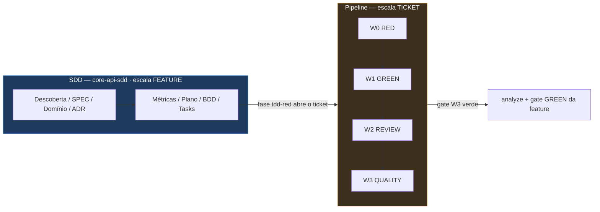

**Atalho legítimo:** nem toda mudança passa pelo SDD. Um bug fix com escopo já entendido entra
**direto na pipeline** com um `000-request.md`. Um typo em doc não abre nada. A regra está em
[§4.9](#49-quando-abrir-ticket-e-quando-não).

---

## 2. Hierarquia de fontes (quem vence quando há conflito)

Regra invariante, replicada de [`AGENTS.md`](../../AGENTS.md) §"Hierarquia de regras". **Nunca**
contradizer um ADR aceito — para mudar uma regra de ADR, abre-se **novo ADR** que `supersedes` o
anterior e registra-se em [`handbook/CHANGELOG.md`](../CHANGELOG.md).

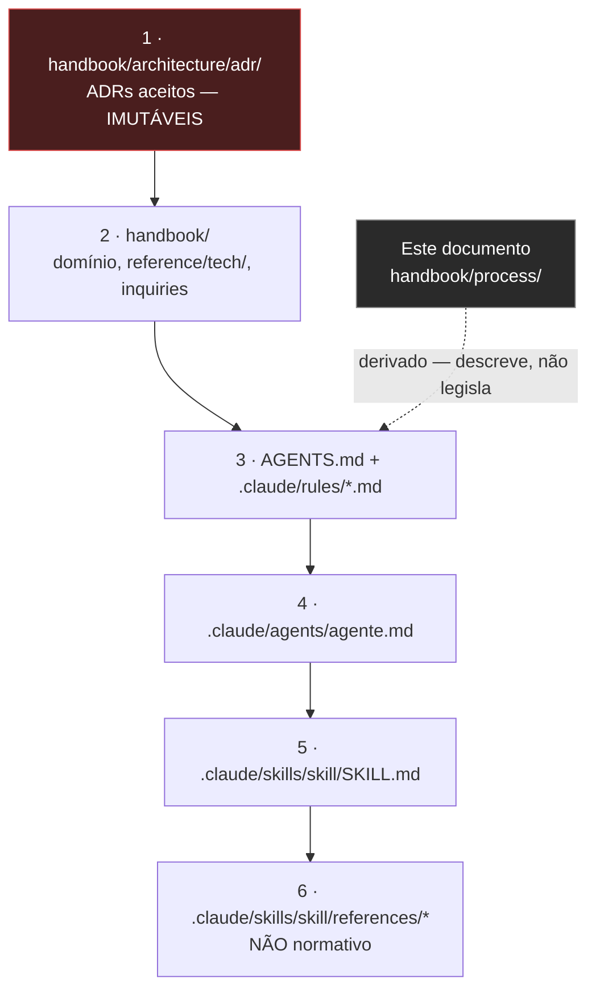

> ⚠️ **Anti-padrão #12 do `AGENTS.md`:** citar `.md`/`.mdx` do handbook **de memória**. Sempre abrir
> o arquivo e citar literalmente, com `path:linha`.

A **constituição do spec-kit** ([`.specify/memory/constitution.md`](../../.specify/memory/constitution.md))
é um **resumo operacional** dos princípios para guiar `/speckit-plan`. Ela declara explicitamente sua
própria subordinação — [`constitution.md:3-7`](../../.specify/memory/constitution.md):

> "esta constituição **resume** os princípios para guiar o fluxo do spec-kit (plan/tasks/implement).
> Ela **não substitui** o cânone — quando houver divergência, vencem, nesta ordem:
> `handbook/architecture/adr/` (ADRs aceitos, imutáveis) → `handbook/` → `AGENTS.md` +
> `.claude/rules/`."

---

## 3. Mapa de arquivos do sistema de processo

```
core-api/
├── AGENTS.md                     ← fonte de verdade de contexto (CLAUDE.md é stub que importa)
├── CLAUDE.md                     ← stub: "@AGENTS.md" + ponteiro do plano corrente
│
├── .claude/                      ← MAQUINÁRIO DA PIPELINE + AGENTES
│   ├── agents/                   ← 14 agentes especialistas por tecnologia
│   ├── skills/                   ← 42 skills (27 próprias + 15 speckit-*)
│   ├── rules/                    ← 6 arquivos de regra path-scoped
│   ├── hooks/                    ← 8 scripts .sh (7 ativos em settings.json + pre-commit opt-in)
│   ├── templates/spec.md         ← template de SPEC de ticket/épico
│   ├── output-styles/            ← erp-contracts.md (idioma/estilo por camada)
│   ├── runbooks/                 ← cheatsheet do Claude Code
│   ├── .pipeline/<TICKET>/       ← 510 pastas · 453 com STATE.json rastreado (18 abertos)
│   ├── .planning/                ← épicos e planejamentos pausados
│   ├── settings.json             ← hooks + permissions + statusline + outputStyle
│   └── statusline.sh
│
├── .specify/                     ← MAQUINÁRIO DO SDD (spec-kit 0.8.19.dev0)
│   ├── memory/constitution.md    ← 9 princípios (I–IX)
│   ├── workflows/
│   │   ├── core-api-sdd/workflow.yml   ← NOSSA receita: 18 steps
│   │   ├── speckit/workflow.yml        ← receita bundled (não usada)
│   │   └── workflow-registry.json
│   ├── templates/                ← 13 templates de fase
│   ├── extensions.yml            ← hooks before_*/after_* do spec-kit
│   ├── extensions/git/           ← extensão git (branch, commit, remote, validate)
│   ├── scripts/bash/             ← create-new-feature.sh, setup-plan.sh, ...
│   ├── integration.json          ← integração = "claude"
│   ├── init-options.json         ← numeração sequencial, context_file CLAUDE.md
│   ├── feature.json              ← feature ativa
│   └── .smoke-test/RUNBOOK.md    ← protocolo canônico de gate + achados #1–#6
│
├── specs/<NNN-slug>/             ← 33 features SDD (artefatos por fase)
├── scripts/pipeline/             ← state-cli, dashboard, metrics, render-state-md
└── handbook/                     ← FONTE DE VERDADE (ADRs, domínio, reference/)
```

---

# Parte I — Pipeline de esteira W0→W3

## 4.1 O contrato central

**Toda mudança em código de produção abre um ticket** em `.claude/.pipeline/<TICKET-ID>/` e percorre
4 waves em ordem. É o **Princípio I** da constituição, marcado **NÃO-NEGOCIÁVEL**
([`constitution.md:11-17`](../../.specify/memory/constitution.md)).

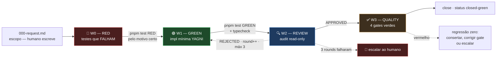

## 4.2 Anatomia de um ticket

```
.claude/.pipeline/<TICKET-ID>/
├── 000-request.md            # ESCOPO — escrito ANTES de qualquer wave
├── STATE.json                # ⭐ CANÔNICO — só o CLI escreve
├── STATE.md                  # GERADO de STATE.json — nunca editar à mão
├── 002-tests/REPORT.md       # W0 — testes RED
├── 003-impl/REPORT.md        # W1 — implementação GREEN
├── 004-code-review/REVIEW.md # W2 — audit read-only
└── 005-quality/REPORT.md     # W3 — tsc + format + lint + test
```

> **Por que não existe `001-`?** Herança de nomenclatura do projeto ACDG. O slot `001-` fica
> reservado para specs de contrato (OpenAPI) — documentado em
> [`.claude/.pipeline/README.md`](../../.claude/.pipeline/README.md).

**Nomenclatura do ticket:** `<MÓDULO>-<TIPO>-<DESCRIÇÃO-CURTA>` em maiúsculas com hífen —
`CTR-VO-MONEY`, `FIN-OFX-COMMA-DECIMAL`, `PARTNERS-BATCH-READER-ISOLATION`,
`CI-INTEGRATION-GATE-REQUIRED`.

> ⚠️ **Colisão de nome:** há 453 tickets, a maioria fechada. Antes de criar, confira se o ID já
> existe — `ls .claude/.pipeline/<ID>`. Tickets fechados são **histórico auditável: não deletar.**

## 4.3 `STATE.json` — a fonte canônica

Desde o ticket `CTR-PIPELINE-STATE-JSON`, o estado é **JSON tipado**, e o `STATE.md` é apenas uma
renderização determinística. Schema em
[`scripts/pipeline/state-schema.ts`](../../scripts/pipeline/state-schema.ts):

| Campo | Tipo | Observação |
| :--- | :--- | :--- |
| `schemaVersion` | `1` | Literal; parser rejeita divergência com `SchemaVersionMismatch` |
| `ticket` | `string` | ID do ticket |
| `size` | `'XS'\|'S'\|'M'\|'L'\|'XL'` | Estimativa declarada no `init` |
| `createdAt` / `closedAt` | ISO-8601 / `null` | |
| `currentWave` | `'W0'..'W3'` \| `null` | Avança sozinho no `wave-finish` |
| `status` | `open` \| `in-progress` \| `closed-green` \| `closed-rejected` \| `superseded` \| `blocked` | |
| `waves[]` | `WaveEntry[]` | Sempre 4 entradas — W0..W3 |
| `blockers[]` | `string[]` | |
| `lastEvent` | `string` | Última transição, legível |
| `supersededBy?` | `string` | Só quando `status === 'superseded'` |

`WaveEntry`: `{ id, status: pending|in-progress|done|failed, agent, startedAt, finishedAt, rounds, reportPath, outcome }`
com `outcome ∈ { RED, GREEN, APPROVED, REJECTED, ALL-GREEN }`.

**Exemplo real** — `PAR-AGG-CONTRACT-COUNT`, ticket S fechado em 7 minutos:

```jsonc
{
  "schemaVersion": 1,
  "ticket": "PAR-AGG-CONTRACT-COUNT",
  "size": "S",
  "status": "closed-green",
  "waves": [
    { "id": "W0", "status": "done", "agent": "tdd-strategist",     "rounds": 1, "outcome": "RED",      "reportPath": "002-tests/REPORT.md" },
    { "id": "W1", "status": "done", "agent": "ports-and-adapters", "rounds": 1, "outcome": "GREEN",    "reportPath": "003-impl/REPORT.md" },
    { "id": "W2", "status": "done", "agent": "code-reviewer",      "rounds": 1, "outcome": "APPROVED", "reportPath": "004-code-review/REVIEW.md" },
    { "id": "W3", "status": "done", "agent": "ts-quality-checker", "rounds": 1, "outcome": "GREEN",    "reportPath": "005-quality/REPORT.md" }
  ],
  "blockers": [],
  "lastEvent": "closed-green"
}
```

## 4.4 A CLI de estado e suas invariantes mecânicas

O `STATE.json` **não se edita à mão**. Toda transição passa por
[`scripts/pipeline/state-cli.ts`](../../scripts/pipeline/state-cli.ts), que **codifica as regras da
pipeline em software** — não em boa vontade do agente.

```bash
pnpm run pipeline:state init <ticket> --size S
pnpm run pipeline:state wave-start  <ticket> W0 --agent tdd-strategist
pnpm run pipeline:state wave-finish <ticket> W0 --outcome RED --report 002-tests/REPORT.md
pnpm run pipeline:state wave-round  <ticket> W2          # incrementa round (máx 3)
pnpm run pipeline:state wave-reopen <ticket> W2          # done+REJECTED → in-progress
pnpm run pipeline:state supersede   <ticket> --by <outro-ticket>
pnpm run pipeline:state close       <ticket>
pnpm run pipeline:state render      <ticket>             # regenera STATE.md
```

**Exit codes:** `0` sucesso · `1` erro de I/O ou de argumento · `2` **violação de invariante da
pipeline**. As invariantes de exit-2, verificadas no código:

| Invariante | Mensagem | Linha |
| :--- | :--- | ---: |
| Wave anterior precisa estar `done` | `wave anterior (Wn) não está done` | `state-cli.ts:136` |
| Wave `done` não reinicia | `wave X já está done` | `state-cli.ts:145` |
| `wave-finish` exige `in-progress` | `wave X não está in-progress` | `state-cli.ts:180` |
| Máximo 3 rounds | `atingiu max rounds (3); escalar ao humano` | `state-cli.ts:220,263` |
| `close` exige as 4 waves `done` | `ticket tem waves não-done: ...` | `state-cli.ts:306` |
| `supersede` sem auto-referência e com ticket vencedor existente | | `state-cli.ts:331,342` |

**Consequência prática:** "pular wave" não é uma questão de disciplina — a CLI **recusa**.

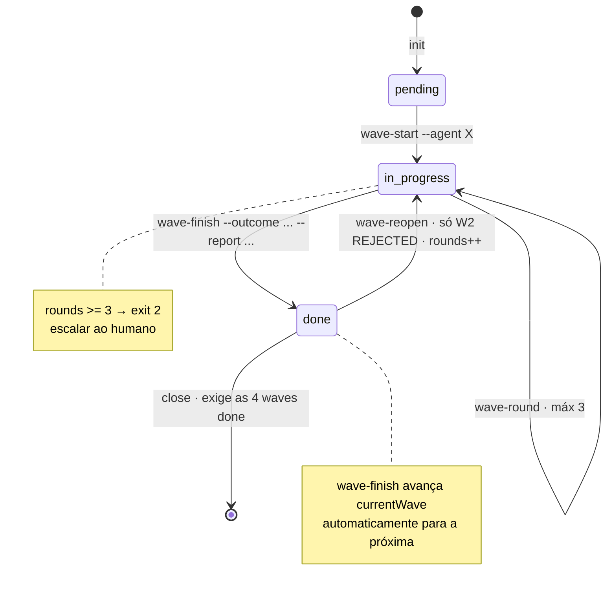

## 4.5 Contrato de cada wave

| | **W0 — RED** | **W1 — GREEN** | **W2 — REVIEW** | **W3 — QUALITY** |
| :--- | :--- | :--- | :--- | :--- |
| **Skill típica** | [`tdd-strategist`](../../.claude/skills/tdd-strategist/SKILL.md) / [`ts-domain-modeler`](../../.claude/skills/ts-domain-modeler/SKILL.md) | [`ts-domain-modeler`](../../.claude/skills/ts-domain-modeler/SKILL.md) ou [`ports-and-adapters`](../../.claude/skills/ports-and-adapters/SKILL.md) | [`code-reviewer`](../../.claude/skills/code-reviewer/SKILL.md) | [`ts-quality-checker`](../../.claude/skills/ts-quality-checker/SKILL.md) |
| **Escreve em `src/`?** | ❌ **nunca** | ✅ o mínimo | ❌ **read-only** | ❌ só corrige vermelho |
| **Gate obrigatório** | `pnpm test` | `pnpm test` + `pnpm run typecheck` | `pnpm run lint` + releitura do diff | `typecheck && format:check && test && lint` |
| **Output** | `002-tests/REPORT.md` | `003-impl/REPORT.md` | `004-code-review/REVIEW.md` | `005-quality/REPORT.md` |
| **`outcome`** | `RED` | `GREEN` | `APPROVED` \| `REJECTED` | `GREEN` / `ALL-GREEN` |
| **Critério de saída** | Todos os testes existem, **todos falham**, e falham **por inexistência da API** — não por typo | Todos os testes de W0 passam; **zero linha além do mínimo** (YAGNI estrito) | Veredito + issues por `arquivo:linha`; máx 3 rounds | Zero erro em todos os comandos |
| **Aborta se…** | algum teste **passa** antes da impl — sinal de teste fraco | sobra código não coberto | 3 rounds sem APPROVED → escalar | qualquer vermelho não-endereçado |

**Ordem obrigatória de construção dentro de W1**, literal em
[`contratos-orchestrator.md:210`](../../.claude/agents/contratos-orchestrator.md):
`VO → Agregado → Eventos → Ports → Use Cases → CLI/Adapter`. Com a CLI embutida aposentada
(ADR-0037), o último elo hoje é o **adapter / borda HTTP**.

## 4.6 O checklist de fechamento de wave (mitigação do bug #47936)

Sub-agentes do Claude Code param no meio da tarefa em **14–30%** das execuções com
`stop_reason: null` — [issue #47936](https://github.com/anthropics/claude-code/issues/47936).
Sintoma: o último turn é um `Edit`/`Write` bem-sucedido, **sem** texto de fechamento, REPORT ausente
e STATE não atualizado — mas o SDK reporta "completed" ao main.

A mitigação é **processual e obrigatória**, em
[`contratos-orchestrator.md:228-279`](../../.claude/agents/contratos-orchestrator.md):

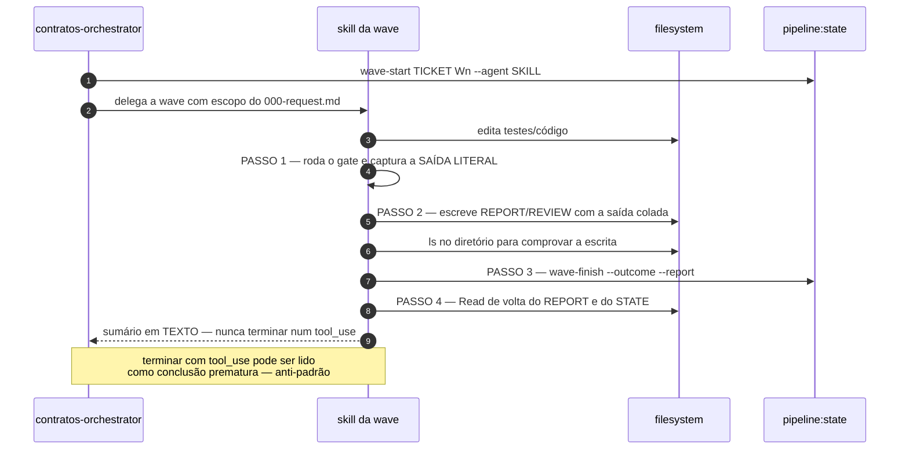

**Backstop mecânico: não há mais.** O hook `SubagentStop` → `subagent-stop-validate.sh`, que
inspecionava o filesystem e o transcript JSONL quando o sub-agente terminava e gravava o diagnóstico
em `.claude/.last-subagent-stop.log`, foi **removido** com o aparato de pipeline (spec 038). A
mitigação do #47936 hoje é **apenas processual** — o checklist acima.

**Anti-padrões deste checklist** (literal, `contratos-orchestrator.md:273-278`):

1. Anunciar "vou escrever o REPORT" sem escrever.
2. Reportar "`pnpm test` passou" sem ter rodado ou sem colar a saída.
3. Atualizar `STATE.md` **antes** do REPORT existir — a ordem importa.
4. Encerrar com `Edit`/`Write` como último tool use.

## 4.7 Observabilidade da esteira

```bash
pnpm run pipeline:status                # tabela markdown de todos os tickets
pnpm run pipeline:status --filter open  # só open + in-progress
pnpm run pipeline:status --json         # para tooling
pnpm run pipeline:metrics               # agregações
pnpm run pipeline:metrics --write       # grava .claude/.pipeline/_METRICS.md
```

Estado em 2026-07-26 (`pipeline:status --json`): **453 tickets · 18 abertos · 431 fechados ·
3 superseded**. O último snapshot de `_METRICS.md` (defasado — 83 tickets, ver
[Apêndice C](#apêndice-c--drifts-conhecidos-verificados-em-2026-07-26)) mostra o que a esteira
entrega: **taxa de rejeição em W2 de 2,5%** — 79 tickets aprovados no round 1, 2 no round 2,
**zero** chegou ao round 3.

## 4.8 Injeção automática de contexto

Restou **um** hook de orientação:

- **`SessionStart` → `session-start-context.sh`** — no boot, resume branch, arquivos modificados e
  planejamentos pausados.

> O `UserPromptSubmit` → `inject-ticket-context.sh`, que a cada prompt detectava o ticket ativo e
> injetava o resumo do `STATE.md`, foi **removido** (spec 038): injetar estado de ticket em **100%
> dos prompts** tornou-o o principal poluidor do contexto que deveria proteger. Com ele saiu também
> o acoplamento que obrigava o `render-state-md.ts` a preservar o layout do `STATE.md` para o
> parsing textual do hook.

## 4.9 Quando abrir ticket (e quando não)

| Tarefa | Abre ticket? |
| :--- | :--- |
| Novo agregado / VO / use case / adapter | ✅ Sim |
| Mudança não-trivial em código de produção | ✅ Sim |
| Bug fix > 3 linhas ou que toque regra de domínio | ✅ Sim |
| Bug fix trivial (1–3 linhas, typo, comentário) | ❌ Commit direto |
| Mudança de docs (`handbook/`, `.claude/`) | ❌ Commit direto |
| Mudança de config (`tsconfig`, `package.json`) | ❌ Commit direto |
| Refactor sem mudança de comportamento | ⚠️ Ticket **se** atravessa fronteira de módulo |

---

# Parte II — SDD: nossa implementação do spec-kit

## 5.1 O que é upstream e o que é nosso

Partimos do [GitHub Spec Kit](https://github.com/github/spec-kit) **v0.8.19.dev0**, integração
`claude`, numeração de branch sequencial ([`init-options.json`](../../.specify/init-options.json)).
Sobre ele construímos uma camada própria:

| Camada | Origem | O que é |
| :--- | :--- | :--- |
| Skills `/speckit-{specify,clarify,plan,tasks,implement,analyze,checklist,constitution,taskstoissues}` | **upstream** (`templates/commands/*.md`) | 9 comandos do bundle, preservados |
| Skills `/speckit-git-{initialize,feature,commit,remote,validate}` | **upstream** (extensão `git`) | 5 comandos da extensão |
| **`/speckit-verify`** | **🔧 NOSSO** | Gate W3 + política de regressão zero como etapa executável |
| **`constitution.md`** | **🔧 NOSSO** | 9 princípios, subordinados ao handbook |
| **`workflow.yml core-api-sdd`** | **🔧 NOSSO** | Receita de 18 steps, RED→YELLOW→GREEN, máximo rigor |
| **8 dos 13 templates** | **🔧 NOSSO** | discovery, domain, adr, metrics, bdd, tdd, review, qa-test-plan |
| **`extensions.yml`** | híbrido | Hooks do git upstream + hook `after_implement → speckit.verify` **nosso** |
| **`RUNBOOK.md`** | **🔧 NOSSO** | Modelo de orquestração + protocolo de gate |

A skill `/speckit-verify` declara a própria natureza no frontmatter
([`speckit-verify/SKILL.md:8`](../../.claude/skills/speckit-verify/SKILL.md)):
`source: "custom (não faz parte do bundle oficial do spec-kit)"` — e o corpo explica **por quê**
isso importa: *"updates do CLI **não** a sobrescrevem"*.

## 5.2 A constituição — 9 princípios

[`.specify/memory/constitution.md`](../../.specify/memory/constitution.md), versão **1.2.0**,
ratificada em 2026-06-05, última emenda 2026-06-07. É o que o `/speckit-plan` verifica no
**"Constitution Check"**.

| # | Princípio | Marcado |
| ---: | :--- | :--- |
| I | TDD fail-first em pipeline W0→W3 | **NÃO-NEGOCIÁVEL** |
| II | Política de regressão zero | **NÃO-NEGOCIÁVEL** |
| III | `pnpm` é o único package manager | |
| IV | Modular Monolith com isolamento estrito por Bounded Context | |
| V | Domínio puro — sem classes, sem framework, sem `throw` | |
| VI | MySQL 8 único + Drizzle; migrations geradas | |
| VII | HTTP-first; CLI embutida aposentada (ADR-0037) | |
| VIII | TypeScript strict + ESM + idioma por camada | |
| IX | Decisões ancoradas no cânone — consultoria ACDG + **citação obrigatória** | |

O **Princípio IX** é o que dá ao fluxo o rótulo "máximo rigor": toda decisão-chave — fronteira de
Bounded Context, ADR, estratégia de teste, achado de review — exige **citação literal de ≥4 linhas**
de livro canônico, extraída pelas tools `skills_buscar`/`skills_citar` do MCP `acdg-skills`.
**Sem citação, o gate não avança.**

## 5.3 Ciclo RED → YELLOW → GREEN

O SDD introduz um estado intermediário que a pipeline sozinha não nomeia
([`constitution.md:75-81`](../../.specify/memory/constitution.md)):

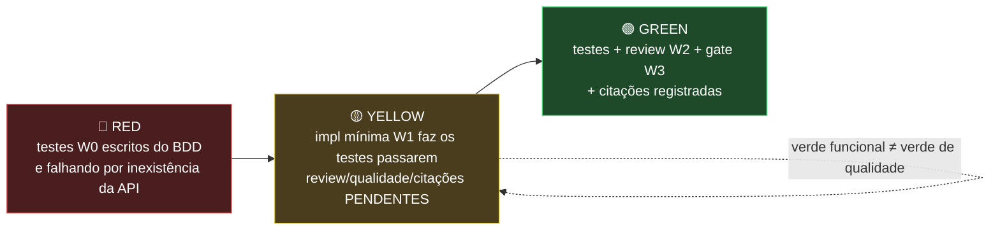

## 5.4 Os 18 steps do `core-api-sdd` v2.1.0

Receita em [`.specify/workflows/core-api-sdd/workflow.yml`](../../.specify/workflows/core-api-sdd/workflow.yml).
**12 gates humanos + 6 comandos**, precedidos de um passo de scaffold.

```mermaid
flowchart TD
    S["S · SCAFFOLD<br/>create-new-feature.sh<br/>branch + specs/NNN-slug/"]

    subgraph F0["Fase 0–1 · Requisitos"]
        G0["0 · discovery 🚪<br/>requirements-engineer"]
        C1["1 · specify ⚙️<br/>/speckit-specify"]
        C2["2 · clarify ⚙️<br/>/speckit-clarify"]
        G3["3 · review-spec 🚪"]
        G35["3.5 · recon 🚪<br/>só se ESTENDE código"]
    end

    subgraph F1["Fase 2–4 · Arquitetura · CITAÇÃO OBRIGATÓRIA"]
        G4["4 · domain 🚪📖<br/>ddd-architect · Evans/Vernon"]
        G5["5 · adr 🚪📖<br/>software-architect"]
        G6["6 · metrics 🚪📖<br/>NFRs mensuráveis"]
    end

    subgraph F2["Fase 5–6 · Plano e Cenários"]
        C7["7 · plan ⚙️<br/>/speckit-plan + Constitution Check I–IX"]
        G8["8 · review-plan 🚪📖<br/>database-engineer · migrations"]
        G9["9 · bdd 🚪<br/>Given-When-Then"]
        C10["10 · tasks ⚙️<br/>/speckit-tasks"]
    end

    subgraph F3["Fase 7–10 · Execução"]
        G11["11 · tdd-red 🔴🚪📖<br/>abre o TICKET da pipeline"]
        C12["12 · implement 🟡⚙️<br/>/speckit-implement"]
        G13["13 · yellow 🟡🚪"]
        G14["14 · review-w2 🚪📖<br/>clean-code-reviewer"]
        C15["15 · analyze ⚙️<br/>consistência cross-artefato"]
        G16["16 · green 🟢🚪<br/>/speckit-verify"]
    end

    S --> G0 --> C1 --> C2 --> G3 --> G35 --> G4 --> G5 --> G6
    G6 --> C7 --> G8 --> G9 --> C10 --> G11 --> C12 --> G13 --> G14 --> C15 --> G16

    style F1 fill:#1e3a5f,stroke:#4a90d9,color:#fff
    style F3 fill:#3d2f1e,stroke:#d9a04a,color:#fff
```

> 🚪 = `type: gate` (pausa e espera humano) · ⚙️ = `command: speckit.*` · 📖 = citação canônica obrigatória

| # | Step | Tipo | Persona / comando | Artefato | Citação |
| ---: | :--- | :--- | :--- | :--- | :---: |
| S | scaffold | — | `create-new-feature.sh` | branch + `specs/<feat>/` | — |
| 0 | `discovery` | gate | `/acdg-skills:requirements-engineer` | `discovery.md` | — |
| 1 | `specify` | cmd | `/speckit-specify` | `spec.md` | — |
| 2 | `clarify` | cmd | `/speckit-clarify` | atualiza `spec.md` | — |
| 3 | `review-spec` | gate | `requirements-engineer` | revisa INVEST + Impacto Arquitetural | — |
| 3.5 | `recon` | gate | leitura do módulo-alvo | `recon.md` ou "N/A — greenfield" | — |
| 4 | `domain` | gate | `/acdg-skills:ddd-architect` | `domain.md` | ✅ Evans/Vernon |
| 5 | `adr` | gate | `/acdg-skills:software-architect` | `adr/NNNN-*.md` | ✅ |
| 6 | `metrics` | gate | `software-architect` + `requirements-engineer` | `metrics.md` | ✅ |
| 7 | `plan` | cmd | `/speckit-plan` | `plan.md` + Constitution Check | — |
| 8 | `review-plan` | gate | `/acdg-skills:database-engineer` | migrations Drizzle + estimativa W0 | ✅ schema |
| 9 | `bdd` | gate | `requirements-engineer` + `tdd-strategist` | `bdd/*.feature` | — |
| 10 | `tasks` | cmd | `/speckit-tasks` | `tasks.md` | — |
| 11 | `tdd-red` 🔴 | gate | `/acdg-skills:tdd-strategist` | testes W0 RED + **abre ticket** | ✅ Kent Beck |
| 12 | `implement` 🟡 | cmd | `/speckit-implement` | impl mínima W1 | — |
| 13 | `yellow` 🟡 | gate | — | `pnpm test` verde funcional | — |
| 14 | `review-w2` | gate | `/acdg-skills:clean-code-reviewer` | `review.md` APPROVED | ✅ Uncle Bob |
| 15 | `analyze` | cmd | `/speckit-analyze` | consistência cross-artefato | — |
| 16 | `green` 🟢 | gate | `/speckit-verify` | W3 verde | — |

## 5.5 Decisão de arquitetura do fluxo: **o Claude orquestra in-session**

Esta é a decisão mais importante e menos óbvia do nosso SDD. Está em
[`.specify/.smoke-test/RUNBOOK.md` §1](../../.specify/.smoke-test/RUNBOOK.md), e é reafirmada no
cabeçalho do próprio `workflow.yml`:

> "Este arquivo é a **RECEITA** dos 17 steps, NÃO o runtime. O Claude orquestra in-session (…)
> **NÃO** usar `specify workflow run` como executor."

Duas descobertas do smoke test de 2026-06-05 tornam o executor nativo inviável:

- **Achado #2 — gate é TTY-only.** `steps/gate/__init__.py` do engine faz
  `if not sys.stdin.isatty(): return PAUSED`. Um agente rodando em Bash não-TTY **nunca** avança um
  gate; e um pty via `script(1)` cai no default `reject` e aborta.
- **Achado #3 — `command` spawna `claude -p` headless.** `integrations/base.py:dispatch_command`
  dispara um `claude` aninhado, **sem o contexto nem o MCP desta sessão** — o rigor de citação do
  Princípio IX não seria garantido.

**Portanto:**

| Step da receita | Como o Claude executa in-session |
| :--- | :--- |
| `command: speckit.*` | invoca a Skill `/speckit-*` **nesta sessão**, com o MCP ativo |
| `type: gate` | apresenta **markdown de texto puro** e espera resposta digitada |
| citação obrigatória | `skills_buscar` / `skills_citar` aqui mesmo |
| `tdd-red` / `green` | usa o pipeline `.claude/.pipeline/<TICKET>/` W0→W3 já existente |

`specify workflow run/resume/status` fica como **recibo/documentação opcional**, nunca como motor.

## 5.6 Protocolo de gate — canônico

Achado #1 do smoke test, **refinado**. A primeira tentativa usou o widget `AskUserQuestion`; ele
**trava no terminal Warp**. Decisão final ([`RUNBOOK.md` §6](../../.specify/.smoke-test/RUNBOOK.md)):
**gate é TEXTO PURO em markdown + resposta digitada. Nada de widget.**

```markdown
## GATE 4/18 — DOMAIN  (responda: approve / reject / ajustar <o quê>)

Produzi `specs/036-budget-plans-monthly/domain.md`. Decisões: agregado BudgetPlan
com alvo (budgetId, subcategoryId, month); citação de Evans p.199 registrada.

- Bounded Context: budget-plans (`bgp_*`)
- Agregados: BudgetPlan (raiz), BudgetResult
- VO novo: Month — TINYINT 1..12

Próximo se aprovar: FASE 3 — ADRs.
```

| Resposta digitada | Ação do agente |
| :--- | :--- |
| `approve` | executa o próximo step in-session |
| `reject` | **para** — artefatos ficam para inspeção |
| `ajustar <X>` | edita o artefato e **reapresenta o mesmo gate** |

**Invariantes:** PT-BR com acentuação completa · **nunca** `AskUserQuestion` · gate sempre como
markdown legível · esperar a resposta antes de avançar.

## 5.7 Scaffold antes do step 0, e o gate `recon`

Duas correções de versão registradas como comentário normativo no `workflow.yml`:

- **Achado #4 — scaffold antes da discovery.** O step 0 já grava `specs/<feature>/discovery.md`, logo
  a pasta precisa existir antes. O Claude roda, no início:
  ```bash
  bash .specify/scripts/bash/create-new-feature.sh --json --short-name "<slug>" "<desc>"
  ```
  Consequência: o hook `before_specify: git.feature` é `optional: true` no `extensions.yml` — ele
  viraria uma **segunda** feature. **Não criar duas.**
- **Achado #6 — gate `recon` (v2.1.0).** Para features que **estendem** código existente, modelar
  domínio no vácuo diverge do padrão real (ex.: inventar um VO quando a query já usa primitivo na
  borda). O gate força ler o módulo-alvo **antes** do `domain` e gravar `recon.md` com o que
  **reusar** e o que **não reinventar**. Greenfield: aprovar com `"N/A — greenfield"`.

O `create-new-feature.sh` faz: descobre o maior número entre `specs/*` e branches locais **e
remotas** via `git ls-remote`, soma 1, formata com `printf %03d`, filtra stop-words para gerar o
slug, cria a branch, `mkdir` da pasta e copia o `spec-template.md`. Trunca em 244 bytes — limite do
GitHub para nome de branch.

## 5.8 Hooks do spec-kit

[`.specify/extensions.yml`](../../.specify/extensions.yml) pendura hooks nos pontos `before_*` e
`after_*` de cada comando. Quase todos são `git.commit` `optional: true` (auto-commit). **Um é
nosso e é obrigatório:**

```yaml
after_implement:
  - extension: bem-comum-verify
    command: speckit.verify
    enabled: true
    optional: false           # ← ÚNICO hook mandatório do arquivo
    description: Quality gate W3 da core-api + política de regressão zero (custom)
```

Ou seja: **terminar a implementação dispara automaticamente o gate W3.** Não há caminho em que a
feature "acabe" sem passar por `typecheck + format:check + lint + test`.

## 5.9 Artefatos por feature

Uma feature madura em `specs/<NNN-slug>/` — exemplo real, `036-budget-plans-monthly`:

```
specs/036-budget-plans-monthly/
├── spec.md                              # /speckit-specify + /speckit-clarify
├── plan.md                              # /speckit-plan + Constitution Check
├── research.md                          # pesquisa de suporte
├── data-model.md                        # modelo de dados
├── contracts/budget-results-monthly.md  # contrato HTTP
├── checklists/requirements.md           # /speckit-checklist
├── quickstart.md
└── tasks.md                             # /speckit-tasks
```

O ponteiro para a feature ativa vive em [`.specify/feature.json`](../../.specify/feature.json), e um
resumo do plano corrente é mantido no [`CLAUDE.md`](../../CLAUDE.md) para carregar em toda sessão.

---

# Parte III — Templates

## 6.1 Templates do SDD

Em [`.specify/templates/`](../../.specify/templates/). Os marcados 🔧 são autorais; os demais vêm do
bundle e foram mantidos.

| Template | Fase | Preenchido por | Citação? | |
| :--- | :--- | :--- | :---: | :---: |
| `discovery-template.md` | 0 | `requirements-engineer` | — | 🔧 |
| `spec-template.md` | 1 | `/speckit-specify` | — | |
| `domain-template.md` | 2 | `ddd-architect` | ✅ Evans/Vernon | 🔧 |
| `adr-template.md` | 3 | `software-architect` | ✅ | 🔧 |
| `metrics-template.md` | 4 | `software-architect` | ✅ | 🔧 |
| `plan-template.md` | 5 | `/speckit-plan` | — | |
| `bdd-template.md` | 6 | `requirements-engineer` + `tdd-strategist` | — | 🔧 |
| `tdd-template.md` | 7 | `tdd-strategist` | ✅ Kent Beck | 🔧 |
| `tasks-template.md` | — | `/speckit-tasks` | — | |
| `review-template.md` | 9 | `clean-code-reviewer` | ✅ Uncle Bob/OWASP | 🔧 |
| `qa-test-plan-template.md` | — | `tdd-strategist` | ✅ Gregory & Crispin | 🔧 |
| `checklist-template.md` | — | `/speckit-checklist` | — | |
| `constitution-template.md` | — | `/speckit-constitution` | — | |

**Marca registrada dos templates autorais:** o bloco de citação. Do `adr-template.md`:

```markdown
## Citação canônica *(obrigatória — princípio IX)*

> Trecho literal de ≥4 linhas do livro canônico que sustenta a decisão, extraído via
> `skills_citar` (consulte /acdg-skills:software-architect).
> — *(Linha NNNN, p. PP, AUTOR, *LIVRO*)*
```

O formato de atribuição — **linha, página, autor, livro** — é o que torna a citação verificável: a
linha vem do arquivo do corpus, não da memória do modelo.

O `bdd-template.md` fixa também a regra de idioma: **Gherkin em PT** (`# language: pt`, negócio),
**identificadores em EN** (código).

## 6.2 Templates da pipeline

| Template | Onde vive | Quem escreve |
| :--- | :--- | :--- |
| `000-request.md` | inline em [`pipeline-maestro/SKILL.md:63-89`](../../.claude/skills/pipeline-maestro/SKILL.md) e `.pipeline/README.md` | **humano**, antes de qualquer wave |
| `STATE.md` | **gerado** por `render-state-md.ts` | ninguém — é derivado do `STATE.json` |
| SPEC de ticket/épico | [`context/templates/spec.md`](../../context/templates/spec.md) | agente, em `001-spec/SPEC.md` ou `.planning/EPIC-*.md` |

O `000-request.md` tem 5 seções: **Contexto** (por quê), **Escopo** (o que entra), **Fora de escopo**
(anti scope-creep), **Critérios de aceite** (testáveis, viram os testes de W0) e **Referências**
(handbook, ADR, inquiry).

O `context/templates/spec.md` é o mais rigoroso dos três — 10 seções, com dois diferenciais:

- **§5 Clarificações** — *"Ambiguidade não resolvida = NÃO pode sair de draft."*
- **§7 Constitution check** — tabela `Fonte | Exigência | Como a spec adere`, uma linha por ADR ou
  regra tocada. *"Conflito = bloqueio."*
- **§10 Fatiamento** — só para épico: transforma o épico em N tickets ordenados por dependência.

---

# Parte IV — Agentes e Skills: como foram feitos

## 7.1 A filosofia

De [`.claude/README.md`](../../.claude/README.md):

> **Um orquestrador roteador + skills especializadas profundas + pipeline fail-first.**
> Zero duplicação: cada skill cita o handbook, nunca redefine.

A origem é empírica: o projeto irmão ACDG/frontend reduziu **22 agents → 1 orquestrador + N skills**,
com **72% menos tokens**. Duas consequências de design:

1. **Um agente OU uma skill por turno.** Carregar vários simultaneamente é o anti-padrão #1.
2. **Referência, nunca cópia.** Uma skill que reescreve uma regra do handbook cria uma segunda fonte
   de verdade — e a segunda fonte sempre apodrece.

## 7.2 Agente vs Skill — a distinção

| | **Agente** (`.claude/agents/*.md`) | **Skill** (`.claude/skills/*/SKILL.md`) |
| :--- | :--- | :--- |
| **Eixo** | **Tecnologia** — "eu conheço Drizzle" | **Disciplina** — "eu sei fazer TDD" |
| **Ancoragem** | um subdiretório de `handbook/reference/<tech>/` | um corpus canônico ou uma etapa do processo |
| **Execução** | contexto próprio, ferramentas próprias, `model`/`maxTurns` próprios | roda **no contexto atual**, injeta instruções |
| **Frontmatter** | `tools`, `model`, `effort`, `maxTurns`, `skills`, `color`, `memory` | `name`, `description` |
| **Exemplos** | `drizzle-orm-expert`, `mysql2-driver-expert`, `fastify-server-expert` | `ts-domain-modeler`, `code-reviewer`, `pipeline-maestro` |

## 7.3 Anatomia de um agente

Frontmatter real de [`drizzle-orm-expert.md`](../../.claude/agents/drizzle-orm-expert.md):

```yaml
---
name: drizzle-orm-expert
tools: Read, Glob, Grep, Edit, Write, Bash   # menos ferramentas = menos superfície de erro
model: sonnet                                # opus só onde o julgamento é caro
maxTurns: 60                                 # backstop contra loop
skills:
  - drizzle-schema-author                    # skill companion carregada junto
color: green
memory: project
description: >
  Use proactively for ...  Trigger quando: ...  Ancorado em handbook/reference/drizzle/
---
```

**Regras de escrita do `description`** — é o que o roteador lê para decidir:

1. Começa com `Use proactively for <tecnologia + versão>`.
2. Lista **triggers literais** — as palavras que o usuário realmente digita
   (`"createPool"`, `"deadlock"`, `"ERR_PNPM_FROZEN_LOCKFILE"`, `"exit 137"`).
3. Declara a **ancoragem**: `Ancorado em handbook/reference/<tech>/`.
4. Declara a **fronteira negativa**: *"NÃO é o `security-reviewer`"*, *"NÃO escreve schemas —
   delegar para `drizzle-schema-author`"*.

**Corpo do agente**, na ordem canônica:

1. Uma frase de identidade + **herança explícita** do `AGENTS.md`, dos ADRs vinculantes e da pipeline.
2. **Versões fixadas** — tabela `pacote | versão | origem`, com a regra: *"upgrade não-trivial = ADR
   novo + ticket dedicado"*.
3. Mapa da referência: tópico → arquivo em `handbook/reference/<tech>/`.
4. Regras normativas com o ADR que as sustenta.
5. Anti-padrões.
6. **Changelog datado** — toda mudança no agente é registrada nele mesmo.

### O painel de 14 agentes

| Agente | Domínio | Ancoragem |
| :--- | :--- | :--- |
| `contratos-orchestrator` | **roteamento + pipeline W0→W3** | `AGENTS.md` + handbook |
| `typescript-language-expert` | type system, tsconfig, Modules | `reference/typescript/` · ADR-0009 |
| `nodejs-runtime-expert` | `node:test`, ESM, signals, ALS | `reference/nodejs/` · ADR-0002/0009 |
| `drizzle-orm-expert` | schema, query builder, Kit, transações | `reference/drizzle/` · ADR-0020 |
| `mysql-database-expert` | EXPLAIN, índice, locks, tuning | `reference/mysql/` · ADR-0013 |
| `mysql2-driver-expert` | pool, auth, TLS, timeouts | `reference/mysql2/` |
| `docker-compose-expert` | Dockerfile, Compose, BuildKit | `reference/docker/` |
| `pnpm-workspace-expert` | lockfile, supply-chain, corepack | `reference/pnpm/` · ADR-0011/0012 |
| `fastify-server-expert` | borda HTTP | `reference/fastify/` · ADR-0025/0037 |
| `nodemailer-email-expert` | adapter SMTP | `reference/nodemailer/` · ADR-0010 |
| `zod-expert` | validação de borda, contrato HTTP | `reference/zod/` · ADR-0027 |
| `bruno-api-client-expert` | coleções `.bru` de teste HTTP | `reference/bruno/` · ADR-0034/0038 |
| `security-backend-expert` | segurança server-side | multi-reference + skill `web-security-backend` |
| `security-frontend-expert` | segurança client-side | TanStack Start + skill `web-security-frontend` |

> **Regra de fronteira documentada** entre agentes vizinhos, de
> [`contratos-orchestrator.md:120`](../../.claude/agents/contratos-orchestrator.md): *"API do ORM,
> Drizzle Kit, SQL gerado → `drizzle-orm-expert`. SQL puro, plano de execução, concorrência,
> infraestrutura → `mysql-database-expert`. Os dois cooperam: o expert Drizzle escreve, o expert
> MySQL audita o plano resultante."*

## 7.4 Anatomia de uma skill

Frontmatter mínimo — só `name` e `description`:

```yaml
---
name: ts-domain-modeler
description: >
  Especialista em modelagem de domínio em TypeScript 6.0 puro (zero framework, zero infra).
  Aplica DDD tático com branded types, discriminated unions, Result<T, E>, smart constructors,
  Readonly imutável e exhaustive switch. SKILL CANÔNICA para src/modules/*/domain/.
---
```

**Corpo canônico**, na ordem:

| Seção | Função |
| :--- | :--- |
| **Persona** | Quem a skill é, em 2–3 frases |
| **Fronteira** | 📌 A seção mais importante: *"você só edita `src/modules/<modulo>/domain/`"* |
| **Source of Truth** | Aponta o `handbook/reference/` obrigatório **antes** de qualquer decisão |
| **Referências deste projeto** | Tabela `tópico → onde olhar`, incluindo **tickets já entregues** como exemplos vivos |
| **Regras não-negociáveis** | Herdadas do `AGENTS.md`, reforçadas no contexto da skill |
| **Anti-padrões** | Tabela `❌ Errado \| ✅ Certo` |
| **Como se relaciona com outras** | Diagrama ASCII de vizinhança |
| **Changelog** | Datado |

**Dois subdiretórios opcionais, com semânticas diferentes:**

- **`references/`** — destilados de doc externa, **não normativos** (nível 6 da hierarquia). Ex.:
  `ts-domain-modeler/references/ts-branded-types.md`. Cada um cita o trecho original do handbook.
- **`modules/`** — decomposição interna de skills grandes: `trilha-pedagogica.md`,
  `workflow-revisao.md`, `anti-padroes-locais.md`, `casos-especiais.md`.

### As 42 skills, por família

| Família | Skills | Papel |
| :--- | :--- | :--- |
| **Waves da pipeline** | `pipeline-maestro`, `code-reviewer`, `ts-quality-checker` | Executam W0→W3 |
| **Camadas do código** | `ts-domain-modeler`, `ports-and-adapters`, `drizzle-schema-author`, `modular-monolith`, `application-cli-builder` *(aposentada — ADR-0037)* | Uma por camada de `src/` |
| **Scripting Node** | `nodejs-fs-scripter`, `nodejs-process-runner` | Substituem Bash por TS |
| **Disciplinas — trio aplicada/tutor/theorist** | `tdd-*`, `clean-code-*`, `database-*`, `requirements-*` | 4 disciplinas × 3 níveis |
| **Arquitetura de testes** | `test-pyramid-engineer` | **Onde** o teste vive — distinto do `tdd-strategist`, que decide **qual o próximo** teste |
| **Segurança** | `web-security-backend`, `web-security-frontend`, `security-reviewer` (OWASP-AI) | 3 superfícies distintas |
| **Processo** | `issue-report` | Achado fora de escopo → GitHub Issue |
| **SDD** | 15 skills `speckit-*` | Parte II |

**O padrão trio** — para cada disciplina existem três skills com gatilhos deliberadamente disjuntos:

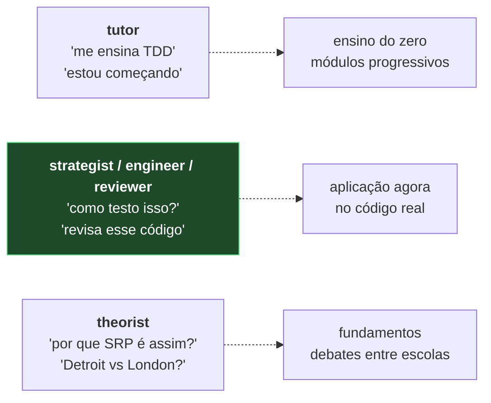

## 7.5 O roteamento

[`contratos-orchestrator`](../../.claude/agents/contratos-orchestrator.md) é o **ponto de entrada
único**. Ele **não modela domínio, não escreve testes, não revisa código** — delega.

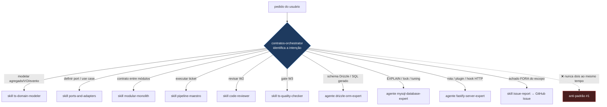

**Quando o pedido não é um ticket claro** (`contratos-orchestrator.md:295-301`):

- Pergunta exploratória → responder em 2–3 frases com recomendação + trade-off. **Não implementar.**
- Bug fix simples (1–3 linhas) → direto, com commit claro.
- Mudança de config → direto, atualizando o README correspondente.
- Dúvida arquitetural duradoura → **abrir inquiry** em `handbook/inquiries/` antes de codar.

## 7.6 O MCP `acdg-skills` e o fallback

O Princípio IX depende de um corpus canônico externo, servido por MCP HTTP
([`.mcp.json`](../../.mcp.json)): 3 tools (`skills_buscar`, `skills_citar`, `skills_cross_ref`) e 18
prompts-persona (`/acdg-skills:ddd-architect`, `:tdd-strategist`, `:clean-code-reviewer`,
`:software-architect`, `:database-engineer`, `:requirements-engineer`, `:security-reviewer`, …).

O `.mcp.json` documenta o **fallback declarado** para quando o servidor está offline: usar os `.md`
do corpus local e citar literalmente via `grep -n`, **≥4 linhas**, com a advertência explícita:

> "NÃO citar de memória (anti-padrão #12)."

## 7.7 Receita: criar um novo agente ou skill

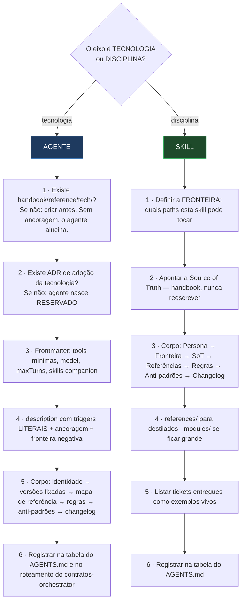

> **Anti-padrão #11 do `AGENTS.md`:** *"Ativar um agente marcado como reservado sem antes abrir o ADR
> de adoção da tecnologia."* Foi o que aconteceu com Fastify (ADR-0025) e Nodemailer
> (`CTR-EMAIL-ADAPTER-NODEMAILER`) — nasceram reservados e só ativaram com ADR.

---

# Parte V — Tecido conjuntivo: hooks, rules, settings

## 8.1 Hooks do Claude Code

Configurados em [`.claude/settings.json`](../../.claude/settings.json). Cada um existe por um
incidente concreto — o cabeçalho de cada script documenta o "por quê".

| Evento | Script | Função | Origem |
| :--- | :--- | :--- | :--- |
| `SessionStart` | `session-start-context.sh` | Resumo do estado do projeto no boot | orientação |
| `PreToolUse(Bash)` | `block-npm.sh` | Bloqueia `npm` | ADR-0011/0012 — `npm` corrompe o lockfile |
| `PreToolUse(Bash)` | `block-cross-project-docker.sh` | Impede tocar recursos do legado e prunes globais | Docker tem **um** daemon por máquina |
| `PostToolUse(Edit\|Write)` | `prettier-write.sh` | Formata o arquivo tocado | drift de Prettier passava de W1/W2 e estourava em W3 |
| `Stop` (async) | `stop-typecheck.sh` | Typecheck em background no fim do turno | sessão terminava com `tsc` quebrado |
| *(opt-in)* pre-commit | `pre-commit-typecheck.sh` | 4 gates antes do commit: format → typecheck → lint → test | ativar com `git config core.hooksPath .claude/hooks` |

> **Removidos pela spec 038:** `UserPromptSubmit` → `inject-ticket-context.sh` (injetava `STATE.md`
> do ticket ativo em todo prompt) e `SubagentStop(contratos-orchestrator)` →
> `subagent-stop-validate.sh` (diagnosticava o bug #47936). Ambos existiam para servir a esteira
> W0→W3 — ver [§4.8](#48-injeção-automática-de-contexto) e [§4.6](#46-o-checklist-de-fechamento-de-wave-mitigação-do-bug-47936).

**Detalhe não-óbvio do `block-npm.sh`:** o `if: "Bash(npm *)"` do `settings.json` **sempre dispara
quando o comando é complexo demais para parsear** (multilinha, loops, heredocs) — por isso o script
**revalida o comando internamente**, sem confiar no filtro declarativo.

**Detalhe não-óbvio do `prettier-write.sh`:** pula `node_modules/`, `.pipeline/` e
`handbook/reference/` — este último é cópia offline de documentação, e reformatá-la geraria diff
gigante e falso.

> ⚠️ **Duas armadilhas conhecidas:** (1) edições feitas por **sub-agentes não passam** pelo hook
> `PostToolUse` — rodar `format` + `lint` na sessão principal antes do W3; (2) o hook reformata a
> working tree **depois** do commit — conferir `git status` antes de fechar o PR.

## 8.2 Regras path-scoped

[`.claude/rules/`](../../.claude/rules/) — 6 arquivos que carregam **só quando o agente toca os
paths declarados** no frontmatter. Mantém o contexto default enxuto.

| Arquivo | `paths` | Conteúdo |
| :--- | :--- | :--- |
| `domain.md` | `src/modules/*/domain/**` | Sem `throw`, sem `class`, sem `this`; `Result<T,E>`; branded types |
| `application.md` | `src/modules/*/application/**` | Use cases como factory functions; ports são `type` |
| `adapters.md` | `src/modules/*/adapters/**` | Única camada que toca infra; `try/catch` vira `Result` na borda |
| `contracts-module.md` | `src/modules/contracts/**` | Mapa de camadas e regras do módulo |
| `testing.md` | `tests/**` | Só `*.test.ts` é descoberto; suítes parametrizadas usam `.contract.ts`/`.suite.ts`; mirror de `src/` |
| `api-collections.md` | `api-collections/**` | Coleções Bruno — normativo ADR-0038 |

## 8.3 Output style e statusline

- **`outputStyle: "erp-contracts"`** — fixa idioma por camada (PT-BR no diálogo e docs; EN no
  código; PT-BR nas strings ao humano via dicionário; EN kebab-case nos erros internos; EN passado
  nos eventos), exige citação literal do handbook, e proíbe criar `.md` de plano sem pedido.
- **`statusline.sh`** — modelo, ticket ativo, branch, PR, cache hit ratio, custo e rate limits;
  cacheia git e ticket por 5s.

---

# Parte VI — Invariantes e anti-padrões

## 9.1 Política de regressão zero

Princípio II, **NÃO-NEGOCIÁVEL**, replicado em `AGENTS.md`, na constituição e na `/speckit-verify`.

> **Não existe "o erro não é meu".** Qualquer falha que apareça numa sessão — teste vermelho, `lint`,
> `typecheck`, hook, build, gate W3 — é tratada como **regressão a corrigir AGORA**, tenha ou não
> sido causada pelo diff atual.

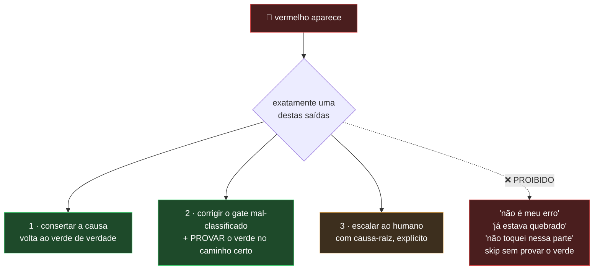

A saída 2 tem um caso típico e recorrente: um teste de integração que roda em `pnpm test` puro em vez
de ficar atrás do opt-in (`*_INTEGRATION=1` / `pnpm run test:integration:*`). Conserta-se o **gate**,
e prova-se o verde no caminho correto. **Nunca** se esconde atrás de um `skip`.

## 9.2 Os 15 anti-padrões do `AGENTS.md`

| # | Anti-padrão |
| ---: | :--- |
| 1 | Carregar múltiplos agentes/skills simultaneamente |
| 2 | Duplicar regras que já vivem no handbook / SKILL.md |
| 3 | Pular waves — ir direto pra W1 sem W0 RED |
| 4 | Misturar módulos numa sessão (`ctr_*` e `fin_*`) — ofende ADR-0014 |
| 5 | Editar ADR aceito |
| 6 | Editar código não-trivial sem ticket |
| 7 | `throw new Error(...)` no `default` de switch exaustivo |
| 8 | `import` sem extensão `.ts` |
| 9 | `import` de tipo sem `type` |
| 10 | `npm` em qualquer doc, script, PR ou comentário |
| 11 | Ativar agente reservado sem ADR de adoção |
| 12 | Citar doc do handbook **de memória** |
| 13 | Importar de `domain/`/`application/` de **outro** módulo — só `public-api/` |
| **14** | **Dispensar vermelho como "não é meu erro"** — o mais grave |
| 15 | Consertar problema fora do escopo do ticket (scope-creep) — registrar via `issue-report` |

## 9.3 Scope-creep → GitHub Issue (ADR-0040)

O anti-padrão #15 tem uma **válvula de escape projetada**. Achou um problema fora do escopo do ticket
atual? Nem conserta (scope-creep) nem esquece: registra via a skill
[`issue-report`](../../.claude/skills/issue-report/SKILL.md), normativa em
[ADR-0040](../architecture/adr/0040-agent-findings-as-github-issues.md).

A skill preenche `.github/ISSUE_TEMPLATE/agent-finding.md` com critérios de aceite testáveis
(Dado/Quando/Então) e **Definition of Done amarrada ao gate W3**, e **deduplica antes de criar** por
`dedup-key` = `<modulo>:<area>:<slug>`: reincidência vira comentário; issue fechada que voltou vira
`reopen`. **Nunca duplica.**

O raciocínio do ADR-0040:

> "O melhor detector de problemas do projeto é o próprio agente, codando — ele acha **qualquer**
> coisa (bug, smell, gap de contrato, débito, risco), não só gap de API."

---

# Parte VII — Receitas ponta-a-ponta

## 10.1 Feature nova, do zero ao merge

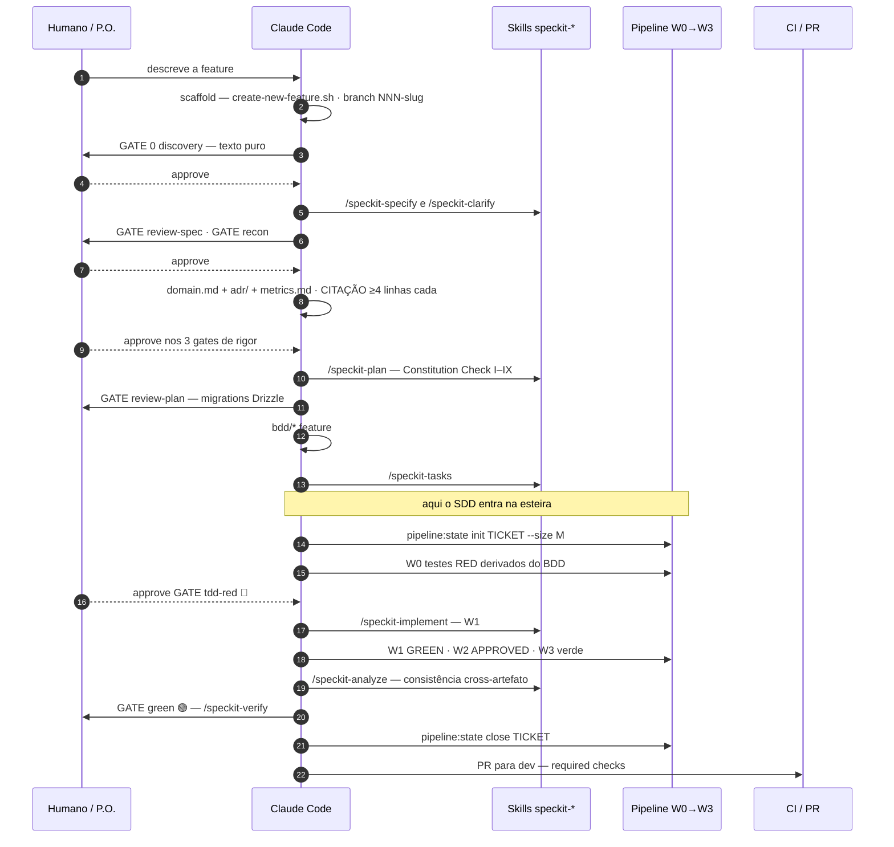

## 10.2 Bug fix com escopo claro (sem SDD)

```bash
# 1 · ticket
pnpm run pipeline:state init FIN-OFX-COMMA-DECIMAL --size S
#    escrever 000-request.md: contexto, escopo, fora de escopo, CAs, referências

# 2 · W0 — o teste que reproduz o bug e FALHA
pnpm run pipeline:state wave-start  FIN-OFX-COMMA-DECIMAL W0 --agent tdd-strategist
pnpm test                                    # confirmar RED pelo motivo certo
pnpm run pipeline:state wave-finish FIN-OFX-COMMA-DECIMAL W0 --outcome RED --report 002-tests/REPORT.md

# 3 · W1 — correção mínima
pnpm run pipeline:state wave-start  FIN-OFX-COMMA-DECIMAL W1 --agent ports-and-adapters
pnpm test && pnpm run typecheck
pnpm run pipeline:state wave-finish FIN-OFX-COMMA-DECIMAL W1 --outcome GREEN --report 003-impl/REPORT.md

# 4 · W2 — audit read-only
pnpm run pipeline:state wave-start  FIN-OFX-COMMA-DECIMAL W2 --agent code-reviewer
pnpm run lint
pnpm run pipeline:state wave-finish FIN-OFX-COMMA-DECIMAL W2 --outcome APPROVED --report 004-code-review/REVIEW.md

# 5 · W3 — gate final
pnpm run pipeline:state wave-start  FIN-OFX-COMMA-DECIMAL W3 --agent ts-quality-checker
pnpm run typecheck && pnpm run format:check && pnpm run lint && pnpm test
pnpm run pipeline:state wave-finish FIN-OFX-COMMA-DECIMAL W3 --outcome ALL-GREEN --report 005-quality/REPORT.md
pnpm run pipeline:state close FIN-OFX-COMMA-DECIMAL
```

## 10.3 W2 rejeitou

```bash
pnpm run pipeline:state wave-reopen FIN-X W2     # done+REJECTED → in-progress, rounds++
# corrigir os issues listados em 004-code-review/REVIEW.md · voltar a W1 se necessário
# 3º round sem APPROVED → exit 2 → escalar ao humano com a lista de issues persistentes
```

## 10.4 Achado fora do escopo

Invocar a skill `issue-report`. Ela dedupe com `gh issue list --search`, e só então cria a issue com
CAs testáveis. **Voltar ao ticket corrente sem desviar.**

---

## Apêndice A — Comandos

```bash
# Qualidade (gate W3, na ordem)
pnpm run typecheck            # tsc --noEmit
pnpm run format:check         # prettier --check .
pnpm run lint                 # eslint . (flat config, strict + type-checked)
pnpm test                     # tests/**/*.test.ts · node:test + --experimental-strip-types

# Integração (por módulo, atrás de opt-in)
pnpm run test:integration              # contracts
pnpm run test:integration:financial    # · :partners · :auth · :budget-plans · :etl · :storage · ...

# Pipeline
pnpm run pipeline:state init|wave-start|wave-finish|wave-round|wave-reopen|supersede|close|render
pnpm run pipeline:status [--filter open|closed] [--json]
pnpm run pipeline:metrics [--json] [--write]

# SDD
bash .specify/scripts/bash/create-new-feature.sh --json --short-name "<slug>" "<desc>"
# depois, in-session: /speckit-specify → /speckit-clarify → /speckit-plan → /speckit-tasks
#                     → /speckit-implement → /speckit-analyze → /speckit-verify

# Migrations e execução
pnpm run db:generate[:auth|:partners|:programs|:financial|:notifications|:budget-plans]
pnpm run serve                # borda HTTP Fastify
pnpm run worker:outbox        # worker do outbox
```

> **NUNCA `npm`. SEMPRE `pnpm`** (ADR-0012). Há hook que bloqueia.

## Apêndice B — Glossário

| Termo | Significado |
| :--- | :--- |
| **Wave** | Uma das 4 etapas do ticket: W0 RED, W1 GREEN, W2 REVIEW, W3 QUALITY |
| **Gate** | Ponto de parada. Mecânico na pipeline (comando verde); humano no SDD (`approve`/`reject`) |
| **Round** | Iteração de W2. Máximo 3; o 4º é exit 2 |
| **RED / YELLOW / GREEN** | Ciclo do SDD. YELLOW = testes passam mas review/qualidade/citações pendentes |
| **Citação canônica** | Trecho literal ≥4 linhas de livro canônico, com linha/página/autor/livro. Princípio IX |
| **Ancoragem** | Subdiretório de `handbook/reference/<tech>/` que sustenta um agente |
| **Fronteira** | Conjunto de paths que uma skill pode tocar |
| **`dedup-key`** | `<modulo>:<area>:<slug>` — idempotência do `issue-report` |
| **Recon** | Gate 3.5 — ler o módulo-alvo antes de modelar, para não reinventar padrão existente |
| **Superseded** | Ticket substituído por outro; `supersededBy` aponta o vencedor |

## Apêndice C — Drifts conhecidos (verificados em 2026-07-26)

Registrados por honestidade documental — nenhum é bloqueante, mas quem chega deve saber:

| Drift | Detalhe |
| :--- | :--- |
| **Contagem de steps** | O `workflow.yml` está em **v2.1.0 com 18 steps** (o `recon` entrou depois). Os rótulos "17 steps" no `description` do próprio yml, no `workflow-registry.json` e no `RUNBOOK.md` são herança da v2.0.0 |
| **Versão no registry** | `workflow-registry.json` registra `core-api-sdd` como **2.0.0**; o `workflow.yml` declara **2.1.0** |
| **Contagem de skills no `.claude/README.md`** | Diz "7 skills especializadas"; hoje são **42** (27 próprias + 15 `speckit-*`) |
| **`_METRICS.md`** | Snapshot de 83 tickets; o dashboard vivo reporta **453**. Rodar `pnpm run pipeline:metrics --write` para atualizar |
| **`pipeline-maestro/SKILL.md`** | Descreve o fluxo em torno do `STATE.md`; o canônico desde `CTR-PIPELINE-STATE-JSON` é o **`STATE.json`** via CLI. O `STATE.md` é gerado |
| **`contratos-orchestrator.md` §Status** | Tabela de 2026-05-14 ainda cita `src/modules/contratos/` (PT) e Fastify/Nodemailer como "reservados". O código está em `src/modules/contracts/` (EN) e os dois foram ativados (ADR-0025, `CTR-EMAIL-ADAPTER-NODEMAILER`) |
| **`bruno-api-client-expert`** | O `description` do agente ainda diz *"Sem ADR de adoção ainda: estado de SUPORTE"*, mas [ADR-0034](../architecture/adr/0034-adopt-bruno-api-client-cli.md) e [ADR-0038](../architecture/adr/0038-bruno-cli-mandatory-and-bru-authoring.md) existem e são normativos — `.claude/rules/api-collections.md` declara *"Normativo: ADR-0038 (vence)"* |
| **Numeração duplicada de ADR** | ~~Existem `0034-adopt-bruno-api-client-cli.md` e `0034-ocr-port-adapter.md`~~ — **resolvido em 2026-07-31**: o de OCR foi renumerado para [`0056`](../architecture/adr/0056-ocr-port-adapter.md) e teve o `Status` corrigido para `Superseded by ADR-0050`, que nunca havia sido atualizado. `ADR-0034` passa a significar, sem ambiguidade, a adoção do Bruno |

---

## Referências

- [`AGENTS.md`](../../AGENTS.md) — contexto canônico do repositório
- [`.specify/memory/constitution.md`](../../.specify/memory/constitution.md) — princípios I–IX
- [`.specify/workflows/core-api-sdd/workflow.yml`](../../.specify/workflows/core-api-sdd/workflow.yml) — a receita
- [`.specify/.smoke-test/RUNBOOK.md`](../../.specify/.smoke-test/RUNBOOK.md) — orquestração e protocolo de gate
- [`.claude/agents/contratos-orchestrator.md`](../../.claude/agents/contratos-orchestrator.md) — roteamento + checklist de wave
- [`.claude/skills/pipeline-maestro/SKILL.md`](../../.claude/skills/pipeline-maestro/SKILL.md) — orquestração das waves
- [`.claude/.pipeline/README.md`](../../.claude/.pipeline/README.md) — convenções de ticket
- [`scripts/pipeline/state-schema.ts`](../../scripts/pipeline/state-schema.ts) · [`state-cli.ts`](../../scripts/pipeline/state-cli.ts) — o estado como software
- [ADR-0040](../architecture/adr/0040-agent-findings-as-github-issues.md) — achados de agente viram issues
- [`handbook/reference/claude-code/`](../reference/claude-code/) — doc oficial do Claude Code, offline
