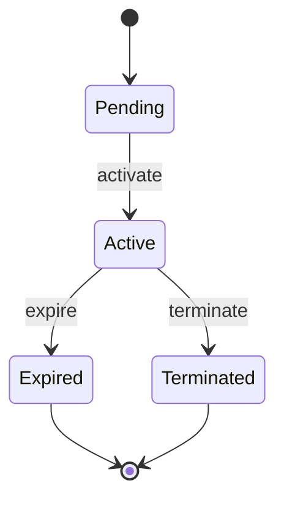
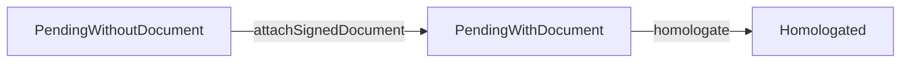

# Módulo Contratos

O **Contratos** é o primeiro módulo end-to-end do `core-api`: domínio puro →
application → adapters Drizzle/MySQL → borda HTTP `/api/v2/contracts` + CLI. Em uma
frase, ele **automatiza o ciclo de vida contratual**, transformando registros estáticos
em um _Estado Contratual Vigente_ dinâmico, auditável e baseado em eventos formais de
alteração (aditivos).

## Os três agregados

Todos modelados como discriminated unions imutáveis, com smart constructors que
devolvem `Result<T, E>`:

- **Contract** — o contrato em si.
- **Amendment** (aditivo) — alteração formal a um contrato vigente.
- **ContractDocument** — documento anexado a um contrato ou aditivo.

E o read-model **Timeline** — uma projeção (ADR-0022) derivada do stream de eventos.

## Contract — quatro estados (ADR-0023)

| Estado       | Significado                         | Campos adicionais                           |
| :----------- | :---------------------------------- | :------------------------------------------ |
| `Pending`    | cadastrado, sem assinatura/vigência | só cadastro                                 |
| `Active`     | vigente (assinado)                  | `signedAt`, `currentValue`, `currentPeriod` |
| `Expired`    | encerrado por fim de período        | `endedAt`                                   |
| `Terminated` | encerrado por rescisão              | `endedAt`                                   |

**A regra central (RN-06/RN-07):** o estado vigente (`currentValue`, `currentPeriod`)
é **derivado** de `originalValue/Period + Σ aditivos homologados` — **nunca** editado
direto. A operação canônica é
`Contract.applyHomologatedAdjustment(contract, adjustment, at)`.

Isso é uma decisão de design deliberada: em vez de deixar alguém _digitar_ o novo valor
vigente (e arriscar divergência), o sistema o **calcula** a partir dos eventos formais.
O valor vigente é sempre uma consequência verificável, não um campo editável.

## Amendment — kind × status

O aditivo tem dois eixos independentes. O **kind** descreve a natureza da alteração:

| kind          | payload                                          |
| :------------ | :----------------------------------------------- |
| `Addition`    | `impactValue: NonZeroMoney` (acréscimo)          |
| `Suppression` | `impactValue: NonZeroMoney` (supressão limitada) |
| `TermChange`  | `newEndDate: PlainDate` (prorrogação)            |
| `Misc`        | — (sem impacto financeiro/prazo)                 |

E o **status** governa a formalização:

**RN-12:** homologar **exige** `signedDocumentRef` — e só `PendingWithDocument`
consegue homologar, garantido pelo próprio tipo. Não é uma checagem em runtime: é
impossível chamar `homologate` num aditivo sem documento, porque o tipo não permite.

## ContractDocument

Vínculo polimórfico (`parentType: Contract | Amendment`), 8 categorias canônicas
(`signed_contract`, `signed_amendment`, `opinion`, `certificate`, `justification`,
`technical_attachment`, `publication`, `other`) e status
`Active | LogicallyDeleted | Superseded`. Carrega hash SHA-256, bucket, storageKey e
versão. Os **bytes** ficam no S3/MinIO (ADR-0019); o MySQL guarda só os metadados.

## Eventos & Outbox (ADR-0015)

Eventos de domínio em EN no passado: `ContractCreated`, `ContractActivated`,
`AmendmentCreated`, `AmendmentHomologated`, `ContractDocumentUploaded`… Eles são
persistidos **atomicamente** com o estado: `repo.save(aggregate, events)` grava
agregado + outbox na mesma transação MySQL. Um worker de outbox publica os eventos
cross-módulo. O contrato público é `contracts/public-api/events.ts` (decoder versionado
v1).

:::warning Limitação MVP conhecida
`homologateAmendment` e o upload+attach de documento fazem dois saves sequenciais sem
atomicidade distribuída — débito registrado em
`.claude/.planning/HOMOLOGATE-DISTRIBUTED-ATOMICITY.md`.
:::

## Use cases

`createPendingContract`, `createContract`, `activateContract`, `endContract`,
`createAmendment`, `homologateAmendment`, `uploadDocument`, `attachSignedDocument`,
`supersedeDocument`, `deleteDocument`, `getContract`, `getContractTimeline`,
`listContracts`, `importContracts`. Cada um é uma factory `(deps) => (cmd) =>
Promise<Result<O, E>>`.

:::tip Fonte
Regras de negócio numeradas (RN-06, RN-12, RN-CV-_, RN-AS-_…) têm texto normativo em
`handbook/domain_questions/contratos/` e `handbook/domain/contratos/`. O código vive em
`src/modules/contracts/`.
:::
