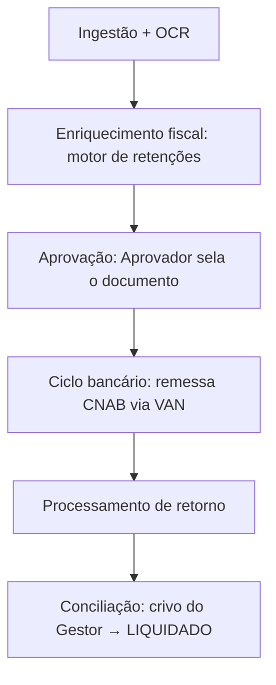

# Módulo Financeiro

O **Financeiro** (Core Financeiro) está em construção (Fase 2). Antes de uma linha de
adapter, o domínio foi modelado em profundidade — context maps, glossário ubíquo e
máquinas de estado. Esta página resume essa descoberta; é um bom exemplo de **domínio
antes do código**.

## Por que o sistema existe

Ele nasce para resolver a fragilidade do modelo de **"títulos avulsos"** e a falta de
rastreabilidade entre o documento fiscal e o pagamento. Em organizações sem fins
lucrativos, a transparência sobre o **Fato Gerador** é crítica para a governança.

> Transforma documentos fiscais e não fiscais em obrigações financeiras integradas,
> automatizando o cálculo de retenções e garantindo a imutabilidade do fluxo de caixa
> através do conceito de **Fato Gerador**.

## O princípio central: Fato Gerador

> **Nada existe no financeiro sem um Fato Gerador.**

Toda obrigação financeira nasce de um documento validado (NFSe, DANFE, Recibo, Fatura),
herdando automaticamente suas regras de retenção. O documento é a raiz; o título é a
consequência.

## Os atores

- **Operador de Contas a Pagar** — ingestão (OCR), enriquecimento de dados, geração de
  remessas CNAB e monitoramento de rejeições.
- **Aprovador** — único perfil que pode "Selar" o documento e habilitar a geração de
  títulos. Após selado, os valores ficam imutáveis.
- **Gestor Financeiro** — autoriza pagamentos, remessas bancárias e o crivo final de
  liquidação.
- **Governança/Auditoria** — valida a Linha do Tempo (Time Travel): quem alterou o quê
  e quando.

## O fluxo do dia

1. **Ingestão e OCR** — o documento é digitalizado; o sistema extrai dados e cruza com
   Contratos/Fornecedores.
2. **Enriquecimento fiscal** — o motor de retenções gera os títulos "filhos" (impostos)
   vinculados ao "pai" (valor bruto).
3. **Aprovação** — o Aprovador sela o documento; os valores tornam-se imutáveis.
4. **Ciclo bancário** — títulos aprovados são agrupados em arquivos de remessa e
   enviados à VAN.
5. **Processamento de retorno** — em caso de erro, o título é marcado para intervenção.
6. **Conciliação** — o extrato bancário é vinculado ao título → `LIQUIDADO`, após crivo
   do Gestor.

## Integridade e exceções

- **Recusa bancária** — títulos rejeitados assumem `RECUSADO`; exigem revisão manual.
- **Divergência de valores** — alterar um título de imposto força reabertura do
  documento pai e recálculo de toda a equação financeira.
- **Quebra de integridade** — alteração manual na base após a remessa invalida o
  **hash** de segurança, alertando a Governança.
- **Atraso bancário** — um título `Transmitido` que ultrapassa D+1 sem confirmação vira
  `ATRASADO`.

## A fronteira com o banco: ACL

O Core **não conhece** CNAB, segmentos ou posições. Toda a tradução do formato Bradesco
acontece numa **Anticorruption Layer** (ADR-0008) — termos de sistemas externos não
"sujam" o domínio de negócio. O integração com a VAN não exige Windows: a validação é
feita pelo Validador Universal Web.

:::tip Fonte
Especificação completa em `handbook/domain/` (financeiro: `01-introduction.md` a
`10-mapeamento-legado-schema.md` e `DOCUMENTO_MESTRE.md`). O mapeamento do schema legado
(32 tabelas reais) está em `10-mapeamento-legado-schema.md`.
:::
